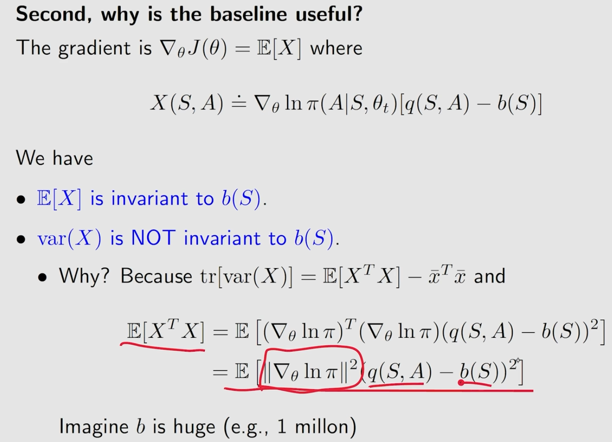
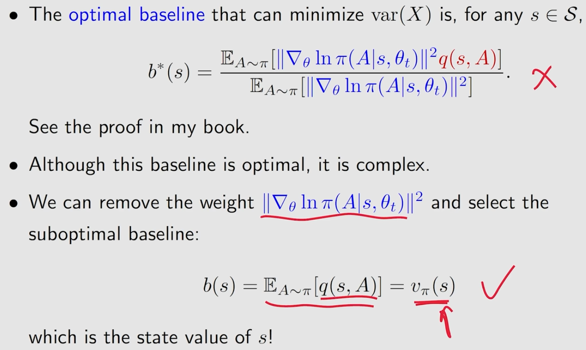
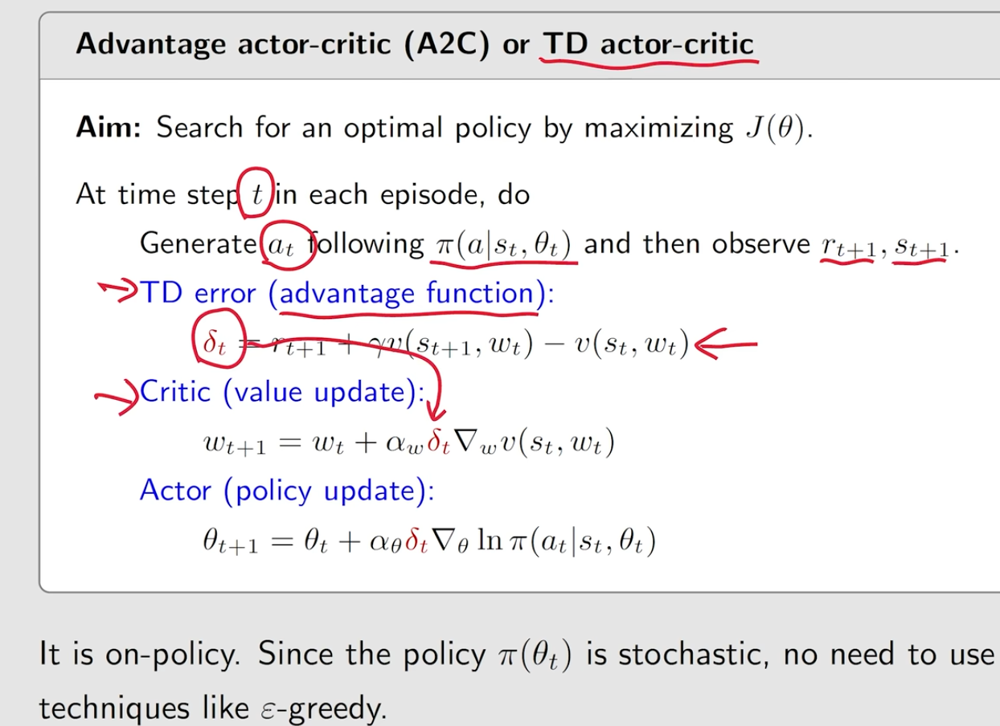
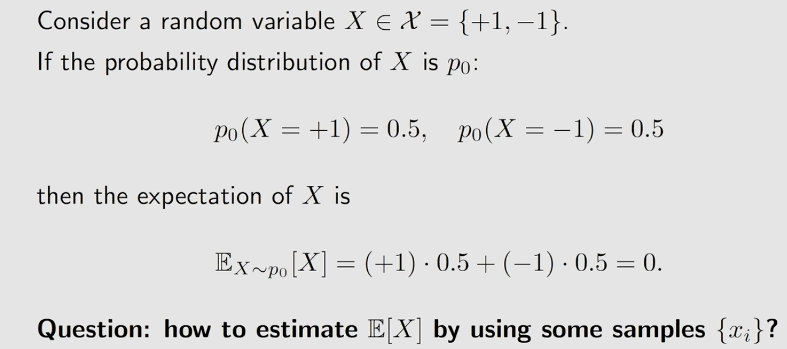
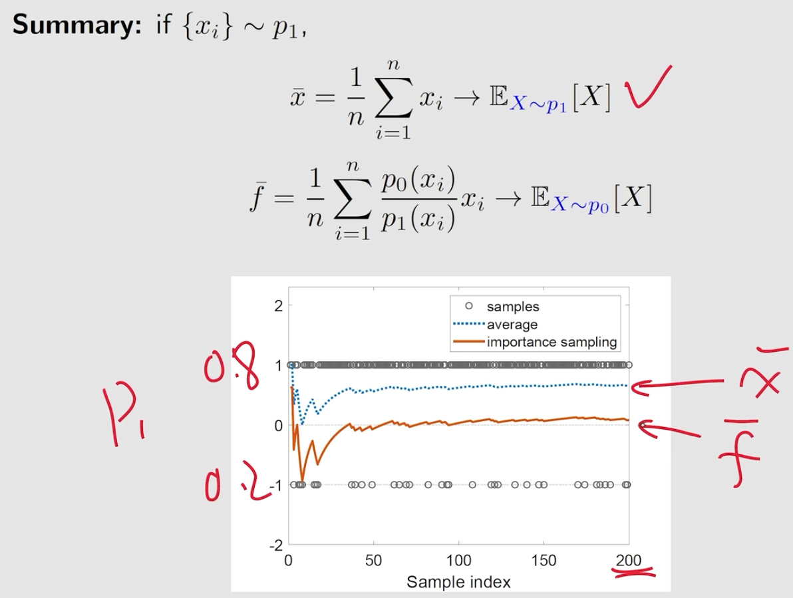

# lecture10 Actor-Critic Methods
[toc]
## the simplest Actor-Critic(QAC)

### how to get $q_t(s_t,a_t)$

### QAC

## Advantage Actor-Critic(A2C)

### why baseline

### baseline

### advantage function

### one value network is enough

### A2C or TD actor-critic

## Importance sampling and off-policy Actor-Critic
### how to estimate $E(x)$ by using samples $\{x_i\}$

#### case1

#### case2

#### how

### Importance Sampling

#### off policy gradient

#### off policy actor-critic

## Deterministic Actor-Critic(DPG)

