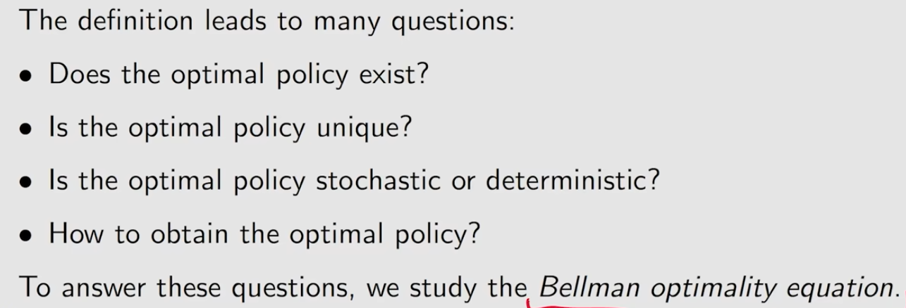
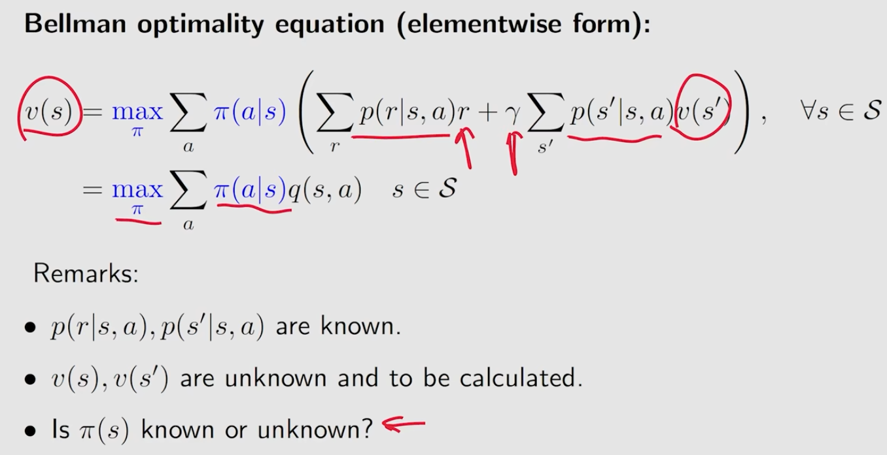
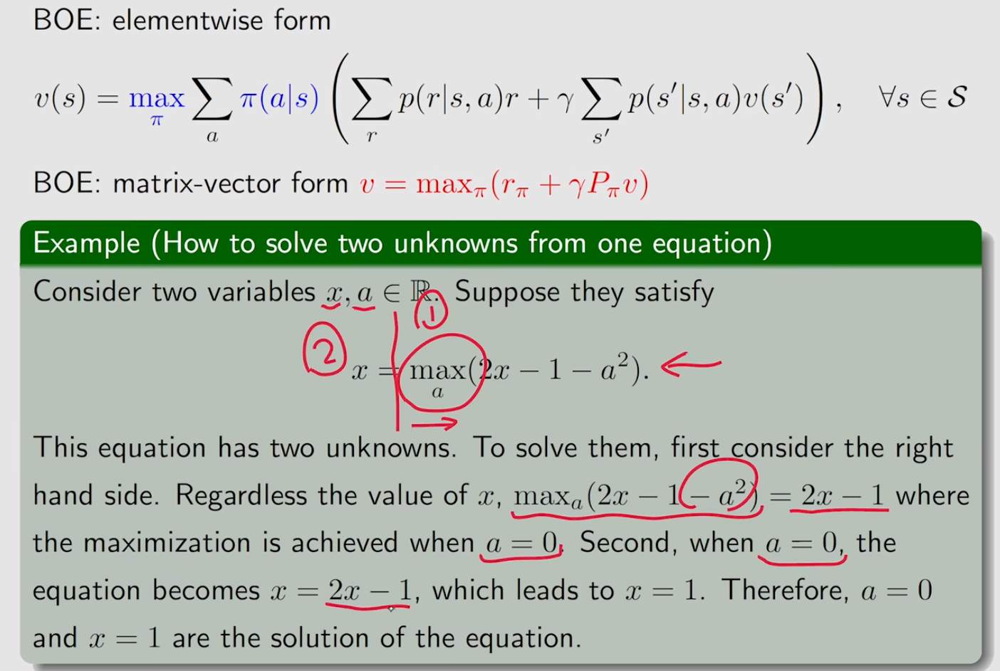
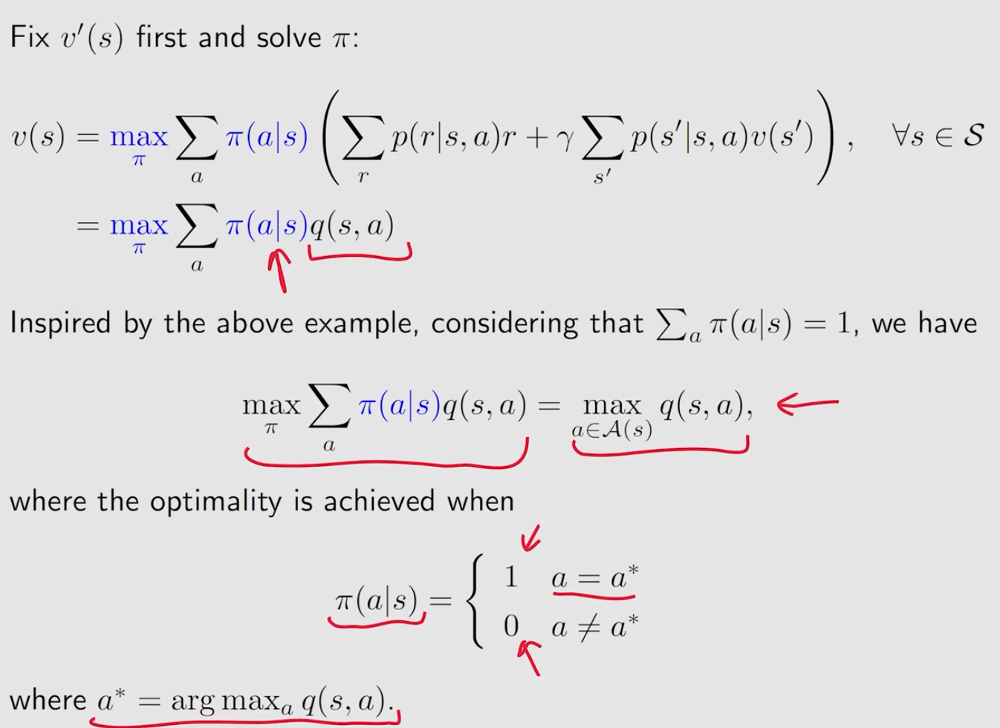
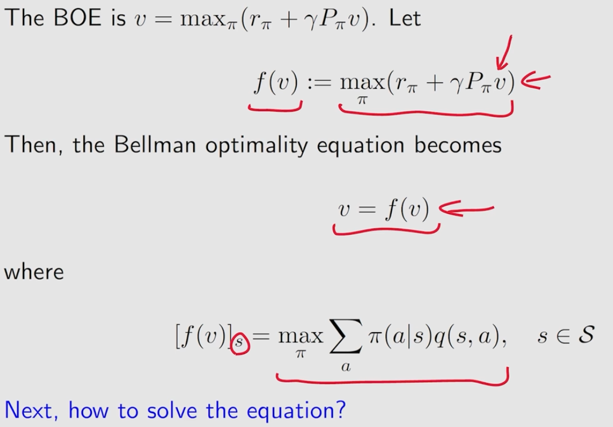
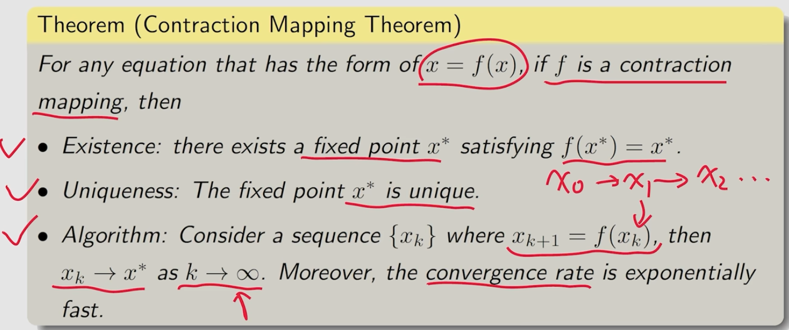
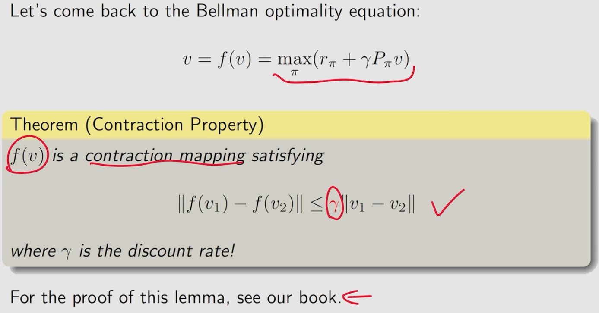
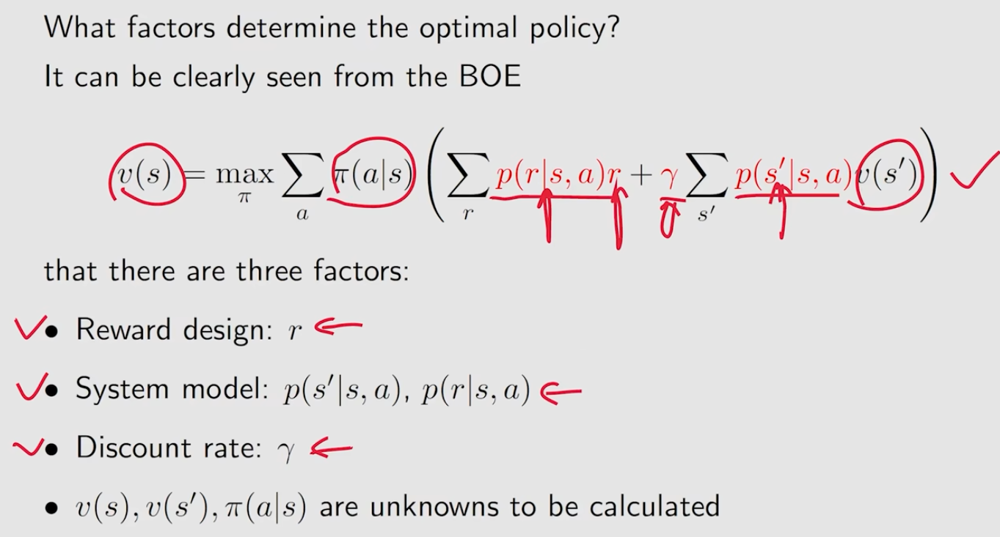
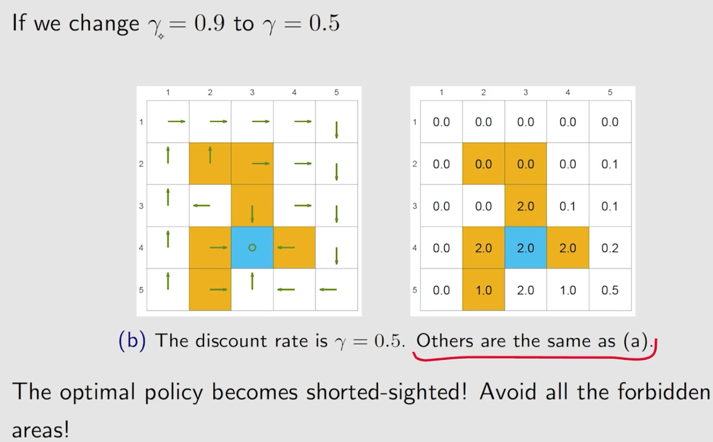
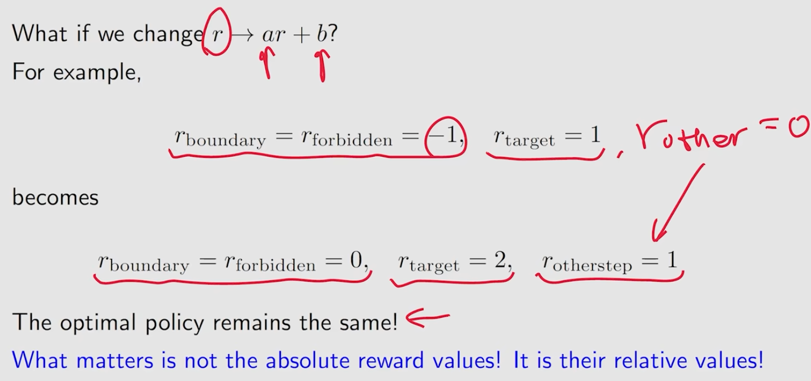

# lecture3 Optimal Policy and Bellman OPtimality Equation
[toc]
## Optimal policy

## Bellman optimality equation(BOE)
### BOE introduction

### maximization on the right side

### Contraction mapping theorem

### BOE solution

## analyze optimal policies

### $\gamma$大小的影响

### r线性变换的影响

## 总结

