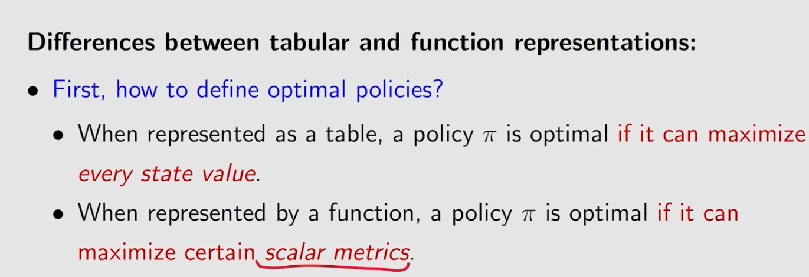
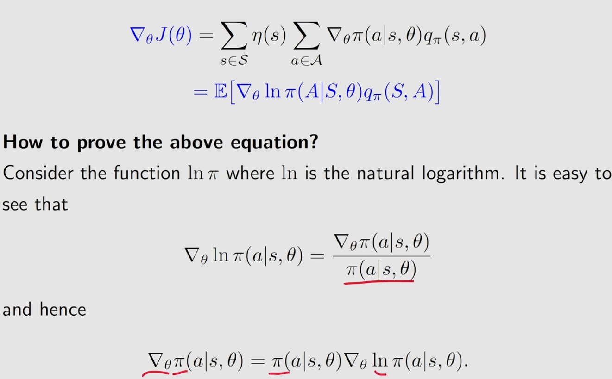
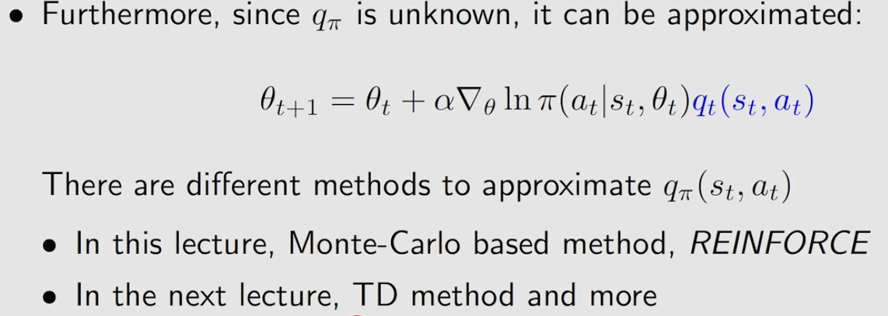
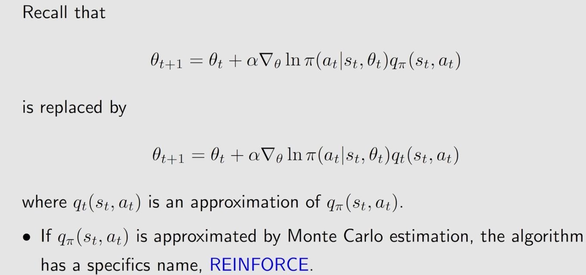

# lecture 9 Policy Gradient Methods
[toc]
## Basic idea

## Metric1-Average value

## Metric2-Average reward

## Gradients of the metrics

### useful form of gradient 

### proven

## Gradient-based algorithms reinforce

### $\beta$的理解

### REINFORCE

