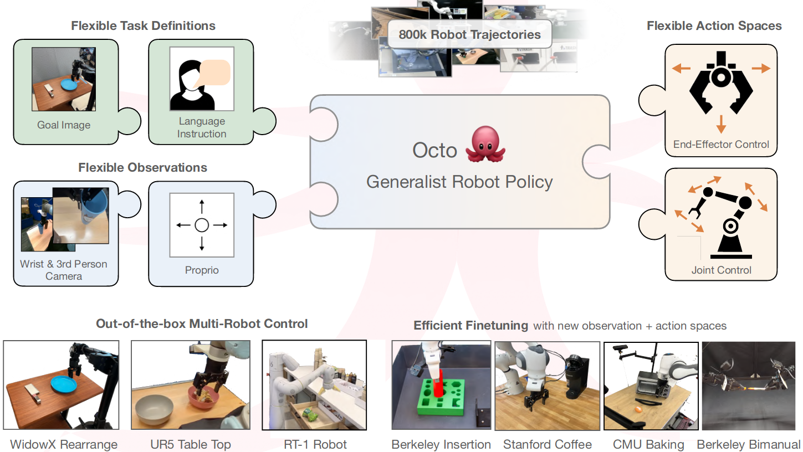
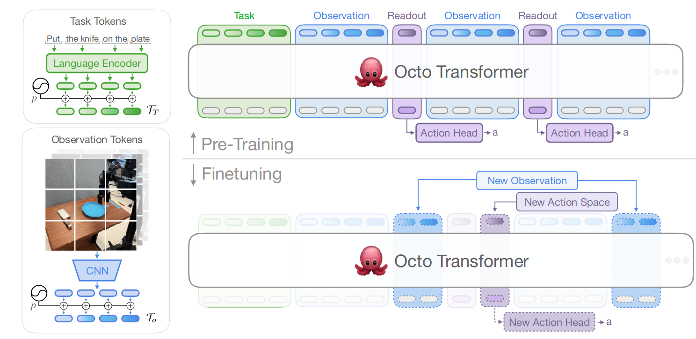
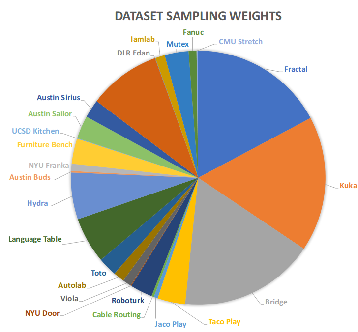
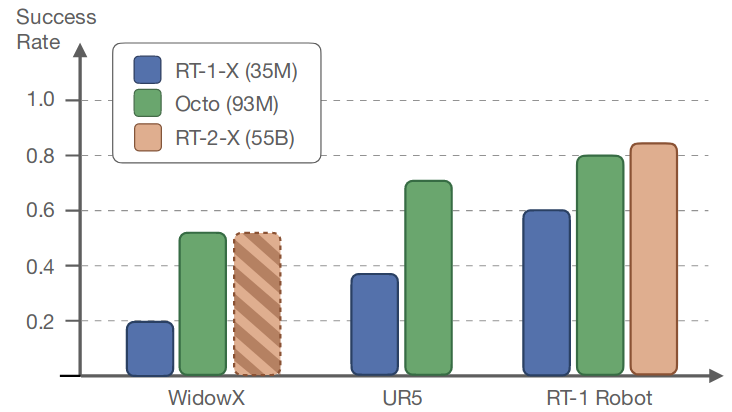
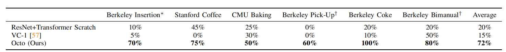
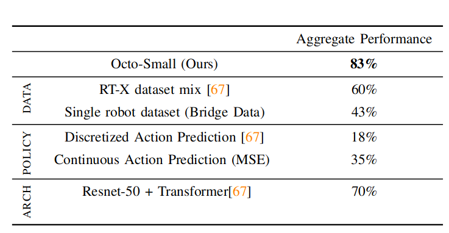
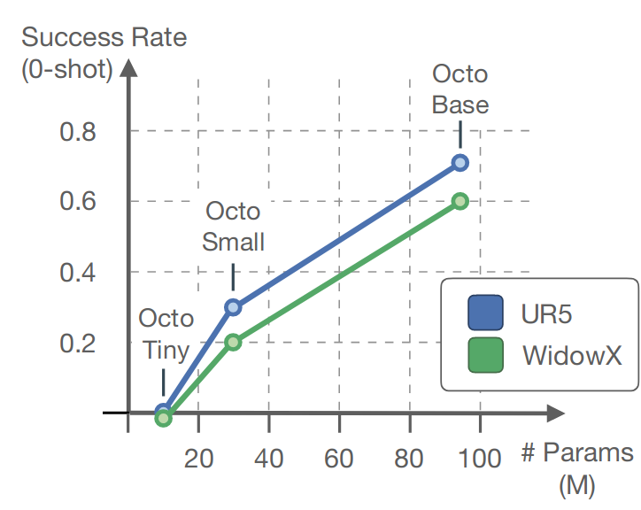

# Octo: An Open-Source Generalist Robot Policy
[toc]

图 1：我们推出了 **Octo**，一个用于机器人操作的开源通用策略。Octo 是一个基于 Transformer 的策略模型，预训练于 Open X-Embodiment 数据集【67】中包含的 80 万个多样化机器人任务示例。它支持灵活的任务和观察定义，并能够快速微调以适应新的观察和动作空间。
## Abstract
大型策略通过在多样化的机器人数据集上进行预训练，有潜力改变机器人学习领域：与从头开始训练新策略相比，这类通用的机器人策略只需少量领域内数据微调，就能实现广泛的泛化能力。然而，要在多种机器人学习场景、环境和任务中广泛应用，这些策略需要能够处理多样的传感器和动作空间，兼容各种常用的机器人平台，并能快速高效地微调以适应新领域。

在本研究中，我们旨在为开发开源的、广泛适用的通用机器人操作策略奠定基础。作为第一步，我们推出了 **Octo**，一种基于大型 Transformer 的策略模型，使用来自 **Open X-Embodiment** 数据集的 **80 万条轨迹**进行训练，这是迄今为止最大的机器人操作数据集。Octo 可通过语言指令或目标图像进行操作，并能够在标准消费级 GPU 上，在几小时内高效微调以适应新的传感输入和动作空间。

在针对 9 个机器人平台的实验中，我们证明了 Octo 作为一种通用的策略初始化方法，可以有效地微调至新的观察和动作空间。此外，我们还对 Octo 模型的设计决策（从架构到训练数据）进行了详细的消融实验，以为未来开发通用机器人模型的研究提供指导。

## Introduction
机器人学习的常见方法是基于针对特定机器人和任务收集的数据集训练策略。这种从零开始的学习方式对每个任务都需要耗费大量数据收集工作，并且所得策略通常只具有狭窄的泛化能力。理论上，来自其他机器人和任务的经验可以作为一种解决方案，通过让模型接触多样化的机器人控制问题来提升对后续任务的泛化能力和性能。然而，尽管通用模型已在自然语言处理[68, 88]和计算机视觉[76, 44]中普及，构建能够为多种机器人执行多种任务的“通用机器人模型”依然具有很大的挑战性。 

在机器人领域中训练统一的控制策略面临一系列独特挑战，需要处理不同的机器人结构、传感器配置、动作空间、任务描述、环境和计算预算。为此，已有一些研究提出了机器人基础模型，这些模型直接将机器人观察映射到动作，并能够实现对新领域和新机器人的零样本或小样本泛化。我们将这些模型广义地称为**“通用机器人策略”（Generalist Robot Policies, GRPs）**，其核心能力是在任务、环境和机器人系统间执行低层次的视觉-运动控制[75, 9, 23, 103, 10, 81, 1, 91, 35, 94, 45]。

例如，**GNM 模型**[80]可以在不同的机器人导航场景中泛化；**RoboCat 模型**[9]能够针对目标条件任务处理不同的机器人结构；而 **RT-X 模型**[67]可以在五种机器人平台中完成语言条件的操作任务。尽管这些模型向真正的“通用机器人模型”迈出了重要一步，但它们在多个关键方面仍然受限：通常限制下游用户使用预定义且较为固定的输入观察形式（例如单一相机流）；缺乏对新领域进行高效微调的支持；并且其中最大规模的模型并未向公众开放。

为了解决这些问题，我们设计了一种更适合下游机器人应用中多样化接口的通用机器人策略预训练系统。我们的核心模型基于 Transformer 架构，将任意输入标记（由观察和任务生成）映射到输出标记（随后解码为动作），并可以在多样化的机器人和任务数据集上进行训练。无需额外训练，该策略即可接受不同的相机配置（例如工作区或手腕相机）、控制不同的机器人，并通过语言指令或目标图像进行引导——仅需更改输入标记即可。更重要的是，该模型可以通过添加适配器和使用小规模目标领域数据集进行微调，适应新的机器人配置、新的传感输入或动作空间，同时保持在可接受的计算预算内。

### 我们的主要贡献
我们推出了 **Octo**，一种基于 Transformer 的策略模型，预训练于迄今为止最大规模的机器人操作数据集——**Open X-Embodiment 数据集**的 **80 万条**机器人演示数据【67】。Octo 是首个可以有效微调至新观察和动作空间的 GRP，也是首个完全开源的通用机器人操作策略，包括训练流程、模型检查点和数据。

虽然 Octo 的各个组成部分（如 Transformer 主干、支持语言和目标图像任务描述的功能、以及用于建模动作分布的扩散头）在之前的研究中已有讨论，但将这些组件结合为功能强大的通用机器人策略是独特且创新的。通过针对来自 4 个机构的 9 个机器人的广泛实验，我们证明了该系统在开箱即用的多机器人控制（包括单臂和双臂操作任务）中达到了最先进的性能，并可以作为微调新设置（包含新观察和动作空间）的有效初始策略。

在此过程中，我们还系统性地研究了 GRP 预训练中的不同设计决策的影响；我们评估了数据分布选择、模型架构和策略形式化对预训练 GRP 质量的影响。评估结果突出了规模和灵活性的实用性：最佳模型是那些在最广泛的数据混合上训练、具有最少限制性归纳偏置、并能适应预训练数据多样行为的策略目标。

与本文一同，我们发布了所有训练、使用、复现和微调 Octo 模型所需的资源。我们提供了两个预训练的 Octo 模型检查点（参数量为 2700 万和 9300 万），能够开箱即用地支持多个 RGB 摄像头输入以及语言和目标图像任务描述。我们还提供了微调这些模型到新领域的脚本，以及完整的预训练流程，包括优化的数据加载器、适用于多模态输入的 Transformer 实现和训练过程监控工具。

## Related Work
许多研究使用机器人收集的大规模轨迹数据集来训练策略，从早期利用自主数据采集来扩展策略训练的尝试【71, 48, 41, 19, 27, 30】，到最近结合现代基于 Transformer 的策略与大规模示范数据集的探索【10, 40, 98, 28, 83, 86】。这些研究主要专注于单一机器人结构，而 **Octo** 则在多种机器人结构的数据集上训练策略，从而扩大了有效训练数据集的规模，并允许微调适应各种机器人配置。

近来，更多研究致力于拓展机器人策略的泛化能力。一些研究利用多样化的非机器人数据或预训练的视觉-语言基础模型来增强策略对新场景和任务的泛化能力【86, 103, 96, 16, 38, 11, 84, 36, 4, 37, 7, 3, 46, 15, 23】。与 Octo 最为相关的是一些跨多个机器人结构训练策略的研究：例如 **GNM 模型**【81, 80】在机器人导航设置中实现了泛化，**RoboCat**【9】和 **RT-X**【67】控制了多种单臂操作机器人。这些模型在策略学习上表现出色，但存在关键问题：缺乏灵活性。它们通常要求用户严格遵循预训练时使用的传感输入和动作空间，无法适配新的观察和动作空间。此外，这些最大规模的模型并未公开。

与这些工作相比，Octo 在多个方面具有显著不同：它在更大且更多样化的机器人数据集上训练；通过高效微调支持更广泛的下游应用；并且完全开源且可复现。Octo 的设计受近期机器人模仿学习和可扩展 Transformer 训练领域的多个进展启发，包括：用于动作解码的去噪扩散目标【34】【17, 31, 85】；预测“动作块”（即未来动作序列）【98, 17, 28】；以及借鉴可扩展视觉 Transformer 训练文献的模型架构和学习率调度策略【22, 97】。我们的工作首次在跨机器人结构通用策略学习中利用了这些方法，发现它们可以显著提高性能。在评估中，我们通过消融实验评估了这些组件的重要性，并在附录 E 中列出了我们认为重要和不重要的设计决策，希望这些发现对未来的通用策略学习研究有所帮助。

### 训练通用机器人策略的关键：机器人训练数据

与可从网络抓取的视觉和语言数据相比，机器人数据的大规模获取极具挑战性，通常需要投入大量硬件和人工资源。目前已有多个大规模机器人导航和自动驾驶数据集【29, 95, 13, 87, 80, 43, 89】。近年来，越来越多的研究致力于构建规模和多样性不断增加的机器人操作数据集，这些数据集通常通过脚本化和自主策略【19, 41, 42, 12, 71, 30】或人类远程操作【59, 60, 25, 90, 39, 10, 26, 6, 77, 63, 79】收集。

Octo 训练于 **Open X-Embodiment 数据集**【67】，这是近期一个集合了上述多个机器人数据集的成果。Open-X 数据集包含约 150 万条机器人操作记录，其中我们筛选了 80 万条用于训练 Octo。需要指出的是，**RT-X 模型**【67】使用了一个更为有限的子集（35 万条记录）。因此，据我们所知，Octo 是迄今为止在最大规模机器人操作示范数据集上训练的模型。

## The Octo Model

图 2：模型架构。  
**左侧**：Octo 使用预训练语言模型和轻量级 CNN 分别对任务描述（绿色）和输入观察（蓝色）进行分词。  
**顶部**：Transformer 主干处理任务和观察标记序列，生成读出标记（紫色），这些标记被传递到输出头部以生成动作。  
**底部**：Transformer 的块状注意力结构允许我们在微调期间添加或移除输入和输出，例如，可以添加新的观察（蓝色，虚线）或动作空间（紫色，虚线），而无需修改任何预训练参数。  

在本节中，我们将介绍 **Octo** 模型——一种开源的通用机器人策略，能够通过微调适应新的机器人和任务，包括新的传感输入和动作空间。我们将探讨关键的设计决策、训练目标、训练数据集和基础设施。  

Octo 模型的设计重点是灵活性和规模化：它支持多种常用的机器人、传感器配置和动作，同时提供了一个通用且可扩展的训练框架，可以在大规模数据上进行训练。Octo 支持以下功能：自然语言指令、目标图像、观察历史以及通过扩散解码【17】实现的多模态、分块动作预测。此外，Octo 专为高效微调设计，能够适应具有不同动作空间、摄像头组合以及本体感知信息的新机器人配置。

这种设计旨在使 Octo 成为一个灵活且广泛适用的通用机器人策略，可应用于多种下游机器人任务和研究项目。

### A. 架构

Octo 模型的核心是基于 Transformer 的策略 \( \pi \)，主要包括三个关键部分：  
1. **输入分词器**：将语言指令 \( \ell \)、目标 \( g \) 和观察序列 \( o_1, \dots, o_H \) 转换为对应的标记 \( T_\ell, T_g, T_o \)（如图 2 左侧所示）。  
2. **Transformer 主干**：处理这些标记并生成嵌入 \( e_\ell, e_g, e_o = T(T_\ell, T_g, T_o) \)（如图 2 顶部所示）。  
3. **读出头部** \( R(e) \)：生成所需输出（即动作 \( a \)）。  

#### 任务和观察分词器
我们通过特定模态的分词器将任务定义（例如语言指令 \( \ell \) 和目标图像 \( g \)）以及观察数据（例如腕部和第三人称摄像头流）转换为统一的“标记化”格式（如图 2 左侧所示）：  
- **语言输入**：首先进行分词，然后通过一个预训练的 Transformer（使用 T5-base 模型，111M 参数【74】）生成一系列语言嵌入标记。  
- **图像观察和目标**：通过一个浅卷积堆栈处理，然后分割为一系列展平的图像块【22】。  

在生成 Transformer 的输入序列时，我们为任务和观察标记添加**可学习的位置嵌入 \( p \)**，并将其按顺序排列为 \( T_T, T_{o,1}, T_{o,2}, \dots \)。

#### Transformer 主干与读出头部
一旦输入被转换为统一的标记序列，Transformer 会对其进行处理（如图 2 顶部所示）。这种方法类似于以观察和动作序列为基础训练 Transformer 的现有研究【92, 73】。

Octo Transformer 的注意力模式采用块状掩码设计：  
- **观察标记**仅能因果地关注相同或更早时间步长的标记 \( T_{o,0:t} \) 以及任务标记 \( T_T \)（绿色）。  
- 对于不存在的观察（例如数据集中缺少语言指令），相应的标记会完全被掩码。  

这种模块化设计允许我们在微调时灵活添加或移除观察或任务标记。

除了输入标记块外，我们还插入了可学习的**读出标记** \( T_{R,t} \)（紫色）。  
- 读出标记 \( T_{R,t} \) 可关注序列中之前的观察和任务标记，但不会被任何观察或任务标记关注。因此，它们仅能被动读取和处理内部嵌入，而不会影响其他标记。  
- 类似于 BERT 中的 [CLS] 标记，读出标记作为观察序列到目前为止的紧凑向量嵌入。  

读出标记的嵌入通过实现扩散过程的轻量级“动作头部”处理，用于预测多个连续动作的“块”，类似于先前的研究【98, 17】。

#### 灵活的输入与输出
我们设计的架构可以在下游微调中灵活地为模型添加新的任务和观察输入或动作输出头部。例如，在添加新任务、观察或损失函数时，可以完全保留 Transformer 的预训练权重，仅根据新规范添加新的位置嵌入、轻量级编码器或新头部的参数（如图 2 底部所示）。  
这与先前架构【10, 81】形成对比——它们在添加或移除图像输入或更改任务规范时，通常需要重新初始化或重新训练模型的大部分组件。

这种灵活性对于 Octo 成为真正的“通用模型”至关重要：由于在预训练期间无法涵盖所有可能的机器人传感器和动作配置，因此能够在微调过程中适配 Octo 的输入和输出，使其成为机器人社区的多功能工具。

相比之下，以标准 Transformer 主干为基础或将视觉编码器与 MLP 输出头部结合的现有模型设计，会固定模型期望的输入类型和顺序。而对于 Octo，切换观察或任务输入不需要重新初始化大部分模型。

### B. 训练数据  

### 图 3：训练数据集构成  
我们从 **Open X-Embodiment** 数据集中精心挑选了 25 个数据集，这些数据集包含图像观测、末端执行器动作，并展示了多样化的行为。饼图展示了每个数据集在每个训练批次中平均贡献的比例。  
数据集的权重依据每个数据集的样本数量进行分配，并结合适当的调整，以平衡数据集的规模与多样性（详见第 III-B 节）。

我们在来自 Open X-Embodiment 数据集【67】的 25 个子数据集混合上训练 Octo。这些数据集涵盖了多样化的机器人学习任务，包括不同的机器人形态和场景。这些数据集的异质性不仅体现在机器人类型上，还体现在传感器（例如是否包含腕部摄像头）和标签（例如是否包含语言指令）上。详见图 3 和附录 C。
#### 数据混合的构建  
为了创建我们的训练数据混合 \( D \)，我们进行了一系列筛选和调整：  
1. **数据筛选**：  
   - 移除所有不包含图像流的 Open-X 数据集。  
   - 移除不使用增量末端执行器控制的数据集。  
   - 移除过于重复、图像分辨率低或任务过于小众的数据集。  

2. **数据权重调整**：  
   - 根据任务和环境的多样性，将剩余数据集大致分类为“更具多样性”和“较少多样性”。在训练时对更具多样性的数据集权重加倍。  
   - 对于包含大量重复片段的数据集，下调其权重，以避免在数据混合中占据主导地位。  

3. **数据对齐**：  
   - 使用零填充对缺失的摄像头通道进行补齐。  
   - 在不同数据集间对抓取器的动作空间进行统一对齐，使得抓取器命令 +1 表示“抓取器打开”，0 表示“抓取器关闭”。  

#### 数据集混合的效果与未来改进  
虽然我们发现生成的训练混合对预训练通用机器人策略效果良好，但未来的工作应对数据混合的质量进行更深入的分析，以优化通用机器人策略的预训练数据选择。

### C. 训练目标  

我们采用 **条件扩散解码头** 来预测连续的、多模态的动作分布【34, 17】。值得注意的是，每次动作预测仅需对 Transformer 主干执行一次前向传播，之后的多步去噪过程完全在小型扩散解码头内完成。这种策略参数化方式在零样本评估和微调中均优于基于均方误差 (MSE) 动作头或离散化动作分布训练的策略【10】。

#### 动作生成过程  
为了生成动作，我们从高斯分布中采样一个噪声向量 \( x_K \sim \mathcal{N}(0, I) \)，并通过一个学习的去噪网络 \( \varepsilon_\theta(x_k, e, k) \) 执行 \( K \) 步去噪过程。该网络依赖于以下条件：
- 上一步去噪输出 \( x_k \)，
- 当前步骤索引 \( k \)，
- Transformer 动作读出嵌入 \( e \)。  

去噪过程的公式为：  
\[
x_{k-1} = \alpha(x_k - \gamma \varepsilon_\theta(x_k, e, k)) + \mathcal{N}(0, \sigma^2 I).
\]  
其中，超参数 \( \alpha \)、\( \gamma \) 和 \( \sigma \) 定义了噪声调度；我们采用文献【66】中的标准余弦调度。

#### 扩散头训练  
扩散头使用标准的 DDPM（去噪扩散概率模型）目标函数【34】，通过向数据集中加入高斯噪声并训练去噪网络 \( \varepsilon_\theta(x_k, e, k) \) 来重建原始动作。详细的扩散策略训练过程请参考 Chi 等人【17】。所有相关超参数列于附录 D。

#### 微调策略  
在微调过程中，我们使用相同的扩散训练目标，并对完整模型进行更新。实验表明，这种方法优于冻结部分预训练参数的方案。在所有微调实验中，我们采用以下流程：
1. 给定一个约包含 100 条轨迹的小型目标域数据集。
2. 进行 50k 步微调。
3. 使用具有线性预热的余弦衰减学习率调度器。

这种配方显著提升了 Octo 在目标域的适配能力。

### D. 训练细节  

我们训练了两个版本的模型：  
1. **Octo-Small**：其变换器骨干网络与 ViT-S 的规模相当。  
2. **Octo-Base**：其变换器骨干网络与 ViT-B 的规模相当【22】。  

**优化器与超参数**  
- **优化器**：AdamW【51】  
- **学习率调度**：反平方根衰减【97】  
- **权重衰减**：0.1  
- **梯度裁剪**：1.0  

**训练配置**  
- **训练步骤**：ViT-B 模型共训练 300k 步  
- **批量大小**：2048  
- **硬件**：使用 TPU v4-128 pod，总计 14 小时完成训练。  
- **微调配置**：在一台配备 24GB VRAM 的 NVIDIA A5000 GPU 上微调同一模型约需 5 小时，可通过多 GPU 训练加速。  

**观测历史**  
我们使用 2 帧的观测历史。初步实验表明，超过 1 帧的额外帧数据带来的性能提升显著减少。  

**目标重标定**  
我们应用了 **hindsight goal relabeling** 技术【2】，在轨迹中随机选择一个未来状态作为目标图像，这与先前研究类似【54, 90, 81, 77, 63】。  

**数据增强与语言指令处理**  
- **图像增强**：训练过程中应用常见的图像数据增强方法。  
- **语言指令与目标图像随机化**：在每个训练样本中，随机去掉语言指令或目标图像，使 Octo 可根据语言指令或目标图像进行控制。  
- **无语言标注的数据集**：始终使用目标图像进行条件控制，主要通过自监督的视觉观测学习控制，减少语言标注的需求。这与多上下文模仿学习的先前研究类似【54, 62, 61, 63】。  

**更多超参数选择的详细信息**请参阅附录 D。  

### E. 模型检查点与代码  

我们开源了所有资源，便于用户训练、微调和运行 Octo 模型：  

- **预训练检查点**：  
  - Octo-Small（27M 参数）  
  - Octo-Base（93M 参数）  

- **微调脚本**：  
  - 针对 Octo 模型的微调脚本，基于 JAX 实现。  

- **预训练管道**：  
  - 用于 Octo 模型在 Open X-Embodiment 数据集上的预训练，基于 JAX 实现。  

- **独立数据加载器**：  
  - 专为 Open X-Embodiment 数据设计，兼容 JAX 和 PyTorch。  

**使用指南**：  
我们在 [附录 B](#) 中提供了一个简单的示例，说明如何加载并运行预训练的 Octo 模型。  

**开源地址**：  
所有资源均可在 [https://octo-models.github.io](https://octo-models.github.io) 获取。

## Experiments
### 实验概述

我们的实验对 Octo 的能力进行了广泛的实证分析，评估其作为通用机器人基础模型的表现，主要关注以下三个问题：

1. **多机器人控制与任务解决能力**  
   Octo 是否能直接控制多种机器人，并在语言指令和目标任务中实现开箱即用的性能？  

2. **数据高效微调能力**  
   Octo 的预训练权重是否能为新任务和机器人提供良好的初始化，与从头训练或常用预训练方法相比是否表现更优？  

3. **关键设计决策分析**  
   在构建通用机器人策略时，Octo 的哪些设计选择最为重要？  

---

### 实验设置

我们在 4 家机构的 9 种机器人学习场景中对 Octo 进行了全面评估（详见图 4），具体包括以下方面：  

1. **零样本测试**  
   在与预训练数据相匹配的机器人设置中（如基于 delta 末端控制器、RGB 图像观察空间的机器人），测试 Octo 在语言任务和目标图像任务上的开箱即用性能。

2. **数据高效微调**  
   测试 Octo 对新环境和任务的微调能力，包括：
   - 新的观察输入（如“Berkeley Insertion”场景中的力-扭矩数据）  
   - 新的动作空间（如“Berkeley Pick-Up”场景中的关节位置控制）  
   - 新的机器人类型（如“Berkeley Coke”和“双臂机器人”场景）

每个微调任务均使用约 100 条领域内示范轨迹，且在单块 NVIDIA A5000 GPU 上微调时间少于 5 小时，超参数设置一致（详见附录 D）。  

3. **任务多样性测试**  
   - 与多种对象交互（如“WidowX BridgeV2”）  
   - 长时间任务（如“Stanford Coffee”）  
   - 精确操作任务（如“Berkeley Insertion”）  

每个评估场景的详细描述可见附录 F。

---

### 对比基线

我们将 Octo 的性能与多个基线模型进行比较：  

1. **开箱即用控制能力**  
   - **RT-1-X** [67]：目前公开可用的最佳通用机器人策略，预训练于 Open X-Embodiment 数据集上，目标是多机器人零样本控制。  
   - **RT-2-X** [67]：一个拥有 550 亿参数的视觉语言模型，微调于 Open X-Embodiment 数据集以生成机器人动作。  
   - RT-1-X 和 RT-2-X 的训练数据为 35 万条轨迹，远少于 Octo 的 80 万条。

2. **数据高效微调性能**  
   - **从头训练基线（ResNet+Transformer Scratch）**：采用与许多先前工作类似的经典策略架构（包括 ResNet 可视化编码器、FiLM 语言条件、以及小型 Transformer 动作解码器），训练总参数为 28M（类似 RT-1 [10]）。  
   - **预训练视觉表示基线（VC-1）**：基于 Majumdar 等人 [57] 的方法，ViT-B 编码器初始化为 VC-1 权重（从 4000 小时自中心视频和 ImageNet 数据预训练），并结合 MLP 动作解码器，采用 MSE 损失训练。

3. **微调模型表现**  
   我们发现，直接从头训练大规模 Transformer 容易在小数据集上过拟合，而更经典的基线架构提供了更稳定的从头训练性能。  

通过以上对比，我们验证了 Octo 作为预训练策略的优越性及其微调效率。

### A. Octo 开箱即用地控制多个机器人

**图 5：零样本评估**
开箱即用的情况下，**Octo** 能够在预训练数据中的环境中控制多个机器人。在使用自然语言指定任务时，**Octo** 在三种不同的机器人形态和设置中均优于当前最优的开源通用机器人策略 **RT-1-X**【67】。此外，在测试的 **WidowX** 和 **RT-1 机器人**任务中，**Octo** 的表现与 **RT-2-X**【103】相当。

我们在图 5 中比较了 **Octo**、**RT-1-X** 和 **RT-2-X** 的零样本（zero-shot）操控能力。评估任务包括从预训练数据集中选择的一些操作任务，例如拾取和放置、用布擦拭桌子，以及打开和关闭抽屉。对于每个机器人，我们从对应的 **OXE 数据集** 中选择了两个基于语言指令的任务，并在每个任务中进行了 10 次实验，初始条件各不相同（详细信息见附录 F）。**这些任务虽然来自预训练数据的“分布内”，但评估要求模型能够推广到新的物体位置、光照条件、背景以及干扰物的情况下完成任务**。

虽然所有方法在预训练环境中的任务上表现都相当不错，但我们发现 **Octo** 的平均成功率比 **RT-1-X**（35M 参数）高出 29%。在 WidowX 和 RT-1 机器人的评估中，我们还与 **RT-2-X**（550 亿参数）【103】进行了比较，发现 **Octo** 的表现与之相当。

此外，尽管 **RT-1-X** 和 **RT-2-X** 仅支持基于语言指令的任务条件设定，**Octo** 还支持基于目标图像（goal image）的条件设定。在 WidowX 的任务评估中，我们使用目标图像条件设定对模型进行了测试，发现其成功率比基于语言指令的设定高出 25%。这可能是因为目标图像提供了更多关于如何完成任务的信息。

在 BridgeV2 域中，我们对零样本能力进行了细粒度分析（见表 VII），分别测量了模型在以下情境中的表现：
- 数据集中出现过的设置；
- 新的环境；
- 新的场景；
- 新的技能。

结果表明，**Octo** 在新物体上的成功率很高，但在新场景中零样本表现略有下降，而在新行为（如翻转或精确插入）中表现明显下降。

### B. Octo 在新领域实现数据高效学习

**表 I：微调评估**

Octo 实现了在新领域中的数据高效微调，并且在性能上优于从头开始训练以及最先进的预训练视觉表示方法。每个领域使用约 100 个目标演示，并采用相同的微调超参数。在每个领域，成功率为 20 次试验的平均值。  
- ∗：新观测输入（力-扭矩本体感知）。  
- †：新动作空间（关节位置控制）。

我们在表 I 中报告了 Octo 在**新领域**进行数据高效**微调**的结果。研究表明，相比从头开始训练或使用预训练的 **VC-1** 权重进行训练，微调 Octo 可以获得更优的策略。在六种评估设置（详见附录 F）的平均性能上，Octo 的表现比第二好的基线方法高出 **52%**。 

更重要的是，我们在所有评估任务中使用了相同的微调流程和超参数（详见第 III-C 节），使其成为一个很好的默认配置。结果还凸显了 Octo 适应新观测（如“Berkeley Insertion”中的力-扭矩输入）、新动作空间（如“Berkeley Pick-Up”中的关节位置控制）以及新机器人形态（如“Berkeley Coke”和“Berkeley Bimanual”）的能力。

这使得 Octo 能够应用于广泛的单臂和双臂机器人操作任务，包括超越单摄像头输入和末端执行器位置控制的复杂问题。

### C. 通用机器人策略训练的设计决策

**表 II: 模型消融实验**  
我们在使用 ViT 架构、扩散动作头（diffusion action head）和广泛的训练数据组合时取得了最佳性能。所有评估均在 WidowX 设置下进行，成功率为两个语言条件任务和两个目标条件任务共 40 次试验的平均值。  

我们已经展示了 Octo 作为零样本多机器人控制器和策略微调初始化的有效性。接下来，我们分析不同设计决策对 Octo 策略性能的影响，具体关注以下方面：  
1. 模型架构  
2. 训练数据  
3. 训练目标  
4. 模型规模  

除非特别说明，所有消融实验均在 Octo-Small 模型上进行，以适应计算预算。

#### **模型架构**
以往基于 transformer 的策略设计通常使用大型 ResNet 风格的编码器[32]对输入图像进行编码，然后将生成的图像特征与相对较小的 transformer 融合[10, 67, 81, 17, 98, 61, 83]。相比之下，我们选择了“transformer-first”架构，使用非常浅的 CNN 补丁编码器，并将大部分参数和计算集中在 transformer 主干中，这与经典的视觉 transformer 架构类似[22]。  
在表 II 中显示，当使用完整的 Open X-Embodiment 数据集训练时，这种可扩展的架构显著提高了性能。值得注意的是，在小数据集（例如“从头训练”对比）上，ResNet 架构优于 ViT，这表明大型 transformer 策略特别适合对多样化数据集进行可扩展训练。

#### **训练数据**
Octo 训练于迄今为止最具多样性的跨机器人数据集，这是一组我们从 Open X-Embodiment 数据集中手动筛选的 25 个数据集的混合（参见第 III-B 节）。我们通过比较训练于较小的 11 个数据集（RT-X 模型使用的数据集）和仅在目标机器人领域数据上训练的模型，研究训练数据混合的影响。在表 II 中显示，随着训练数据集数量的增加，Octo 的性能逐步提升。这表明进一步扩大数据集可能会进一步提升策略性能。未来的工作将深入研究数据策划的最佳实践。

#### **训练目标**
我们将 Octo 的扩散解码训练目标（参见第 III-C 节）与先前工作中的常见替代方法进行比较：简单的均方误差（MSE）损失[8, 47]和离散化动作的交叉熵损失[10, 103]。在表 II 中显示，Octo 的扩散训练目标显著提高了性能。这种改进可能是因为扩散头能够建模多模态动作分布（而 MSE 头不能），同时保留连续动作的精度（而离散头不能）。定性来看，该策略比使用 MSE 训练的策略更加果断，比离散化动作训练的策略更加精确。

#### **模型规模**

**图 6：模型规模化**  
Octo 的性能随着模型规模的增加而提高，在 UR5 和 WidowX 任务上均表现出明显的改进。成功率是基于每个机器人一个语言条件任务，10 次试验的平均值。  

我们比较了三种不同规模的 Octo 模型，这些模型遵循常见视觉 transformer 模型的阶梯[97]：Octo-Tiny（10M 参数）、Octo-Small（27M 参数）和 Octo-Base（93M 参数）。在图 6 中显示，策略的零样本性能随着模型规模的增大而提升。我们发现 Base 模型在初始场景配置方面比 Small 模型更具鲁棒性，并且更少倾向于过早抓取动作，这表明更大的模型具有更好的视觉场景感知能力。

### V. 讨论与未来工作

我们介绍了 Octo，这是一种基于大型 transformer 的策略模型，预训练于迄今为止最大的机器人操作数据集，包括 80 万条机器人轨迹。我们证明了 Octo 能够即开即用地解决多种任务，并展示了其组合式设计如何支持微调适应新的输入和动作空间，使其成为解决广泛机器人控制问题的多功能初始化模型。除了模型本身，我们还发布了完整的训练和微调代码，以及支持在大规模机器人数据集上训练的工具。

尽管 Octo 在零样本和微调评估中表现出色，我们发现当前模型仍存在一些不足，这主要归因于训练数据的特性。首先，当前的 Octo 模型在处理腕部摄像头信息方面表现不佳。在许多情况下，仅使用第三视角摄像头而不是结合腕部和第三视角摄像头时，微调结果更好。此外，我们还注意到语言条件策略性能与目标条件策略性能之间存在显著差异。在两种情况下，训练数据中对应模态的缺乏可能是主要原因：仅有 27% 的数据包含腕部摄像头信息，而只有 56% 的预训练数据包含语言标注。

扩展用于训练 Octo 的数据集是一个自然的改进方向。由于 Open X-Embodiment 数据集由最优机器人示范组成，当前模型通过模仿学习进行训练；未来的工作可以考虑从次优数据或在线交互数据中学习，这需要采用替代目标。此外，尽管我们仅在单臂和双臂操作机器人上训练和评估了 Octo，扩展至执行导航或移动操作的更广泛机器人集将是一个值得探索的重要方向。

Octo 代表了构建即开即用的通用机器人策略迈出的重要一步，能够适用于多样化的机器人配置。然而，模型仍需改进，包括更好的语言条件支持、增强对腕部摄像头的支持，以及整合更广泛的数据源超越最优示范。我们希望 Octo 能够为研究人员和实践者提供一个简单的起点，帮助他们访问更大的机器人数据集并利用预训练机器人模型高效学习新任务并实现广泛泛化。

## 附录 E：有效与无效的策略

**有效的策略：**

- **在预训练时添加历史帧**：在预训练时，使用一帧历史作为上下文比没有历史的模型在零-shot评估中表现更好。尽管在我们评估的几个任务上，增加历史长度没有带来明显的额外好处，但其他任务可能会受益。
  
- **使用动作分块**：我们发现使用“动作分块” [98]（即预测多个未来动作）有助于得到更连贯的政策动作。在评估中，我们没有发现对未来动作进行时间集成（temporal ensembling）能提供比回溯控制更多的好处。
  
- **减小图像块的大小**：将图像分成16×16的块比使用32×32的块表现更好，特别是在抓取和其他精细任务上。虽然这增加了计算复杂度（令令牌数量增加了4倍），但如何平衡计算成本和分辨率仍然是一个需要解决的问题。
  
- **增加数据洗牌缓冲区的大小**：并行加载来自25个数据集的数据是一个挑战。我们发现，在训练期间实现良好的帧洗牌至关重要——使用小的洗牌缓冲区（20k）和轨迹级别交错会导致零-shot性能显著下降。我们通过在解码图像前对来自不同轨迹的帧进行洗牌和交错，解决了这个问题，并成功适配了更大的洗牌缓冲区（最多500k）。同时，在数据加载时，我们从每个训练轨迹中随机抽取最多100个步骤，以避免“过度拥挤”洗牌缓冲区。

**无效的策略（目前未奏效）：**

- **MSE 动作头**：将我们的扩散解码头替换为简单的L2损失，导致了“保守”的策略，动作非常缓慢，例如在WidowX评估中未能正确旋转抓取器。
  
- **离散动作头**：将动作离散化为每个维度256个箱子，并使用交叉熵损失训练（如Brohan等人 [10]）导致了更为“果断”的政策，但缺乏精确度，通常未能成功抓取。

- **ResNet编码器**：在我们的评估中，ResNet编码器未能很好地扩展到更大的数据集（见表II），尽管在从零开始训练小型数据集（约100个示范）时表现优于ViT架构。

- **预训练编码器**：在零-shot评估中，使用ImageNet预训练的ResNet编码器未带来额外的好处，这可能与ResNet架构表现不佳有关。

- **相对抓取器动作表示**：在对不同数据集的抓取器动作表示进行对齐时，我们尝试了以下两种方法：(A) 绝对抓取器动作，即抓取器打开时为+1，关闭时为0；(B) 相对抓取器动作，即在抓取器打开/关闭的时刻动作为+1/0，其他时刻为0.5。我们发现后者由于大多数训练数据表示“不要改变抓取器”动作，导致抓取器不太常打开或关闭，因此抓取成功率略高。然而，相对表示导致抓取失败后缺乏更多重试行为，最终效果较差。因此，我们选择了绝对抓取器动作表示。

- **添加本体感知输入**：使用本体感知观察训练的策略整体表现较差，可能是因为状态与未来动作之间有强烈的相关性。我们推测这可能是由于本体感知信息与目标动作之间存在因果混淆 [21]。

- **微调语言模型**：为了改进Octo的视听语言对接，我们实验了：i）不同大小的T5编码器 [74]：小型（30M）、基础（111M）和大型（386M）；以及ii）微调编码器的最后两层。使用冻结的基础模型得到了最好的语言条件政策。我们没有发现使用更大的编码器或微调编码器带来改善。我们推测这可能是因为大多数数据集中的语言注释缺乏丰富的多样性和自由形式的描述。
