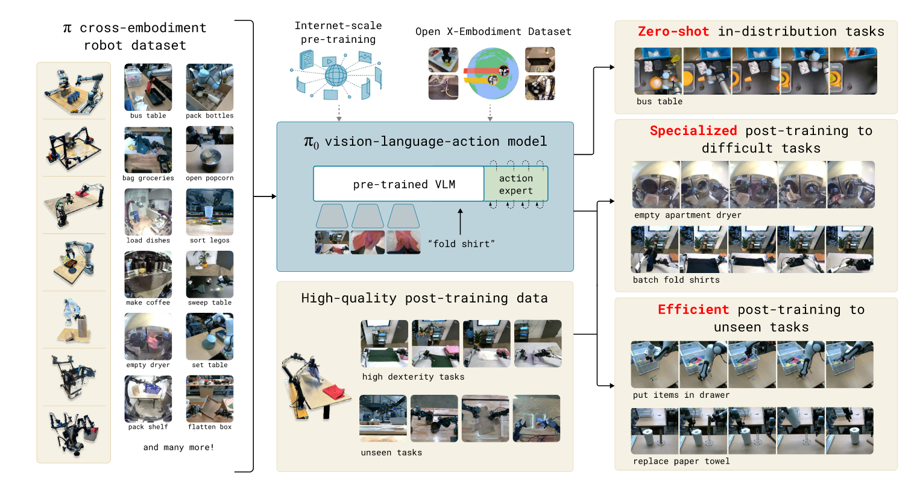
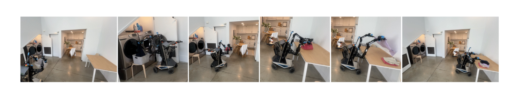
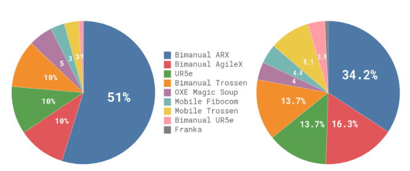
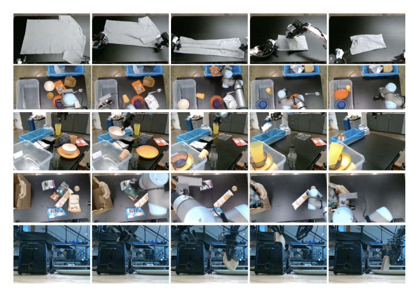
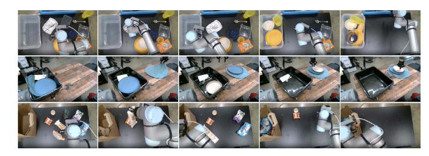
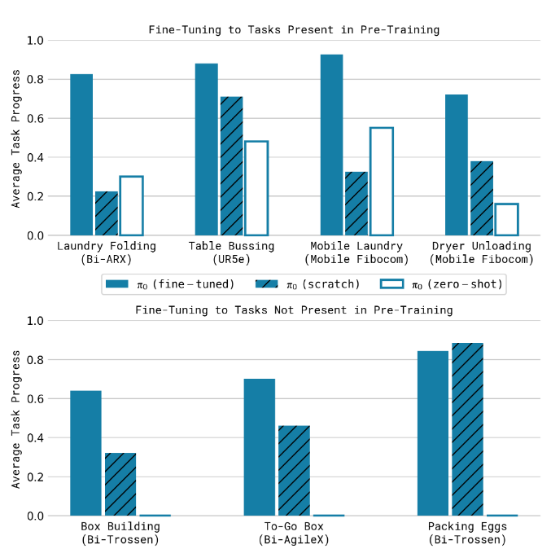

# π0: A Vision-Language-Action Flow Model for General Robot Control
[toc]

图1：我们的一般性机器人策略采用了一个预训练的视觉-语言模型（VLM）作为基础架构，同时使用了一个多样化的跨实体数据集，该数据集包含各种灵巧的操作任务。通过添加一个单独的动作专家，该模型被适应于机器人控制，该专家通过*流匹配（flow matching）*产生连续的动作，从而实现精确和流畅的操作技能。随后，该模型可以被用于零样本控制，或者在高质量数据上进行微调，以执行复杂的多阶段任务，比如折叠多件洗衣或组装一个盒子。
## abstract
机器人学习具有巨大的潜力，可以释放灵活、通用和灵巧机器人系统的全部潜能，并解决人工智能中一些最深层次的问题。然而，将机器人学习提升到现实世界系统所需的通用性水平时，面临数据、泛化和鲁棒性等重大障碍。在本文中，我们讨论了**通用机器人策略**（即机器人基础模型）如何应对这些挑战，以及如何为复杂且高度灵巧的任务设计有效的通用机器人策略。我们提出了一个基于**预训练视觉-语言模型（VLM）** 的新颖**流匹配**架构，以继承互联网规模的语义知识。然后，我们讨论了如何在多个灵巧机器人平台的大型和多样化数据集上对该模型进行训练，包括单臂机器人、双臂机器人以及移动操作器。我们根据模型在预训练后进行零样本任务的能力、遵循人们和高层VLM策略的语言指令的能力，以及通过微调获取新技能的能力来评估我们的模型。我们的结果涵盖了多种任务，如叠衣服、清理桌面和组装盒子。

图2： π0控制一个移动操作器进行叠衣服。我们的模型在7种不同的机器人配置和68个任务的多样化数据上进行了预训练，随后可以用于零样本或微调到复杂的下游任务，如本例中的叠衣服策略，该策略从干衣机中取出衣服，将其装入衣篮中，将衣篮带到折叠桌前，然后折叠每件衣服。
## introduction
人工智能系统形式多样，从解决人类思维无法触及的复杂问题的高度专业化系统，如预测蛋白质的构象[21]，到能够根据文本提示生成逼真高分辨率图像或视频的系统[40]。然而，人类智能在多样性上超越机器智能的轴线是灵活性：在各种物理环境中解决多样化任务的能力，同时智能地应对环境限制、语言命令和意外的扰动。AI在这种灵活性上的最明显进展可能出现在大型语言和视觉-语言模型[1, 48]上：这些系统在大规模、极具多样性的互联网图片和文本语料库上进行预训练，然后使用更精心挑选的数据集进行微调（“对齐”），以诱导所需的行为模式和响应性。尽管这些模型已显示出广泛的指令遵循和问题解决能力[53, 27]，但它们并不真正像人那样处于物理世界中，它们对物理交互的理解完全基于抽象描述。如果这些方法要在展现人类所具备的物理环境中的灵活性方面取得实质性进展，我们需要在物理环境的数据上对它们进行训练——即来自具身机器人代理的数据。

灵活且通用的模型能够执行各种机器人行为的任务具有巨大的实际意义，但它们也可能为机器人学习今天面临的一些最艰难的挑战提供解决方案，如数据可用性、泛化和鲁棒性。在自然语言[1]和计算机视觉[39]中，**在多任务数据上预训练的通用基础模型往往优于专门定制和专业化的解决方案** 例如，如果目标是识别照片中的鸟类，可能更有效的是在许多不同的图像-语言关联上进行预训练，然后针对鸟类识别任务进行微调或提示，而不是仅在鸟类识别数据上进行训练。同样，我们可能发现，**对于有效的专业机器人系统，首先在大规模多样化的机器人数据上进行预训练，然后针对所需任务进行微调或提示可能更有效。** 这可以解决数据稀缺问题，因为对于通用模型来说，有更多的数据来源可供使用——包括来自其他任务、其他机器人甚至非机器人的来源——并且它可能解决鲁棒性和泛化问题，因为多样化数据展示了更广泛的观察和行动覆盖，提供了各种场景、校正和恢复行为，这些在更狭窄的专业化数据中可能并不存在。因此，采用大规模预训练方法来进行机器人学习有潜力解决该领域的许多挑战，并使实用的学习型机器人成为现实，同时进一步加深我们对人工智能中最深层次问题的理解。

然而，开发这种通用机器人策略——即机器人基础模型——涉及一系列重大挑战。**首先** ，任何此类研究都必须在**大规模**上进行，因为大规模预训练的全部好处在较小规模上往往并不明显[54]。**其次**，需要开发能够**有效利用多样化数据源的正确模型架构**，同时**能够表示与复杂物理场景交互所需的复杂和微妙的行为**。**第三**，需要**正确的训练配方**。这可能是最重要的成分，因为近期在NLP和计算机视觉中大型模型的进步很大程度上依赖于精心策划的预训练和后训练数据策略[35]。

在本文中，我们提出了一种原型模型和学习框架，我们称之为**π0**，它展示了如何解决这三个瓶颈中的每一个。我们在图1中展示了我们的模型和系统。为了**整合多样化数据源**，我们首先利用**预训练的视觉-语言模型(VLM)** 导入互联网规模的经验。通过基于VLM构建我们的模型，我们继承了语言和视觉-语言模型的一般知识、语义推理和问题解决能力。然后，我们进一步训练我们的模型以整合机器人动作，将其变成一个**视觉-语言-动作（VLA）模型**[7]。为了使利用**多样化机器人数据源**成为可能，我们采用了**跨实体训练**[10]，其中**许多类型的机器人数据被合并到同一个模型中**。这些不同类型的机器人具有不同的配置空间和动作表示，包括单臂和双臂系统，以及移动操作器。此外，为了能够执行高度灵巧和复杂的物理任务，我们使用了**动作分块架构[57]结合流匹配**（扩散的一种变体）来表示**复杂的连续动作分布**[28, 32]。这使我们的模型能够以高达**50 Hz**的频率控制机器人执行如叠衣服等灵巧任务（见图1）。为了将流匹配与VLM结合起来，我们使用了一个新的**动作专家**，它通过**流匹配输出**增强了标准的VLM。

正如语言模型一样，我们模型的架构只是我们方法的一部分。为了灵活且稳健地执行复杂任务，我们需要正确的训练配方。我们的配方反映了在超大规模语言和图像-语言模型中常见的预训练/后训练分离[1, 48]，其中模型**首先在大规模、极具多样性的语料库上进行预训练**，**然后在更狭窄、更精心挑选的数据上进行微调**，以诱导所需的行为模式——在我们的案例中，是灵巧性、效率和鲁棒性。从直观上讲，仅在高质量数据上进行训练并不会教会模型如何从错误中恢复，因为在这种数据中很少见到错误。仅在较低质量预训练数据上进行训练并不会教会模型高效且稳健地行动。结合两者提供了所需的行为：模型尽可能地以类似高质量数据的方式行动，但仍有一套恢复和校正的策略可在出错时部署。

我们工作的贡献包括基于**VLM预训练**和**流匹配的新颖通用机器人策略架构**，以及对这种**机器人基础模型的预训练/后训练配方的实证研究**。我们评估了我们的模型在**零样本控制**、**语言命令下**、**微调到下游任务**以及**结合输出中间语言命令执行复杂和时间扩展任务**的高级语义策略的表现。虽然我们的模型和系统使用了近期工作中提出的各种想法，但成分的组合是新的，实证评估显示出一种超越之前展示的机器人基础模型的灵巧性和通用性。我们通过在超过10,000小时的机器人数据上进行预训练，并微调到各种灵巧任务来评估我们的方法，包括叠衣服（见图2）、清理桌子、将盘子放入微波炉、将鸡蛋装入纸板盒、组装盒子和打包杂货。

## related works
我们的工作建立在最近提出的大规模机器人学习方法以及多模态语言模型之上。我们的工作与最近提出的**视觉-语言-动作（VLA）** 模型最密切相关，这些模型使用针对机器人控制进行微调的预训练VLM[7, 24, 55]。这些模型采用自回归离散化来以类似文本标记的方式表示动作。相比之下，我们的模型采用了一种新颖的设计，通过**流匹配**[32, 28]（扩散的一种变体[20, 46]）**微调VLM来产生动作**。这使我们能够**处理高频率的动作块**[57]（高达50 Hz）和**高度灵巧的任务**，我们展示了这些任务对之前的自回归VLA[7]构成了重大挑战。这类似于近期关于用于动作生成的扩散模型的多项工作[9, 60]。与这些工作相反，我们的模型使用了一个预训练的VLM骨干[5]。我们的贡献还具有根本的整合性，专注于机器人基础模型的框架，包括不仅模型架构本身，还包括预训练配方、预训练和后训练阶段，以及一系列现实世界的实验。

在机器人控制之外，许多模型已经提出，将预训练的语言模型与扩散结合起来[40, 41, 14]，包括专门混合扩散和自回归大型语言模型的模型[19, 29, 59]。这些模型通常关注图像生成，但我们的动作生成模型建立在之前提出的多个概念之上。像Zhou等人[59]一样，我们通过**在单个序列元素上应用扩散风格（流匹配）的损失**来训练我们的模型，以替代仅解码器变换器的标准交叉熵损失。像Liu等人[29]一样，我们为对应于扩散的标记使用了一组单独的权重。在将这些概念融入VLA模型中，我们引入了我们所知**第一个为灵巧控制产生高频率动作块的流匹配VLA**。

我们的工作也建立在一个丰富的历史上，关于大规模机器人学习的先前工作。该领域的早期工作通常利用自监督或自主数据收集[26, 22, 8]，为抓取[18, 37]或推动[56]等简单任务提供了可行的数据源，但没有更灵巧行为的复杂性。最近，一些高质量的数据集已被收集用于机器人控制，允许广泛的泛化[23, 10, 52, 33, 34, 43, 13, 6]，但通常是对于更简单的任务，这些任务包括物体重新定位和初级家具操作（例如，开抽屉）[31, 15]。更灵巧的任务已在较小的规模上进行研究，通常有10或100个训练轨迹[57]，相当于10小时或更少。由于我们的目标之一是研究复杂和灵巧的行为，我们利用了一个**更大的数据集**，大约有**10,000小时**的示范，并结合了**开源的OXE数据集**[10]。据我们所知，这代表了**迄今为止在机器人数据量方面的最大机器人学习实验**。在这个规模上，我们展示了一个更复杂的预训练/后训练配方非常有效——类似于用于大型语言模型的配方，预训练阶段赋予我们的模型广泛的基础知识，然后在后训练阶段通过更高质量的精心挑选数据来细化，以实现所需的行为。

我们展示的任务的复杂性远远超出了之前的工作。虽然最近的工作展示了许多更复杂和灵巧的行为，如系鞋带[58]或煮虾[17]，但我们展示了我们的框架可以**训练非常长的任务**，有时长达几分钟的任务，这些任务结合了物理灵巧性和组合复杂性。例如，我们的叠衣服任务要求机器人操作各种可能从任何配置开始的衣物，并连续折叠多个物品。我们的清理桌子任务需要辨别新对象的类别（垃圾或盘子）。我们展示了一个单一的跨实体模型可以用作这些任务的基础模型。据我们所知，我们的工作展示了端到端机器人学习文献中最长的灵巧任务。

## overview

图3：我们框架的概览。我们从预训练混合物开始，它包括我们自己的灵巧操作数据集和开源数据。我们使用这种混合物来训练我们的流匹配VLA模型，该模型由一个较大的VLM骨干和一个较小的动作专家组成，用于处理机器人状态和动作。VLM骨干权重从**PaliGemma** [5]初始化，提供了从大规模互联网预训练中学习的表示。由此产生的π0模型可以用来控制具有不同动作空间的多个机器人实体，以完成各种各样的任务。

我们在图3中提供了我们模型和训练程序的概述。在我们的训练框架中，我们首先组装一个预训练混合物，它由我们自己的灵巧操作数据集（V-C节）的加权组合组成，这些数据集在7种不同的机器人配置上收集了68种不同的任务，以及整个OXE数据集[10]，其中包含来自22个机器人的数据。预训练阶段（V-A节）还使用了多样化的语言标签，结合了任务名称和段落注释（子轨迹的细粒度标签，通常大约2秒长）。**预训练阶段**的目的是**训练一个基础模型**，该模型展示了广泛的能力和泛化性，但不一定专门针对任何一项任务的高性能。这个基础模型可以**遵循语言命令**并以**初级熟练度**执行各种任务。对于复杂和灵巧的任务，我们然后采用一个**后训练程序**（V-A节），它使用高质量的精心挑选数据来适应模型以执行特定的下游任务。我们研究了使用少量到适量数据的高效后训练，以及使用更大数据集进行复杂任务（如叠衣服和移动操作）的高质量后训练。

我们在IV节中描述的模型基于PaliGemma视觉-语言模型[5]，然后我们用我们的**数据混合物进一步训练**它。为了将**基础的PaliGemma VLM转化为π0**，我们添加了使用**流匹配[32, 28]来生成连续动作分布的动作输出**。我们在接下来的部分中详细描述了这种设计。注意，我们使用PaliGemma是因为其便利性和相对较小的尺寸（这对于实时控制是有用的），但我们的框架与任何基础预训练VLM兼容。

## THE $\pi_0$ MODEL
π0模型，如图3所示，主要由一个语言模型变换器骨干组成。遵循标准的晚期融合VLM配方[3, 11, 30]，图像编码器将机器人的图像观察嵌入到与语言标记相同的嵌入空间中。我们进一步用特定于机器人的输入和输出增强了这个骨干——即本体感觉状态和机器人动作。π0使用**条件流匹配**[28, 32]来建模**动作的连续分布**。流匹配为我们的模型提供了高精度和多模态建模能力，使其特别适合高频率的灵巧任务。我们的架构灵感来自**Transfusion** [59]，它使用多个目标来训练一个单一的变换器，其中标记对应于连续输出的通过流匹配损失监督，而标记对应于离散输出的通过交叉熵损失监督。在Transfusion的基础上，我们还发现**为特定于机器人（动作和状态）的标记使用一组单独的权重可以提高性能**。这种设计类似于专家混合[45, 25, 12, 16]，其中有两个混合元素，第一个元素用于图像和文本输入，而第二个用于特定于机器人的输入和输出。我们将第二组权重称为动作专家。
在本文中，我们使用“标记”一词来指代序列维度上的输入/输出插槽，无论该插槽对应的是离散变量（例如，语言标记）还是连续变量（例如，图像块或机器人动作）。

正式地，我们希望建模数据分布 p(At|ot)，其中 At = [at, at+1, ..., at+H−1] 对应于**未来动作的动作块**（我们为我们的任务使用 H = 50），ot 是一个观察。观察由多个RGB图像、语言命令和机器人的本体感觉状态组成，使得 ot = [It1, ..., Itn, ℓt, qt]，其中 Iit 是第i张图像（每个机器人有2或3张图像），ℓt 是一序列语言标记，qt 是一个关节角度向量。**图像 Iit 和状态 qt 通过相应的编码器进行编码，然后通过线性投影层投影到与语言标记相同的嵌入空间中**。

对于动作块 Aₜ 中的每个动作 aₜ，我们都有一个相应的动作标记，将其馈送到动作专家模块。在训练过程中，我们使用**条件流匹配损失** [28, 32] 来监督这些动作标记，
$Lₜ(θ) = Eₚ₍A_t∣oₜ₎,q₍A_t^τ∣Aₜ₎ ||v_θ(A_t^τ, oₜ) - u(A_t^τ|Aₜ)||²$，
其中下标表示机器人时间步，上标表示流匹配时间步，τ ∈ [0, 1]。最近在高分辨率图像 [14] 和视频 [38] 合成方面的工作表明，流匹配与简单的线性高斯（或最优传输）概率路径 [28] 相结合，可以实现强大的经验性能，其公式为 $q(A_t^τ|Aₜ) = N(τAₜ, (1 - τ)I)$。在实践中，网络的训练方法是：采样随机噪声 ε ~ N(0, I)，计算“噪声动作” $A_t^τ = τAₜ + (1 - τ)ε$，然后训练网络输出 $v_θ(A_t^τ, oₜ) $以匹配去噪向量场 $u(A_t^τ|Aₜ) = ε - Aₜ$。动作专家模块使用完整的双向注意力掩码，以便所有动作标记都能相互关注。在训练期间，我们从一个 beta 分布中采样流匹配时间步 τ，该分布强调较低（噪声较大）的时间步。更多细节请参见附录 B。

在推理时，我们通过从 τ = 0 到 τ = 1 对学习到的向量场进行积分来生成动作，起始值为随机噪声  Aₜ⁰ ~ N(0, I)。我们使用前向欧拉积分规则：$Aₜ^{τ+δ} = Aₜ^τ + δv_θ(Aₜ^τ, oₜ)$，其中 δ 是积分步长。在我们的实验中，我们使用了 10 个积分步（对应于 δ = 0.1）。需要注意的是，推理可以有效地实现，方法是缓存前缀 oₜ 的注意力键和值，并且只为每个积分步骤重新计算与动作标记对应的后缀。我们在附录 D 中提供了关于推理过程的更多细节，包括模型每个部分的推理时间。

虽然从原则上讲，我们的模型可以从头开始初始化或从任何VLM骨干进行微调，但在实践中，我们使用PaliGemma [5]作为我们的基础模型。PaliGemma是一个开源的30亿参数VLM，它提供了一个在大小和性能之间的方便权衡。我们为动作专家增加了3亿参数（这些参数从头开始初始化），总共为33亿参数。我们在附录B中提供了模型架构的完整描述。

非VLM基线模型。除了我们主要的VLA模型外，我们还训练了一个类似的基线模型，该模型在消融实验中没有使用VLM初始化。我们将其称为π0-small的模型，具有4.7亿参数，不使用VLM初始化，并且有一些我们发现对于在没有VLM初始化的数据上训练有帮助的小差异，这些差异在附录C中有总结。这个模型在我们的比较中用于评估引入VLM相关性的好处。

## DATA COLLECTION AND TRAINING RECIPE
广泛能力的机器人基础模型不仅需要一个表达力强且强大的架构，还需要合适的数据集，更重要的是合适的训练配方。就像LLM训练通常分为预训练和后训练阶段一样，我们为我们的模型采用了多阶段训练程序。预训练阶段的目标是使模型接触到多样化的任务，从而获得广泛适用和通用的物理能力，而后训练阶段的目标是为模型提供执行所需下游任务的技巧和流畅能力。因此，预训练和后训练数据集的要求是不同的：**预训练数据集应涵盖尽可能多的任务**，并且在每个任务中应涵盖多样化的行为。**后训练数据集则应涵盖有助于有效任务执行的行为**，这些行为应表现出一致和流畅的策略。从直观上讲，多样化（但质量较低）的预训练数据允许模型从错误中恢复并处理高度多变的情况，这些情况在高质量的后训练数据中可能不会出现，而后训练数据则教会模型很好地执行任务。

### A. Pre-training and post-training

图4：我们数据集的概览：预训练混合物由OXE [10]的一个子集和π数据集组成。我们使用了OXE的一个子集，我们称之为OXE Magic Soup [24]。右图展示了预训练混合物中不同数据集的权重。左图展示了它们按步骤数量衡量的相对大小。

我们在图4中提供了我们预训练混合物的概览。由于每个训练示例对应一个时间步——即元组 (ot, At)，——我们将在讨论中以时间步来量化数据。训练混合物的9.1%由开源数据集组成，包括OXE [10]、Bridg v2 [52] 和 DROID [23]。这些数据集中的机器人和任务通常有一个或两个摄像头，并使用2到10 Hz之间的低频控制。然而，这些数据集涵盖了广泛的物体和环境。为了学习灵巧和更复杂的任务，我们还使用了我们自己的数据集中的9.03亿时间步，其中1.06亿步骤来自单臂机器人，7.97亿来自双臂机器人。这些数据有**68个任务**，其中每个任务由复杂的行为组成——例如，“清理”任务涉及将各种不同的盘子、杯子和餐具放入清理箱中，以及将广泛的垃圾项目放入垃圾桶中。注意，这个任务的定义与之前的工作显著不同，后者通常使用名词和动词的任何组合（例如，“拿起杯子”与“拿起盘子”）来构成一个独特的任务。因此，我们数据集中的行为范围实际上比这个“任务”数量所暗示的要广泛得多。我们在V-C节中更详细地讨论了我们数据集中的具体机器人和任务。

由于数据集在大小上有些不平衡（例如，更困难的叠衣服任务被过度代表），我们根据 n^0.43 **对每个任务-机器人组合进行加权**，其中 n 是该组合的样本数量，以便过度代表的组合被减权。配置向量 qt 和动作向量 at 总是具有数据集中最大机器人的维度（在我们的情况下是18，以适应两个6自由度的机械臂，2个抓手，一个移动底座和一个垂直驱动的人体躯干）。对于具有较低维度配置和动作空间的机器人，我们对配置和动作向量进行零填充。对于具有少于三张图像的机器人，我们还屏蔽掉缺失的图像插槽。

在后训练阶段，我们用一个较小的任务特定数据集来**微调**我们的模型，使其专用于特定的下游应用。如前所述，我们对“任务”的定义相当广泛——例如，“清理”任务需要操作各种不同的物体。不同的任务需要非常不同的数据集，最简单的任务只需要5小时的数据，而最复杂的任务使用100小时或更多的数据。

### B. Language and high-level policies
需要**语义推理和高级策略**的更**复杂任务**，如桌面清理，也可以从分解高级任务（如“清理桌子”）到更直接的子任务（如“拿起餐巾纸”或“把餐巾纸扔进垃圾桶”）的**高级策略**中受益。由于我们的模型被训练来处理语言输入，我们可以使用一个高级VLM来进行这些语义推断，这类似于**LLM/VLM规划方法**，如SayCan [2]。我们使用这样的高级策略来协助我们的模型在几个实验任务中制定高级策略，我们将在第六节中讨论。

### C. Robot system details

图5：我们在实验中使用的机器人。这些包括单臂和双臂操作器，具有6自由度和7自由度的机械臂，以及全向和非全向的移动操作器。π0在所有这些平台上联合训练。

我们的灵巧操作数据集包括7种不同的机器人配置和68个任务。我们在图5中总结了这些平台，并在下文中讨论它们：
UR5e：带有并联颚抓手的机械臂，腕部和肩上安装的相机，总共有两个相机图像和7维的配置和动作空间。
双臂UR5e：两个UR5e设置，总共三个相机图像和14维的配置和动作空间。
Franka：Franka设置有两个相机和8维的配置和动作空间。
双臂Trossen：这个设置有两个6自由度的Trossen ViperX机械臂，基于ALOHA设置[4, 57]，有两个腕部相机和一个底座相机，14维的配置和动作空间。
双臂ARX & 双臂AgileX：这个设置使用两个6自由度的机械臂，支持ARX或AgileX机械臂，三个相机（两个腕部和一个底座）和14维的配置和动作空间。我们将它们归为一类是因为其运动学特性相似。
移动Trossen & 移动ARX：基于Mobile ALOHA [57]平台，两个6自由度的机械臂安装在移动底座上，机械臂可以是ARX或Trossen ViperX。非全向底座增加了两个动作维度，配置空间为14维，动作空间为16维。有两个腕部相机和一个底座相机。我们将它们归为一类是因为其运动学特性相似。
移动Fibocom：两个6自由度的ARX机械臂安装在全向底座上。底座增加了三个动作维度（两个用于平移，一个用于方向），配置空间为14维，动作空间为17维。

我们在图4中总结了我们数据集中每个机器人的比例。

## EXPERIMENTAL EVALUATION

图6：零样本评估任务：为了评估我们的基础模型，我们在预训练后对其运行五个任务：叠衣服、简单清理、困难清理、杂货装袋和从烤面包机中取出面包。这些任务需要灵巧操作、多阶段行为和语义识别的组合。

图7：零样本评估结果：我们评估了训练了完整700k步的π0，一个与基准模型更新次数匹配的训练了160k步的版本，π0-small，以及三个基准：在我们所有数据上训练的OpenVLA和Octo，以及仅在UR5e任务上训练的OpenVLA（我们发现它在UR5e任务上表现更好）。在所有任务和所有比较中，即使是我们模型的“平价”版本也超过了所有基准，而我们模型的完整版本则以很大优势获得了最佳结果。

我们的实验评估包括**零样本评估实验**，这些实验比较了我们的基础（预训练）模型与其他模型设计，以及详细的微调实验，这些实验评估了我们在挑战性下游任务上的表现，并将其与为灵巧操作提出的其他方法进行比较。我们研究以下研究问题：

**π0在预训练数据中存在的各种任务上的预训练后表现如何？** 我们通过直接评估π0并与其他机器人基础模型进行比较来研究这个问题。

**π0在遵循语言命令方面表现如何？** 这些实验将π0与没有VLM初始化的π0-small（我们模型的一个较小版本）进行比较，以评估其在遵循语言命令方面的表现。我们使用人类提供的命令以及第V-B节讨论的高级VLM策略指定的命令进行评估。

**π0与为解决灵巧操作任务而提出的方法相比如何？** 这些实验研究了我们可以从预训练初始化微调模型，或从头开始在任务特定数据上训练的下游任务，并与为灵巧操作提出的先前方法进行比较。我们旨在评估我们架构和预训练程序的优势。

**π0能否适应复杂的多阶段任务？** 在我们最后的一组实验中，我们将π0微调到一组特别复杂的任务中，包括叠衣服和清理桌子。这些任务完成所需时间在5到20分钟之间。一些任务需要高级策略的指导。

### A. Evaluating the base model
在我们的第一组实验中，我们在完整的混合物上预训练后评估模型，没有进行任何后训练，以评估我们的基础模型在各种任务上的表现。我们与文献中的其他机器人基础模型进行比较：既有VLA也有从头开始在相同预训练混合物上训练的较小模型。我们评估以下任务，这些任务在图6中可视化，每个任务通过语言命令向同一基础模型发出指令：

叠衣服：机器人必须叠一款T恤，T恤开始时是展开的。

简单清理：机器人必须清理桌子，将垃圾放入垃圾桶，将餐具放入餐具箱。分数表示正确放置的物体数量。

困难清理：清理任务的更难版本，有更多物体和更具挑战性的配置，例如餐具故意放在垃圾物体之上，物体相互阻塞，以及一些不在预训练数据集中的物体。

杂货装袋：机器人必须将所有杂货项目，如薯片、棉花糖和猫粮装袋。

从烤面包机中取出面包：机器人从烤面包机中取出面包。

为这些实验提供比较是具有挑战性的，因为很少有先前模型能在这种规模上操作。我们与**OpenVLA** [24]进行比较，这是一个7B参数的VLA模型，最初在OXE数据集[10]上训练。我们在我们的完整混合物上训练OpenVLA。这对于不支持动作分块或高频控制的OpenVLA来说是一个非常困难的混合物。我们还与**Octo** [50]进行比较，这是一个较小的93M参数模型。虽然Octo不是VLA，但它使用扩散过程生成动作，为我们的流匹配VLA提供了一个宝贵的比较点。我们也对Octo进行了与我们模型相同的混合物训练。由于时间限制，我们无法像我们的完整模型一样为OpenVLA和Octo训练相同的轮次。因此，我们还与我们的模型的“计算平价”版本进行比较，该版本仅训练了160k步（而不是主要模型的700k步），这等于或低于提供给基准的步骤数（OpenVLA为160k，Octo为320k）。我们还包括一个仅在UR5e数据上微调的OpenVLA模型版本，没有跨实体训练，希望提供一个在UR5e任务上的更强基准。最后，我们包括与第IV节描述的π0-small模型的比较，这可以被视为没有VLM预训练的我们模型的缩小版本。

评估指标使用每任务和方法10个回合的平均归一化分数，其中一个回合因完全成功而获得1.0分，因部分成功而获得分数部分。例如，清理任务的分数是正确放置在适当容器中的物体的比例。我们在附录E中描述了评分规则。结果，如图7所示，显示π0在所有零样本任务上都取得了迄今为止最好的结果，在叠衣服和更简单的清理任务上几乎完美成功，并在所有基准上取得了很大改进。训练仅160k步的π0的“平价”版本仍然超过了所有基准，甚至π0-small也超过了OpenVLA和Octo。OpenVLA在这些任务上挣扎，因为它的自回归离散化架构不支持动作块。仅在UR5e任务上训练的OpenVLA模型表现更好，但仍远低于π0的表现。Octo支持动作块，但具有相对有限的表示能力。这一比较说明了将大型、表达力强的架构与通过流匹配或扩散建模复杂分布的能力相结合的重要性。此外，与π0-small的比较说明了引入VLM预训练的重要性。不幸的是，很难使这一最后的比较公平：π0-small使用较少的参数，但不进行预训练的大型模型很难使用。总体而言，这些实验表明，π0提供了一个强大的预训练模型，能够有效地执行各种任务，使用各种机器人，其性能远超之前的模型。

### B. Following language commands

图8：我们的语言评估任务。我们在三种不同的语言条件任务中对模型进行评估，每种任务都需要按照一系列中间语言指令操作。任务包括：清理餐桌（上图），将碗碟放入回收箱，将垃圾放入垃圾桶；摆放餐桌（中图），从箱子中取出物品进行布置；以及打包购物袋（下图）。

图9：语言评估。我们比较了不同策略的表现：一种是“平坦”策略（−flat），仅接收总体任务指令（例如“打包杂货”）；另一种是接收人类专家中间指令的策略（−human）或接收高级视觉语言模型（VLM）策略中间指令的策略（−HL）。此外，我们还在“专家”条件下比较了我们的模型与一个小型非VLM变体（π0和π0-small）在语言执行准确性方面的表现。结果表明，从人类专家提供的中间语言指令中，π0策略的表现有显著提升，而自动高级策略（−HL）提供的指令则提升较小。值得注意的是，由于π0-small在语言理解能力上的限制，即使增加高级专家的帮助，其整体表现也未得到明显提升。

在接下来的实验中，我们对基础模型 π0 进行微调，使其能够在一组评估领域中更好地遵循语言指令。我们将微调后的 π0 模型与第 IV 节中描述的 π0-small 模型进行比较。此前我们发现，π0-small 是一个表现最强的基线模型。需要注意的是，π0-small 并未使用 VLM（视觉语言模型）的初始化。本实验旨在衡量 VLM 预训练对模型语言指令执行能力的提升效果。

需要说明的是，π0-small 也是一个显著更小的模型，不幸的是，这带来了一些混淆因素，因为 VLM 初始化既能使更大规模模型的训练更为可行（避免过拟合），又能提升语言指令执行能力。尽管如此，我们希望这一实验能够揭示 π0 在语言理解方面的能力。

每个任务的语言指令包括需要拾取的物体以及将这些物体放置的位置，语言指令分段的时长约为 2 秒。每个完整的任务由多个这样的指令段组成。评估任务包括：

- **清理餐桌**：机器人需要清洁餐桌，将碗碟和餐具放入回收箱，垃圾放入垃圾桶。  
- **摆放餐桌**：机器人需要从箱子中取出物品布置餐桌，包括餐垫、碗碟、餐具、餐巾和杯子，并根据语言指令进行调整。  
- **打包杂货**：机器人需要将杂货物品（如咖啡豆、薏米、棉花糖、海苔、杏仁、意大利面和罐头）放入购物袋中。  

在图8中，我们展示了语言条件任务及其评估结果。本次评估涵盖五种不同条件：  

- **π0-flat**（及**π0-small-flat**）：模型直接通过任务描述指令（如“打包杂货”）进行操作，不包含中间语言指令。  
- **π0-human**（及**π0-small-human**）：由专家用户提供中间步骤指令（例如，指定要拾取的物品及其放置位置）。这些条件评估模型执行更详细语言指令的能力。虽然中间指令包含了执行任务的重要信息，模型仍需理解并遵循这些指令才能从中受益。  
- **π0-HL**：对**π0**模型进行评估，高级命令由高级视觉语言模型（VLM）提供（详见第V-B节）。这一条件完全自动化，无需人工干预。  

图9显示了每个任务10次试验的平均结果，表明**π0**的语言执行准确性显著优于**π0-small**。这一结果表明，更大规模的预训练VLM初始化显著提升了模型能力。这种能力提升不仅体现在专家用户指导下的表现改进（**π0-human**），还表现在高级模型指导下的改进（**π0-HL**）。结果表明，**π0**的语言指令执行能力直接转化为复杂任务中高级指导的更优自主表现。

### C. Learning new dexterous tasks

图10：微调评估任务。我们将模型微调至一系列下游任务，这些任务与预训练中涉及的任务有所不同。这些任务涵盖了从与预训练任务高度相似到完全不同的范围，包括：与预训练任务最相似的任务（如堆叠碗和折叠毛巾）、引入全新元素的任务（如使用微波炉），以及需要全新动作和处理新对象类型的任务（如在抽屉中操作Franka物品以及更换纸巾）。

在接下来的实验中，我们对模型在与预训练数据**显著不同的新任务**中的表现进行了评估，这些任务需要完全新的行为。为每个新任务，我们使用不同数量的数据对模型进行微调。尽管每个任务都是全新的，我们将任务按照与预训练数据的相似程度划分为不同的“难度层级”。这些任务如图10所示，包括：

- **UR5e 堆叠碗**：此任务要求堆叠四个大小不同的碗。由于任务需要抓取和移动碗，与预训练数据中的清理餐桌任务类似，因此归为“简单”层级。训练数据包含多种碗，评估则混合使用训练中出现和未出现的碗。

- **折叠毛巾**：此任务要求折叠一块毛巾。因为其与预训练数据中的折叠衬衫任务相似，因此也归为“简单”层级。

- **将保鲜盒放入微波炉**：此任务要求打开微波炉，将塑料容器放入并关闭微波炉。容器有不同的形状和颜色，评估中混合使用见过和未见过的容器。容器的操作与预训练数据相似，但微波炉在预训练中未出现。

- **更换纸巾卷**：此任务要求从纸巾架上移除旧的纸巾卷芯，并更换新的纸巾卷。由于预训练中没有类似的物品或任务，因此归为“困难”层级。

- **Franka机器人操作抽屉**：此任务要求打开抽屉，将物品放入抽屉并关闭它。由于预训练中没有使用Franka机器人执行类似任务的记录，因此也归为“困难”层级。

我们将微调后的模型与 **OpenVLA** [24] 和 **Octo** [50] 进行比较，这两种方法也采用了预训练和微调的流程。为了公平地评估具体模型（而非架构），我们使用这些模型公开可用的预训练检查点（在 OXE [10] 数据集上训练），并对每个任务进行微调。此外，我们还将模型与专为从小型数据集学习灵巧任务设计的 **ACT** [57] 和 **Diffusion Policy** [9] 进行比较。ACT 和 Diffusion Policy 仅在微调数据集上进行训练，这些数据集的规模与其原始实验中的个体数据集大小相当【9, 57】。

我们对 **π0** 的评估分为两种方式：从预训练的基础模型微调，以及从头开始训练。此对比旨在评估 **π0** 架构及其预训练流程的独立优势。我们的假设是，采用 VLM 初始化的 **π0** 架构本身已为单个任务提供了更强的起点，而预训练过程应进一步提升其性能，尤其是在小型微调数据集上。

图11 展示了多种方法在所有任务上的表现（每个任务进行10次试验取平均），并在每个任务上使用不同数量的微调数据。我们在“堆叠碗”和“将保鲜盒放入微波炉”任务上包含了所有基线模型。由于 **OpenVLA** 和 **Octo** 的性能显著较差，我们仅在一种数据集大小下对其进行评估，以减少在真实世界环境中运行大量模型的时间成本。

结果表明，**π0** 通常优于其他方法。值得注意的是，性能最强的传统模型是那些完全从头开始针对目标任务训练的模型，这表明在这些领域利用预训练仍然是一个主要挑战。虽然 **π0** 在“保鲜盒任务”上的5小时微调策略与基线模型表现相近，但1小时版本的表现显著更优。正如预期，预训练对于与预训练数据更相似的任务带来了更大的性能提升，而即使对于差异较大的任务，预训练模型的表现也通常优于非预训练模型，有时甚至高出多达2倍。

图11：使用不同数据量进行微调。**π0** 即使在数据量较少的情况下也能够学习一些较简单的任务，而预训练模型相比从头开始训练的模型通常能取得更大的性能提升。

### D. Mastering complex multi-stage tasks

图12：我们评估了一系列复杂且时间延续性较长的任务，包括：使用静态机器人(a)或移动机器人(b)从箱中折叠衣物，清理实际午餐餐桌(c)，组装纸箱(d)，将鸡蛋装入蛋盒(e)，以及将食物装入外带盒(f)。这些任务需要组合数十种独立的行为，例如抓取、堆叠、折叠和平整，同时要求模型能够泛化到各种物体配置，并处理复杂的物理特性，如可变形物体或柔性的纸板材料。

在最终的实验中，我们通过结合微调和语言处理技术，解决了一系列复杂的多阶段任务。这些任务中，有些在预训练数据中存在，但仍需微调以达到高效完成；有些任务则完全未出现在预训练数据中。本次评估的任务如图12所示，包括：

- **折叠衣物**：该任务要求静态（非移动）双臂系统折叠衣物。衣物以随机揉皱的状态堆放在箱中，目标是将衣物取出、折叠，并放置在已折叠衣物的堆叠顶部。随机初始配置的揉皱衣物带来极大挑战，因为策略需能够泛化到任何配置状态。该任务在预训练数据中存在。  

- **移动折叠衣物**：使用图5所示的Fibocom移动机器人进行衣物折叠，面临与静态系统类似的挑战，但需要同时控制机器人移动的方向和位置。该任务在预训练数据中存在。  

- **从烘干机中取出衣物**：要求Fibocom移动机器人从烘干机中取出衣物并将其放入篮子中。该任务在预训练数据中存在。  

- **清理餐桌**：要求在复杂场景中清理餐桌，涉及多种全新的物品，难度远高于零样本评估中的基准任务。机器人需泛化到未见过的形状和尺寸各异的物品，并执行复杂的灵巧动作，例如旋转夹爪以抓取大盘子，以及小心抓取易碎的薄玻璃器皿。机器人需处理密集的杂乱场景，并智能排序不同的行为。例如，为了清理带垃圾的盘子，机器人需先拾取盘子，摇晃盘内垃圾进入垃圾桶，再将盘子放入回收箱。该任务未出现在预训练数据中。  

- **组装纸箱**：机器人需组装一个扁平状态的纸箱。此任务具有较大挑战性：机器人需以正确的方式弯折纸箱，同时使用双臂按压部分纸箱并折叠其他部分，甚至需要借助桌面的支撑。机器人可能需重试某些折叠步骤，这需要一个具备反应性和智能策略的系统。该任务未出现在预训练数据中。  

- **整理外带盒**：任务要求将多个食品从盘子移入外带盒中，需要将食物整齐地放入盒内以防突出，并用双臂关闭盒子。该任务未出现在预训练数据中。  

- **包装鸡蛋**：机器人需从碗中取出六个鸡蛋，放入蛋盒的空槽中并关闭盒盖。机器人需根据鸡蛋在碗中的姿态进行适当抓取，然后小心放置到盒内空槽中。这一任务具有挑战性，因为鸡蛋的形状、光滑表面以及精确放置的需求。关闭蛋盒需要双臂协调操作。该任务未出现在预训练数据中。  

实验结果如图13所示，展示了每个任务在10次试验中的平均得分。评分标准详见附录E。满分1.0表示任务执行完全成功，而部分得分对应于任务部分完成（例如，得分0.5表示正确完成了一半的操作）。这些任务非常困难，我们无法使用其他方法解决。因此，这些任务用于与我们方法的不同变体进行比较，包括**预训练和微调后**的 **π0**，**仅进行预训练后**的零样本评估（“零样本”），以及**仅在微调数据上从头开始训练**（“从头训练”）。

结果显示，**π0** 可以完成许多任务，其中**完整的预训练和微调流程在所有任务上表现最佳**。值得注意的是，对于许多较难的任务，使用**预训练模型带来了显著的性能提升**，这表明预训练在处理复杂任务时尤为有用。**π0** 的绝对性能在不同任务之间有所差异，这可能与任务的难度以及这些任务在预训练数据中的表示程度有关。

我们建议读者访问附属网站观看任务视频，以更全面地了解这些任务及其复杂性。我们认为，**π0** 在如此具有挑战性的任务上的自动化性能达到了灵巧机器人操作中基于学习策略的新前沿水平。

图13：复杂任务的后训练结果，展示了每个任务在10次试验中的平均得分。完整的预训练 **π0** 模型在所有任务中都获得了超过50%的最高得分，并且通常优于各个变体，尤其在最困难的任务上，表现出显著的改进。

## DISCUSSION, LIMITATIONS, AND FUTURE WORK

我们提出了一种机器人基础模型的训练框架，称为 **π0**，该框架包括在高度多样化的数据上进行预训练，然后通过零样本评估或微调来应对复杂的下游任务。我们的实证评估研究了结合灵巧性、泛化能力和时间延续性多阶段行为的任务。我们的模型结合了互联网规模的视觉语言模型（VLM）预训练和流匹配技术，用于表示复杂的高频动作片段。我们的预训练数据集由来自7种不同机器人配置和68个任务的10,000小时灵巧操作数据构成，此外还包括大量来自 OXE [10]、DROID [23] 和 Bridge [52] 的机器人操作数据。据我们所知，这是迄今为止用于机器人操作模型的最大预训练数据集。

我们的微调实验包括超过20个任务，结果表明我们的模型在多个基线模型中表现优异，包括先前的 VLA 模型 [24] 以及专为灵巧操作设计的模型 [57, 9]。我们还研究了我们的后训练流程如何支持高度复杂的任务，例如从任意初始配置折叠多件衣物或组装纸箱。我们的框架与大型语言模型的训练程序有相似之处，通常包括在非常大的网络数据集上对基础模型进行预训练，然后进行后训练，以“对齐”模型，使其能够遵循指令并执行用户命令。一般认为，这类模型的大部分“知识”是在预训练阶段获得的，而后训练阶段则是告诉模型如何利用这些知识来完成用户指令。

我们的实验表明，类似现象可能也会出现在机器人基础模型中，其中预训练模型具有一些零样本能力，但像折叠衣物这样的复杂任务仍然需要通过高质量数据进行微调。仅在这些高质量数据上进行训练会导致模型变得脆弱，无法可靠地从错误中恢复，而使用预训练模型进行零样本评估则不一定能够展示出在后训练数据中表现出来的流畅策略。

我们希望我们的结果能够为通用且广泛适用的机器人基础模型提供一个起点。我们的实验表明，这类模型可能很快成为现实，但仍有许多局限性和未来工作的空间。首先，我们的实验尚未全面理解如何组成预训练数据集：我们结合了所有可用数据，但仍然不清楚哪些类型的数据更有助于提升模型性能，以及如何对不同的数据进行加权。我们的评估中，并非所有任务都能稳定可靠地完成，目前仍无法预测需要多少、什么样的数据才能达到接近完美的性能。最后，如何从高度多样化的数据中获得积极的迁移仍然是一个待解问题，尤其是当这些数据来自不同的任务和机器人时：尽管我们的结果表明通用的预训练机器人基础模型可能会成为现实，但是否这种通用性能够扩展到更加不同的领域（例如自动驾驶、导航和腿式运动）仍是未来工作的重点。

## 附录
### A. Contributions
作者在以下领域做出了贡献（按字母顺序列出）：

- **数据和操作**：Noah Brown, Michael Equi, Chelsea Finn, Niccolo Fusai, Lachy Groom, Liyiming Ke, Suraj Nair, Lucy Shi, Anna Walling  
- **评估实验**：Kevin Black, Michael Equi, Chelsea Finn, Brian Ichter, Liyiming Ke, Adrian Li-Bell, Suraj Nair, Karl Pertsch, Lucy Shi  
- **模型设计**：Kevin Black, Brian Ichter, Sergey Levine, Karl Pertsch, Lucy Shi, Quan Vuong  
- **后训练**：Michael Equi, Chelsea Finn, Liyiming Ke, Adrian Li-Bell, Suraj Nair, Lucy Shi  
- **预训练**：Kevin Black, Danny Driess, Brian Ichter, Sergey Levine, Karl Pertsch, Lucy Shi, Quan Vuong  
- **机器人硬件**：Noah Brown, Adnan Esmail, Chelsea Finn, Tim Jones, Mohith Mothukuri  
- **机器人软件**：Karol Hausman, Szymon Jakubczak, Sergey Levine, James Tanner, Haohuan Wang  
- **训练基础设施**：Kevin Black, Michael Equi, Sergey Levine, Adrian Li-Bell, Suraj Nair, Quan Vuong, Haohuan Wang, Ury Zhilinsky  
- **写作与插图**：Kevin Black, Chelsea Finn, Lachy Groom, Karol Hausman, Brian Ichter, Sergey Levine, Quan Vuong

### B. Model Architecture Details
在这一部分，我们提供了模型架构的完整描述。我们遵循了PaliGemma VLM [5] 的设计，并做出以下几个改动：（1）为机器人特定的标记增加额外的输入和输出投影，包括状态向量qt和动作向量At = [at, ..., at+H−1]；（2）增加了一个用于结合流匹配时间步信息τ的额外MLP；（3）为动作专家设置了第二组较小的权重。

#### 额外的输入和输出
标准的PaliGemma架构输入一个图像序列[It1, ..., Itn]，然后是一个语言提示ℓt。我们在此基础上添加了一个输入qt，表示机器人本体的感知状态，该状态通过线性投影映射到变换器的嵌入维度。最终的输入标记集对应于噪声动作块Atτ = [atτ , ..., aτt+H−1]，其中标记的数量等于动作时间范围（对于我们的任务，H = 50）。我们只使用与这H个噪声动作相关的变换器输出，并通过线性投影解码成vθ(Atτ , ot)。

#### 融入流匹配时间步
噪声动作块Atτ通过一个MLP映射到变换器的嵌入维度，MLP同时融合了流匹配时间步τ。对于每个噪声动作aτt′，其嵌入表示通过以下表达式输入到变换器：

\[
W_3 \cdot \text{swish}(W_2 \cdot \text{concat}(W_1 \cdot aτt′ , φ(τ)))
\]

其中，φ : R → Rw 是一个正弦位置编码函数 [51]，W1 ∈ Rw×d，W2 ∈ Rw×2w，W3 ∈ Rw×w，d是动作维度，w是动作专家的嵌入维度（或宽度）。

#### 注意力掩码
π0使用一个基于块的因果注意力掩码，包含三个块：[It1, ..., Itn, ℓt]，[qt] 和 [atτ , ..., aτt+H−1]。在每个块内部，有完全的双向注意力，而块中的标记不能关注到未来块中的标记。第一个块包含PaliGemma VLM预训练的输入模态，这些模态不能关注到未来块（这些块包含新的输入），以尽量减少来自预训练的分布偏移。机器人状态qt是独立的块，因为它在每个流匹配集成步骤中不会变化；防止它关注到最后一个块，使得它的键和值可以在采样期间缓存。最后一个块对应于噪声动作Atτ，可以关注整个输入序列。

#### 动作专家
π0实现为一个单一的变换器，具有两组权重（也称为专家 [45]），每个标记都会被路由到其中一个专家；权重只通过变换器的自注意力层进行交互。图像和语言提示[It1, ..., Itn, ℓt]被路由到更大的VLM骨干网络，该网络是从PaliGemma初始化的。VLM预训练中未见的输入[qt, Atτ]被路由到动作专家。PaliGemma基于Gemma 2B [49]语言模型，使用多查询注意力[44]和以下配置：{宽度=2048，深度=18，MLP维度=16,384，头数=18，KV头数=1，头维度=256}。由于专家之间仅在自注意力层中交互，宽度和MLP维度在专家之间不一定需要匹配。为了加速推理（这需要对动作专家进行多次前向传递），我们将动作专家的大小缩小至{宽度=1024，MLP维度=4096}，结果约为3亿个参数。

#### 流匹配时间步的采样

原始的流匹配论文 [28, 32] 将流匹配时间步τ从均匀分布中采样：τ ∼ U(0, 1)。Esser 等人 [14] 提出了从对数正态分布中采样的方案，强调了中间时间步；作者认为，在高时间步（低噪声水平）时，模型只需要学习恒等函数，而在低时间步（高噪声水平）时，模型只需要学习数据分布的均值。然而，我们假设，动作预测任务与高分辨率图像合成任务存在细微的不同——虽然基于文本标签预测均值图像可能相对容易，但在给定机器人观测值的条件下预测均值动作（即，学习 E[At|ot]）则是一个更为困难的问题；这是因为观测值 ot 在此过程中提供了大量信息，它应该比文本标签对图像可能分布的约束更强。因此，我们设计了一种时间步采样分布，强调低时间步（高噪声水平）；此外，超出某一阈值 s 的时间步将不再采样，因为只要集成步长 δ 大于 1−s，就不需要它们。

该分布由以下公式给出：

\[
p(\tau) = Beta\left(\frac{s - \tau}{s}; 1.5, 1\right)
\]

并且在图14中进行了可视化。我们在实验中使用了 s = 0.999，这使得 δ > 1 / 1000，即最多可以进行 1000 次集成步骤。

### C. 非VLM基线架构

我们的基线架构 π0-small 并不依赖于VLM主干网络，因此它可以用来评估VLM预训练的益处。我们设计它以足够表达能力以适应我们的庞大数据集，同时在从零开始训练时也能提供良好的性能。该模型约有 470M 参数，并且与我们主要模型的不同之处如下：

1. 我们使用 DistilBERT [42] 来编码语言命令 ℓt 的语言标记，因为该模型不使用语言模型主干。
2. 动作专家与观测编码器的输出进行交叉注意力（cross-attend），类似于传统的编码器-解码器 transformer [51]，而不是像我们主要模型那样采用解码器仅的专家混合（mixture of experts）[45]。
3. 图像使用一个较小的预训练 ViT 编码器进行编码（具体来说，采用 Steiner 等人 [47] 提出的 R26-S-32 ResNet-ViT 混合架构）。
4. ViT 图像编码器不共享权重。
5. 编码观测值的 transformer 主干（即在 ViT 图像编码器之后的部分）并未在互联网数据上进行预训练。
6. 动作专家使用的是 DiT 架构 [36]，而非 Gemma 架构，因此采用 AdaLN-Zero 层来集成流匹配时间步 τ。

除此之外，这些模型大体相似：两者都使用预训练的 ViT 图像编码器，都为观测编码器和动作专家使用独立的权重，都采用相同的观测格式，并且都执行 10 步流匹配来预测动作块。

### D. 推理

回顾一下，我们的模型接收一个观测值 \( o_t = [I_{t1}, ..., I_{tn}, \ell_t, q_t] \) 和噪声动作 \( A_t^\tau \)，并输出一个需要积分的矢量场，进而得到下一个流匹配步骤 \( v_t^\tau \)。每次我们预测一个新的动作块 \( A_t \) 时，必须对每张图像 \( I_{t1}, ..., I_{tn} \) 进行编码，对对应的 \( o_t \) 标记进行前向推理，然后执行 10 步流匹配，每步都需要对对应的 \( A_t^\tau \) 标记进行前向推理（其中 \( o_t \) 对应的键值对会被缓存）。

表 I 总结了使用 3 张摄像头图像时该操作的计算时间。所有操作都在 NVIDIA GeForce RTX 4090 消费级 GPU 上进行计时。对于移动机器人，推理是通过 Wi-Fi 连接在板外完成的，这会增加一些网络延迟。进一步的优化、量化以及其他改进可能会进一步降低推理时间。由于该模型一次生成整个 \( H \) 步的动作块，我们可以在需要再次运行推理之前执行最多 \( H \) 个动作。然而，我们可能会更频繁地运行推理，并且使用不同的聚合策略来结合来自不同推理调用的动作。我们在早期尝试过时间集成（temporal ensembling）[57]，发现它会降低策略性能，因此我们决定不对动作进行聚合，而是以开放回路的方式执行动作块。

对于 20Hz 的 UR5e 和 Franka 机器人，我们每 0.8 秒（执行 16 个动作后）运行一次推理；而对于所有其他 50Hz 的机器人，我们每 0.5 秒（执行 25 个动作后）运行一次推理。