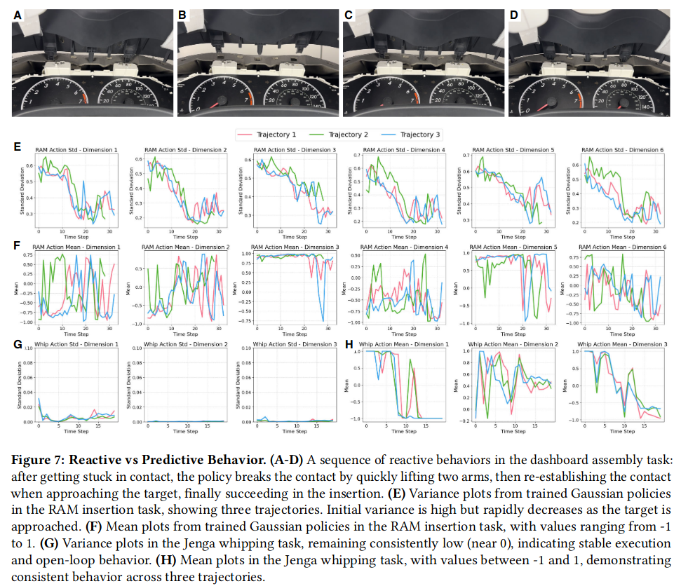

# Precise and Dexterous Robotic Manipulation via Human-in-the-Loop Reinforcement Learning
[toc]
## 前言
文中展示了一个**人类参与的基于视觉的强化学习系统**。该系统在诸多操作任务上比如动态操控，精确装配和双臂协同上有出色表现。文中的方法集成了演示和人类纠正，高效强化学习算法和其他系统级别设计。通过这些方法能达到很高的成功率和仅需几个小时的训练时间。文中的方法显著超越模仿学习和之前的强化学习方法，2倍成功率提高，1.8倍更快执行。文中的结果显示，强化学习能够直接在现实世界中以能够接受的训练时间内学习到复杂的基于视觉的操控策略。

## 1.引言
通过不断试错，一个高效的强化学习算法应该能够获得熟练的技能，不仅超越手动设计的控制器，还能超越人类控制。然而，达到这个是困难的，原因包括采样复杂度，猜想和优化稳定性。强化学习在虚拟环境训练中和大规模真实世界数据表现高效。强化学习也被用于手动提取特征或对特定领域任务的表征。然而，发展通用的能够超越模仿学习的能高效学习复杂物理技能基于视觉的方法仍然是困难的。
在这篇文章中，我们为基于视觉的操控提出一个强化学习系统，该系统能够习得广泛的精确且灵巧的机器人技能。该系统被称为**人类参与的高效采样的机器人强化学习**。该系统能在现实世界中实现快速和高效的强化学习。
为了解决优化稳定性的问题，文中为策略学习采用了一个预训练的视觉网络。为了解决采样复杂度问题，文中使用了基于**RLPD的离线强化学习**算法，包含人类演示和纠正。并且一个高度设计的低阶控制器也被用于确保训练中的安全。在训练中，系统请求人类操作来获得潜在的修正，可被用于之后升级策略。我们发现**人类参与的修正对策略从错误中学习并改善表现十分关键，尤其是对于挑战性任务**。

如图1所示，我们的系统解决的任务包括在平底锅中动态翻转物体，从积木塔中抽出积木块，在两只机械臂之间传递物体，以及使用一只或两只机械臂组装复杂设备，如计算机主板、宜家货架、汽车仪表板或正时皮带。这些任务在复杂和精细的动态、高维状态和动作空间、长时间跨度或其组合方面提出了重大挑战。其中一些技能以前被认为在现实世界环境中直接用强化学习训练是不可行的，例如许多双臂操作任务，或者几乎无法用当前的机器人方法完成的任务，如正时皮带组装或抽积木块。它们需要不同类型的控制策略，例如用于精确操作任务的反应闭环控制，或用于非常难以预设的精细开环行为，例如抽积木块。然而，也许最令人惊讶的发现是，我们的系统可以在现实世界中仅用1**到2.5小时的训练时间**，训练RL策略以实现几乎完美的成功率和超人级的循环时间，几乎所有任务都能达到这一水平。我们训练的RL策略在成功率方面平均提高了101%，循环时间快了1.8倍，远远超过了在相同数量的人类数据（例如相同数量的演示或纠正集）上训练的模仿学习方法。这个结果非常重要，因为它表明RL确实可以在现实世界中直接学习广泛的复杂基于视觉的操作策略，并且在实际的训练时间内完成，这在以前的方法中被认为是不可行的。此外，RL的表现远远超过了模仿学习和手工设计的控制器，达到了超人级的性能。
为了评估我们系统的有效性，我们将其与几种最先进的RL方法进行了比较，并进行了消融研究以了解每个组件的贡献。结果表明，我们的系统不仅优于相关基线，还突显了这些令人印象深刻的实证结果确实是由于这些组件的精心集成。此外，我们提供了对实证结果的全面分析，提供了关于基于RL的操作有效性的见解。该分析探讨了为什么RL能够实现近乎完美的成功率，并进一步研究了RL策略作为通用视觉策略获取不同类型控制策略的灵活性。
总之，我们的贡献表明，通过适当的系统级设计选择，RL可以有效地解决现实世界中广泛的灵巧和复杂的基于视觉的操作任务。值得注意的是，据我们所知，我们的系统是**第一个在现实世界环境中使用RL实现图像输入的双臂协调，以及像抽积木块和组装正时皮带这样的任务**。我们还提供了对基于RL的操作成功的全面分析，提供了关于基于RL的操作有效性的见解。这一分析塑造了我们对RL在这些复杂任务中成功的理解，并提出了进一步扩展基于RL的操作到更具挑战性场景的潜在方向。
通过本文中展示的结果，我们希望这项工作能成为未来基于学习的机器人操作研究的基石，从长远来看，能够实现适应多种环境和任务的稳健可部署的机器人操作技能，使我们更接近通用机器人操作的目标。
## 2.相关工作

该系统使用强化学习（RL）解决灵巧操作任务，因此我们调查了现实世界中机器人强化学习方法和系统的相关工作，以及解决类似灵巧操作任务的其他方法。

### 现实世界中的RL算法和系统

现实世界中的机器人强化学习（RL）需要能够高效处理高维输入（如机载感知）并支持轻松指定奖励和重置的算法。几种算法已经展示了直接在现实世界中高效学习的能力（Riedmiller等，2009；Levine等，2016；Luo等，2021；Yang等，2020；Zhan等，2021；Tebbe等，2021；Popov等，2017；Luo等，2019；Zhao等，2022；Hu等，2024b；Johannink等，2019；Hu等，2024a；Rajeswaran等，2018；Schoettler等，2020；Luo等，2024a）。这些包括离线策略RL的变体（Kostrikov等，2023；Hu等，2024b；Luo等，2023）、基于模型的RL（Hester和Stone，2013；Wu等，2022；Nagabandi等，2019；Rafailov等，2021；Luo等，2018）和在线策略RL（Zhu等，2019）。尽管取得了进展，这些方法通常需要较长的训练时间。我们的系统在复杂任务上实现了超越人类的表现，并且训练时间更短。

其他研究工作致力于通过成功分类器（Fu等，2018；Li等，2021）、基于基础模型的奖励（Du等，2023；Mahmoudieh等，2022；Fan等，2022）和视频奖励（Ma等，2023b；a）从原始视觉观察中推断奖励。此外，为了实现自主训练，已经有许多在无重置学习（Gupta等，2021；Sharma等，2021；Zhu等，2020；Xie等，2022；Sharma等，2023）方面的算法进展，这些算法在训练过程中需要最少的人类干预。**虽然我们在这些领域没有引入新的算法，但我们的框架有效地整合了现有方法**。正如方法部分所详述的那样，使用**基于二元分类器的奖励和演示**对于本文中的复杂任务是有效的。

与我们研究最相关的工作之一是SERL（Luo等，2024a），该工作也提出了一个用于训练灵巧操作任务的强化学习（RL）策略的系统。我们的方法与SERL的不同之处在于：我们结合了**人类演示和纠正**来训练RL策略，而SERL仅依赖于人类演示。虽然这看起来是一个微小的区别，但我们的结果表明，**整合纠正对于使策略从错误中学习并提高性能至关重要，特别是对于从头开始学习困难的任务**。此外，SERL专注于相对短期的简单任务，并且没有涉及双臂协调或动态操作。我们的独特贡献在于展示了我们的方法能够有效地学习广泛任务的通用视觉操作策略，这些任务具有不同的物理特性，使我们的系统与之前的SERL工作有根本不同。

### 灵巧机器人操作

对于本文中考虑的一些任务，先前的工作探索了替代方法。在插入任务中，先前的工作使用了基于模型的方法（Tang等，2016；Jin等，2021）和具有被动顺应性的末端执行器工具机制（Morgan*等，2021；Su等，2022）。这些方法通常依赖于无感知的基于状态的模型或需要特定任务的开发，限制了其鲁棒性和适应性。另一种方法是使用视觉伺服在多阶段管道中对齐机器人手臂与目标，然后使用搜索原语进行插入（Spector等，2022；Chang等，2024；Song等，2015）。它们也面临特征可靠性和对齐精度的挑战。相比之下，我们的方法采用了更紧密的感知-动作循环。它以闭环方式学习任务相关的视觉特征和视觉运动策略，这对于许多反应性高精度任务至关重要。从控制的角度来看，学习到的策略可以看作是输出反馈控制的一个实例（Astrom和Murray，2008）。

本文还考虑了一些动态操作任务（Mason和Lynch，1993）。Kormushev等（2010）利用运动捕捉系统和动态运动原语（Ijspeert等，2013）学习在平底锅中翻转物体。然而，我们的系统直接使用像素输入，消除了对精确运动捕捉系统的需求，同时实现了显著更高的成功率。Fazeli等（2019）提出了一种学习方法，以准动态方式从塔中推出积木。然而，我们的方法使用鞭子动态移除积木，呈现出一个更具挑战性的任务，需要更复杂的控制策略。此外，虽然有关于柔性物体操作的研究，如电缆布线（Luo等，2024b；Jin等，2019）、追踪或解缠（Viswanath等，2023；Shivakumar等，2023；Viswanath等，2022），但本文中的正时皮带组装任务要求两臂之间进行反应性且精确的协调，以动态调整张紧器和正时皮带。这个任务与之前的电缆操作工作有根本的不同，并且更具挑战性。

## 3.人在回路中的强化学习系统

在本节中，我们详细描述了论文中使用的方法。有关总结所述方法的动画电影，请参阅附带的视频。

### 3.1 初步和问题陈述

机器人强化学习任务可以通过一个马尔可夫决策过程（MDP）\( M = (S, A, P, p_0, r, \gamma) \) 来定义，其中 \( S \) 是状态观测（例如，图像与机器人的本体状态信息结合），\( A \) 是动作（例如，期望的末端执行器扭转），\( P(s') \) 是初始状态的分布，\( P \) 是依赖于系统动态的未知且可能是随机的转移概率，\( r: S \times A \rightarrow R \) 是奖励函数，它编码任务。最优策略是最大化奖励的累积期望值的策略，即 \( E[\sum_{t=0}^{\infty} \gamma^t r(s_t, a_t)] \)，其中期望是相对于 \( P(s')P(s_{t+1}|s_t, a_t)p_0(s_0) \) 计算的。

为了实现机器人任务的强化学习算法，我们必须仔细选择适当的状态观测空间 \( S \) 和动作空间 \( A \)。这涉及选择合适的摄像头组合、本体状态和相应的机器人低级控制器。对于我们所有的任务，我们采用稀疏奖励函数。该函数使用训练好的分类器对任务是否成功做出二元决策。在这种设置中，优化目标 \( E[\sum_{t=0}^{\infty} \gamma^t r(s_t, a_t)] \) 旨在最大化每个轨迹的成功概率。理想情况下，在收敛时，策略应在每次尝试中都能成功。

具体来说，我们构建的核心基础RL算法是RLPD（Ball等，2023），我们选择它是因为它的样本效率和能够结合先验数据。在每个训练步骤中，RLPD在先验数据和策略数据之间均匀采样以形成训练批次（Song等，2023）。然后根据各自损失函数的梯度更新参数化Q函数 \( Q(s, a) \) 和策略 \( \pi_\theta(a|s) \)：

\[ L_Q(\theta) = E_{s,a} [(Q_\theta(s,a) - (r(s,a) + \gamma E_{s'}[Q_{\theta'}(s',a')]))^2] \]

\[ L_\pi(\theta) = -E_{s} [E_{a \sim \pi_\theta(a|s)}[Q_\theta(s,a)] + \alpha H(\pi_\theta(a|s))] \]

其中 \( Q_{\theta'} \) 是目标网络（Mnih等，2013），并且演员损失使用自适应调整权重 \( \alpha \) 的熵正则化（Haarnoja等，2018）。

### 3.2 系统概述

我们的系统由三个主要组件组成：执行过程、学习过程和位于学习过程中的重放缓冲区，所有组件都以分布式方式运行，如图2所示。执行过程通过在机器人上执行当前策略与环境交互，并将数据发送回重放缓冲区。环境设计为模块化，允许灵活配置各种设备。这包括支持多个摄像头、集成用于远程操作的SpaceMouse输入设备，以及控制不同类型控制器的多个机器人手臂的能力。需要一个实现的奖励函数来评估任务的成功，该函数使用人类演示离线训练。在执行过程中，人类可以使用SpaceMouse干预机器人，从而接管RL策略对机器人的控制。

我们使用两个重放缓冲区，一个用于存储离线人类演示，称为演示缓冲区，通常范围在20-30；另一个用于存储策略数据，称为RL缓冲区。学习过程从演示和RL重放缓冲区中均等地采样数据，使用RLPD优化策略，并定期将更新的策略发送到执行过程。在本节的其余部分，我们将详细介绍我们为每个组件所做的设计选择。

### 3.3 系统设计选择

该系统的样本效率至关重要，因为每分钟的训练数据获取都会产生成本。因此，训练时间必须保持在一个实际范围内，特别是在处理高维输入（如图像）时。此外，下游机器人系统必须适应RL策略，以确保顺畅和高效的学习过程。例如，实际的低级机器人控制器需要特别小心，尤其是对于大多数精确的接触丰富任务，其中机器人在环境中与物体进行物理交互。这个控制器不仅需要准确，还必须足够安全，以便RL算法在训练期间可以通过随机动作进行探索。因此，为了开发能够在现实世界中执行样本高效策略学习的系统，我们做出了以下设计选择。

#### 预训练的视觉网络

为了提高训练过程的效率，我们使用**预训练的视觉骨干网络**来处理图像数据。这种方法现在在计算机视觉中已经成为一种常见做法，旨在提高鲁棒性和泛化能力（Radford等，2021；Dosovitskiy等，2021；Kolesnikov等，2020）；在强化学习（RL）中，这种处理方式还提供了额外的好处，如优化稳定性和探索效率（Yang和Wang，2019；Du等，2020），使这种方法在实际机器人RL训练中特别有利。我们的神经网络架构如图2所示，使用相同的预训练视觉骨干网络处理来自多个摄像头的图像。具体来说，我们使用了在ImageNet（Deng等，2009）上预训练的ResNet-10模型（He等，2015）来生成输出嵌入。这些嵌入随后被连接并进一步与处理过的本体感知信息整合，从而促进更高效和更有效的学习过程。

#### 奖励函数

强化学习系统的一个关键方面是奖励函数，它用于指导学习过程并确定策略的质量。虽然之前有研究利用奖励塑形来加速学习过程（Ng等，1999；Florensa等，2018；2017），但这种方法往往是任务特定的，设计起来耗时。在一些复杂任务中，进行这样的奖励塑形根本不可行。我们发现，使用稀疏奖励函数，结合人类演示和修正，为各种任务提供了一种简单而有效的设置。具体来说，**我们收集离线数据，并为每个任务训练一个二分类器，该分类器仅在任务完成时给予正奖励，否则为零**。

#### 下游机器人系统

为了适应策略学习过程，我们对下游机器人系统做出了一些特别重要的设计选择。为了促进空间泛化，我们在相对坐标系中表示机器人的本体感知状态，允许自我中心的表述。基本上，在每个训练回合开始时，机器人的末端执行器的姿态在工作空间的预定义区域内均匀随机化。机器人的本体感知信息是相对于末端执行器初始姿态的框架表达的；策略的动作输出是相对于当前末端执行器框架的。这一过程模拟了从附加在末端执行器上的框架相对地移动目标。因此，即使物体移动，或者在我们的一些实验中，在回合中途受到干扰，策略也能成功。对于涉及接触的任务，我们在实时层中使用带有参考限制的阻抗控制器以确保安全，如（Luo等，2024a）所述。对于动态任务，我们直接在末端执行器框架中命令前馈扭矩以加速机器人手臂，虽然它不执行围绕加速度的闭环控制，但我们发现这种简单的开环控制对于所考虑的任务是足够的。关于观测表示以及控制器设计的详细信息，请参阅补充材料。

#### 夹持器控制

对于涉及夹持器控制的任务，我们使用一个单独的评价网络来评估离散的抓取动作。尽管这种方法最初看起来像是额外的开销或有些不常规，但在实践中证明是非常有效的，特别是结合人类演示和修正时。离散动作的性质使得用连续分布来近似它们更加具有挑战性，尤其是在本文考虑的复杂任务中。通过使用离散动作，我们简化了训练过程并提高了强化学习系统的整体有效性。具体来说，我们在这些任务中解决了两个独立的马尔可夫决策过程（MDP），分别是M1 = {S, A1, p1, P1, r, y}和M2 = {S, A2, p2, P2, r, y}，其中**A1和A2分别是连续和离散动作空间**。它们都从环境中获取相同的状态观测，如图像、本体感知、夹持器状态等。离散动作空间A2包括所有可能的离散动作。对于单个夹持器，这些动作是“打开”、“关闭”和“保持”。如果涉及两个夹持器，动作空间扩展到3^2 = 9种组合，涵盖了每个夹持器可以采取的所有可能动作。M2的评价网络更新遵循标准的DQN实践（Mnih等，2013），并使用额外的目标网络来稳定训练。

$$
C(\theta') = E_{s \sim d_{\pi}} [ ( \gamma Q(s', \underset{a'}{\mathrm{argmax}} Q(s', a'; \theta^-); \theta^+)) - Q(s, a) )^2 ]
$$

其中，θ'是目标网络，可以通过Polyak平均化当前网络参数获得。

在训练或推理时，我们首先从M1中的策略查询连续动作，然后通过对评价网络输出取argmax从M2中的评价网络查询离散动作；接着我们将这些连接的动作应用到机器人上。

### 3.4. 人类参与的强化学习

在系统级设计选择到位后，我们现在描述用于加速学习过程的人类参与程序。强化学习理论文献中已经明确指出，学习最优策略的样本复杂性与状态和动作空间的基数以及任务时间范围密切相关（Jin等，2018；2020；Azar等，2012；Kearns和Singh，1998），假设有适当的探索策略。这些因素共同作为可行解决任务复杂性的“上限”的代理。具体来说，**状态/动作空间的大小、任务时间范围或它们的组合的增加会导致学习最优策略所需样本数量的比例上升**；最终跨越一个阈值，使得在现实世界中训练RL策略变得不切实际。为了应对现实世界机器人RL训练中的这一挑战，我们引入人类参与反馈来指导学习过程，帮助策略更有效地探索。具体来说，**人类操作员在训练期间监督机器人，并在必要时提供纠正动作**，如图2所示。在从时间步𝑡0到𝑡𝑁的自主展开轨迹中，人类可以在任何时间步𝑡𝑖进行干预，其中𝑡0 ≤ 𝑡𝑖 < 𝑡𝑁。在干预期间，**人类可以控制机器人最多𝑁步**。在单个轨迹中可以发生多次干预，如图2中的红色段所示。当人类干预时，他们的动作𝑎𝑖𝑡𝑣被应用到机器人上，而不是策略的动作𝑎𝑅𝐿。我们将干预数据存储在演示和RL数据缓冲区中。然而，我们仅将策略的转换（即干预前后的状态和动作）添加到RL缓冲区中。这种方法已被证明在提高策略训练效率方面是有效的。

这种干预在策略将机器人引导到不可恢复或不理想状态，或当它陷入局部最优而没有人类帮助需要大量时间才能克服时尤为重要。这一过程类似于HG-DAgger（Kelly等，2018），其中人类在策略表现不佳时接管机器人的控制以收集数据；但我们的方法使用这些数据通过强化学习而不是监督学习来优化策略，类似于Luo等（2023）。在我们的设置中，人类操作员使用**SpaceMouse 3D鼠标**为机器人提供纠正动作。在训练过程开始时，人类更频繁地进行干预以提供纠正动作，随着策略的改进，干预频率逐渐减少。根据我们的经验，我们注意到，当人类操作员发出具体的纠正时，同时让机器人自行探索，策略改进得更快。

### 3.5. 训练过程

为了阐明我们系统的训练过程并帮助读者重现我们的结果，我们详细介绍了每个实验中涉及的步骤。首先，我们选择最适合任务的摄像头。腕部摄像头由于提供自我中心视角，特别有助于促进学习策略的空间泛化。然而，如果仅靠腕部摄像头无法提供环境的全景，我们还会放置几个侧面摄像头。对于所有摄像头，我们进行图像裁剪以聚焦于感兴趣的区域，并将图像调整为128x128，以便神经网络处理。

接下来，我们收集数据以训练奖励分类器，这是定义指导学习过程的奖励函数的关键步骤。通常，我们通过远程操作机器人执行任务，**收集200个正样本和1000个负样本。这大约相当于10个人类轨迹，假设每个轨迹大约需要10秒**。使用我们的数据收集管道，如补充代码中详细描述的那样，通常需要大约5分钟来收集这些数据点。此外，我们可能会收集额外的数据以解决奖励分类器的假阴性和假阳性问题。训练后的奖励分类器在评估数据集中的准确率通常超过95%。

然后，我们收集**20-30条人类演示解决任务的轨迹**，并用它们**初始化离线演示回放缓冲区**。对于每个任务，我们要么编写机器人重置动作脚本，要么让人类操作员在每个轨迹开始时手动重置任务，例如USB插拔任务。最后，我们开始策略训练过程。在此阶段，如果有必要，可以对策略进行人类干预，直到策略收敛。还需要注意的是，我们应避免**持续提供导致任务成功的长时间稀疏干预。这种干预策略会导致价值函数的高估**，特别是在训练过程的早期阶段；这可能导致训练动态不稳定。

## 4. 实验结果

在本节中，我们讨论我们的实验。我们首先介绍实验设置和结果，然后讨论这些结果及其意义。

### 4.1. 实验概述

我们在七个不同的任务上进行了实验，这些任务涵盖了各种不同的特征，如图3所示。这些任务包括一系列操作挑战，包括动态物体操作（例如，在平底锅中翻转物体）、精确和细致的操作（例如，将SSD插入匹配的插槽）、动态和精确操作的结合（例如，在目标移动时插入组件）、柔性物体操作（例如，组装正时皮带）以及包含多个子任务的多阶段任务（例如，组装宜家书架）。我们通过使用单臂或双臂机器人以及各种观察和动作的组合来解决这些任务。观察空间可以包括来自腕部安装和侧面摄像头的图像、末端执行器的姿态、扭转、力/扭矩以及两个机械臂的当前夹持状态。对于动态任务，动作空间直接在末端执行器框架中命令前馈扭矩，这大致可以看作是期望的加速度。对于其他任务，动作空间可以包括每个机械臂的下游阻抗控制器的6D笛卡尔扭转目标，以及控制一个或两个夹持器的离散动作。对于所有任务，除非另有说明，我们训练了一个二元分类器作为奖励检测器，它以来自腕部和/或侧面摄像头的图像作为输入，并预测当前状态是否成功完成当前任务。为了训练这样的分类器，我们收集了来自人类操作员的正面和负面示范，如果有必要，我们还收集了额外的潜在假阳性或假阴性示例。我们在补充材料中包含了每个任务的训练过程的详细信息。对于涉及抓取的任务，我们还包括一个小的负面惩罚，以防止策略不必要地操作其夹持器。每个任务还使用脚本化的机器人运动或手动人类重置来随机化任务的初始状态。每个任务的设置和策略训练的详细信息可以在补充材料中找到。在本节的其余部分，我们将首先详细描述每个任务，并展示相关结果以及与其他最先进方法的比较。

### 4.2. 任务描述

本小节将介绍我们实验中的各项任务。我们选择的任务涵盖了广泛的操作挑战，包括丰富的接触动力学、双臂协调、柔性物体操作和动态操作。我们将任务按相似挑战进行分组。首先介绍两个需要在接触丰富的环境中进行精确操作的任务，然后是三个需要双臂协调才能完成的复杂任务，包括柔性物体操作。最后介绍两个需要动态操作的任务。图 3 展示了每个任务的示意图。

#### 主板装配

主板装配任务包括四个子任务：将内存条插入匹配的插槽，将 PCI-E 固态硬盘安装到主板上，拾取自由放置的 USB 数据线并将其插入插槽，以及将 USB 数据线固定到紧固的卡扣中。

**内存条插入**

在这个任务中，机器人需要将内存条插入匹配的插槽。该过程包括两个主要步骤：首先需要将内存条与插槽两侧的窄开口对齐，然后以适当的力向下 délicatement 推动，将内存条插入插槽。如果内存条完全插入插槽且未触发锁定机制，则认为任务成功，以便于重置。如果需要，可以在执行训练好的策略后施加额外的向下力以锁定内存条。这项任务具有挑战性，因为施加过大的力会导致内存条在夹爪内倾斜，从而导致失败，而力太小则可能导致内存条无法正确插入插槽。假设机器人已预先抓取内存条，但我们也会定期将其放回固定装置并重新抓取，以引入抓取变化。

**固态硬盘安装**

在这个任务中，机器人需要将固态硬盘的一侧插入匹配的插槽，然后将另一侧放置在主板上的固定装置上。如果固态硬盘的两侧都正确地与对应部分配对，则认为任务成功。此任务需要一开始采用轻柔但精确的插入策略，以避免损坏接触针脚，然后需要另一个精确的动作将另一侧与支撑夹具对齐。假设机器人已预先抓取固态硬盘，但我们也会定期将其放回固定装置并重新抓取，以引入抓取变化。

**USB 接口抓取-插入**

在这个任务中，USB 数据线随意放置在桌子上，机器人需要抓取 USB 接口部分，将其插入相应的插槽并松开夹爪。如果 USB 接口完全插入插槽并且夹爪已松开，则认为任务成功。困难在于 USB 数据线初始放置位置的可变性，以及抓取姿态的不确定性；策略必须学会在插入过程中考虑这种不确定性。例如，如果执行了不合适的抓取，策略可能需要释放物体并重新抓取以获得更好的抓取姿态。

**USB 数据线卡入**

该任务假设 USB 数据线已插入主板，机器人的任务是拾取数据线的剩余部分并将其插入紧固的整理卡扣中。如果 USB 数据线完全插入卡扣，则认为任务成功。困难在于可变形 USB 数据线的可变性以及紧密的插入阶段。

**整个组装**

我们还通过将上述四个子任务串联在一起，使用脚本化动作在子任务之间进行过渡，完成了整个组装任务。整个组装过程的视频片段可以在我们的项目网站以及补充材料中找到。视频展示了计算机在执行整个组装策略后成功启动，验证了我们方法的有效性，不仅实现了任务成功，还优雅地完成了强化学习训练过程，而没有损坏这些精密组件。

#### IKEA组装
IKEA组装任务涉及组装一个由四块板材构成的IKEA架子，该任务被分解为三个子任务：机器人首先需要将两块侧板组装到固定在桌子上的面板上，然后在组装完成后将顶板安装到侧板上。当所有部件都正确组装成架子时，即视为任务成功。对于所有子任务，我们假设机器人已预先抓取面板，但我们会定期将它们放回固定装置并重新抓取，以引入抓取变化。

**侧板组装**
在这个任务中，假设机器人已预先抓取侧板的顶部，尽管由于在交互式组装过程中面板的重量较大，抓取位置可能会发生变化，我们也会定期从固定装置重新抓取它们。如果底部正确地安装在两个配对销钉上，则视为任务成功。

**顶板组装**
在两块侧板组装完成后，这个任务要求机器人将顶板安装到两块侧板上。如果顶板的四个销钉都正确插入侧板上相应的孔中，则视为任务成功。这个任务很困难，因为在组装过程中侧板的顶部可能会移动，策略必须适应这些变化才能成功。

**整体组装**
我们还通过将三个训练好的策略串联起来执行整体组装任务，使用脚本化动作在子任务之间过渡，这在图3和补充材料中有所说明。对于每个子任务，我们在每个平移维度上统一随机化脚本抓取姿势1厘米，以引入策略变化。如果所有面板都成功组装，则视为该任务成功，每个子策略最多允许尝试两次。对于这个任务，由于它是一个很长期的任务，我们对串联策略进行了10次试验。

#### 其他任务
**汽车仪表板组装**

如图 3 所示，汽车仪表板组装任务包括两个阶段：两个机械臂首先需要抓住工件的适当位置，然后将其抬起，组装到仪表板上。如果工件的所有销钉都完全插入仪表板上相应的孔中，则该任务被视为成功。这项任务需要精确的操作以及双臂协调：两个机械臂必须协调运动和夹爪闭合的时机，才能抬起工件，旋转它并同时对齐多个销钉。

**物体交接**

在这个任务中，需要两个机械臂协调将物体从一个篮子转移到另一个篮子。右臂首先从右侧的篮子中拾取物体。然后，它将物体交给左臂，左臂将物体精确地放入左侧的篮子中。如果物体平放在右边的篮子里，则该任务被视为成功。交接部分具有挑战性，因为机器人的夹爪必须协调运动的时机，以防止物体掉落。

**同步带组装**

在这个任务中，两个机械臂协作将同步带组装到滑轮上并启动张紧器。此任务是 NIST 电路板组装挑战赛的一部分 (Kimble et al., 2020)。该过程包括定位和操纵随机放置的皮带，协调精确的运动以将皮带穿过两个滑轮，并同时启动张紧器以容纳皮带。如果皮带正确地穿在两个滑轮上并且张紧器牢固地拧紧，则认为成功。这项任务提出了几个挑战。皮带在组装过程中可能会发生不可预测的变形，需要自适应操作。机械臂必须精确协调，并通过仔细计时的运动来有效地穿线。张紧器调整的时机至关重要，因为张紧器必须允许皮带穿过，同时避免卡住。在整个过程中，策略必须不断适应柔性皮带和整个系统配置的变化状态。这项任务的复杂性源于需要处理可变形物体，同时精确协调双臂动作并管理张紧器机构。这需要策略开发复杂的反应行为才能持续成功。

**积木抽取 (Jenga Whipping)**

在这个任务中，机器人应该从积木塔中抽出特定的积木块，而不会使塔倒塌。这项任务的性质与之前的任务大不相同，因为它要求机器人学习高度动态的开环行为，而不是之前任务中所需的反应性闭环行为。这项任务的动力学极其复杂：可变形的鞭子以非常高的速度移动并与周围的压缩空气相互作用，使其运动难以预测。此外，由于涉及复杂的接触动力学，确定在不破坏整个塔的稳定性的情况下移除特定块所需的精确力会进一步增加复杂性。策略必须通过观察自身行为的结果、直观的物理原理以及鞭子和积木块之间的相互作用来发展类似反射的行为。这使得机器人能够执行精确且一致的运动，从而成功地移除目标块而不会导致塔倒塌。请注意，对于这个特定任务，我们使用 30 个专家演示来初始化离线数据集，而不是使用实时人工校正。这是特意选择的，因为考虑到任务的独特性质，在训练期间结合人工反馈既不切实际也不合适。

**物体翻转**

在这个任务中，一个物体被随机放置在连接到机器人末端执行器的盘子上，机器人的任务是将物体绕水平轴翻转。如果物体翻转到另一侧并留在盘子中，则该任务被视为成功。由于物体的初始放置是随机的，因此策略必须学会适应这些变化，例如，在执行翻转动作之前将物体移动到更有利的位置。该任务的性质类似于积木抽取任务，需要精确而复杂的开环行为。然而，它也涉及闭环组件，因为策略可能需要首先重新定位对象。

### 4.3 实验结果

在本小节中，我们将展示上述所有任务的实验结果。对于每个任务，我们报告成功率、循环时间和训练时间。训练时间包括所有脚本化运动、策略 rollout、有意停止以及在单个 NVIDIA RTX 4090 GPU 上进行的机载计算。除非另有说明，所有结果均基于 100 次评估试验。在这些评估中，我们使用脚本化机器人运动或人工重置来随机化初始状态。我们的评估协议可以在补充材料中找到。

本文的一个核心论点是 HIL-SERL 优于基于人工遥操作的模仿学习方法。为了证实这一点，至关重要的是在相同的设置下公平地比较相关的模仿学习方法。如 (Ross et al., 2011) 指出的，朴素的模仿学习方法经常受到误差累积问题的影响。DAgger 及其变体 (Ross et al., 2011; Kelly et al., 2018) 通过结合人工纠正来改进策略，从而解决了这个问题，这些纠正通过监督学习来优化策略。我们的方法也利用了人工纠正，但不同的是，我们利用它们通过基于特定任务奖励的强化学习来优化策略。因此，我们将我们的方法与模仿学习进行比较，方法是使用 HG-DAgger (Kelly et al., 2018) 训练一个基线，使用与强化学习中相同数量的人工演示和纠正。我们首先使用与我们的方法提供的相同数量的离线人工演示，通过行为克隆 (BC) 预训练一个基本策略。然后，我们运行此策略并收集人工专家纠正，以使试验和干预的总数与强化学习训练相匹配。具体来说，我们运行它的 episode 数量与我们的方法相同，并旨在提供每 episode  相当数量的干预。

除了叠叠乐抽积木和物体翻转任务之外，所有任务都进行了这种比较，因为这两个任务中的干预具有挑战性且不可取。对于这些任务，我们改为收集 50 和 200 个离线演示，并训练 BC 策略作为基线。这提供了比我们的方法多得多的演示数量，我们的方法通常只需要 20-30 个演示。

在我们所有的实验中，我们使用成功率和循环时间作为主要指标来比较不同的方法。为了进一步验证我们方法的有效性，我们还报告了随时间变化的干预率，表明我们的策略逐步改进，减少了对干预的需求。理想情况下，干预率趋向于零，表明策略可以自主执行。实验结果如图 4 和表 1a 所示。

首先，如表 1 所示，HIL-SERL 在几乎所有任务的 1 到 2.5 小时的真实世界训练中都达到了 100% 的成功率。这比 HG-DAgger 基线有了显著的改进，后者在所有任务中的平均成功率为 49.7%。对于需要更复杂行为的任务（叠叠乐抽积木、RAM 插入和同步带组装），性能差距更为明显。我们还在图 4 中报告了几乎所有任务随时间变化的人工干预次数。具体来说，我们报告了干预率，为此我们计算了在一个 episode 内干预时间步长与总时间步长的比率，并报告了超过 20 个 episode 的运行平均值。如图所示，随着训练的进行，干预率逐渐降低，表明策略正在改进并且减少了对人工纠正的依赖。此外，我们观察到干预的总持续时间急剧减少。最初，当策略不成熟时，我们会进行长时间的、稀疏的干预。随着策略的改进，较短的干预足以纠正较少的错误。相比之下，HG-DAgger 策略需要更频繁的干预来纠正策略，并且干预的总持续时间不一定会随着时间的推移而减少。因此，我们的方法以较少的人工监督实现了更好的性能。

我们的方法由于强化学习的关键优势而优于 HG-DAgger。强化学习探索了更广泛的状态空间，并直接优化了特定任务的奖励，而 DAgger 依赖人工纠正可能会引入不一致性并限制状态空间探索。由于强化学习从其自身的状态分布中学习并自主纠正错误，因此它克服了人类演示的限制，从而产生了更鲁棒的策略。这些经验发现与 (Luo et al., 2023) 中讨论的理论结果一致，这些结果表明，强化学习 (RL) 策略原则上可以优于 DAgger。随着人工纠正的次优性增加，性能差距往往会扩大，这种情况更有可能在任务变得更复杂时发生。

另一个需要考虑的重要方面是循环时间，即完成任务所需的时间。平均而言，HG-DAgger 策略的平均循环时间为 9.6 秒，而我们的方法的平均循环时间为 5.4 秒。这表明速度提高了 1.8 倍。这种改进是预期的，因为模仿学习方法缺乏处理人工演示次优性的机制。相比之下，强化学习 (RL) 可以利用动态规划来优化折扣奖励总和。对于折扣因子 𝛾 < 1，这种方法鼓励策略更快地获得奖励，从而与模仿人类演示所获得的循环时间相比，循环时间更短。

从这些实验中，我们注意到，我们的方法被证明是通用的，并且在具有 vastly 不同物理属性的任务中都很有效，它可以生成非常适合每个任务特定要求的开环和闭环策略。对于精确的操作任务，例如组装同步带或插入 RAM，该策略学习将与任务相关的视觉特征与适当的扭转运动联系起来。它执行连续的视觉伺服行为，实时响应流式观察结果，并调整其运动直到到达目标。相反，对于叠叠乐抽积木和物体翻转等任务，该策略学习通过交互预测其动作的潜在结果。然后，它精确地改进其运动以达到预期的结果，同时保持执行的一致性。我们还提供了对学习行为的深入分析，我们将在后面的章节中讨论。

总的来说，我们的实验表明，我们的方法既通用又有效。它使用相同的方法成功地学习了各种具有挑战性的操作任务的策略，并在所有任务中都实现了高性能。此外，即使对于高维观测和动作空间（例如双臂操作所需的那些），它也能在实际训练时间内实现这种性能。

### 4.4 鲁棒性结果

为了测试我们方法学习到的策略的零样本鲁棒性，我们在图 5 中提供了一组定性结果。这些结果证明了策略能够动态地适应变化并处理外部干扰，例如人为地从夹具中掉落物体，或者人为地在任务执行期间强行打开夹具。相应的视频剪辑可以在我们的补充材料和网站 https://hil-serl.github.io/ 中找到。

在同步带组装任务中，同步带可能会发生任意变形，并且策略应该在组装过程中适应这些变化。此外，我们引入了外部干扰来进一步测试策略的鲁棒性。这些干扰包括人为地扰动同步带的形状或在组装过程中动态地重新定位它，如图 5 (C) 和 (D) 所示。在 RAM 插入任务中，由于本体感受观察的以自我为中心的表示，即使目标在插入过程中移动，学习到的策略也能成功插入 RAM，如图 5 (A) 所示。对于汽车仪表盘组装和物体交接任务，在策略抓住物体后，我们在任务执行期间强制打开夹具。策略通过重新尝试抓住物体并继续执行其余任务来应对这种意外情况，如图 5 (B)、(E) 和 (F) 所示。在 USB 连接器抓取插入任务中，我们改变了 USB 连接器的初始姿态，并偶尔将其强制从夹具中取出，以模拟抓取姿态不良的情况。策略通过释放连接器并重新抓取它以获得更好的插入姿态来适应这种情况，如图 5 (G) 和 (H) 所示。这些鲁棒行为是通过在强化学习训练阶段的自主探索实现的。例如，策略学习将抓取姿态与下游插入任务联系起来，并在必要时重新抓取物体。然而，这些鲁棒行为通常很难用模仿学习方法来实现，因为它们缺乏这种自主探索和从其行为结果中学习的机制。

### 4.5  其他基线比较

为了验证我们方法中设计选择的有效性，我们对三个代表性任务进行了额外的比较：汽车仪表盘面板组装（双臂协作）、RAM 插入（精确操作）和物体翻转（动态操作）。我们将我们的方法与几种最先进的方法进行比较，以突出其性能的不同方面。为了说明人工干预的重要性，我们进行了消融研究，改变了人工演示和纠正的数量。为了展示我们的方法如何有效地结合和利用人工演示，我们与 Residual RL (Johannink et al., 2019)、DAPG (Rajeswaran et al., 2018) 和 IBRL (Hu et al., 2024a) 进行了比较。此外，我们还与 Diffusion Policy (Chi et al., 2024) 进行了比较，以确保任务难度并非完全源于人类演示中的多模态性。这些全面的比较有助于验证我们方法在各种操作场景中的有效性和能力，结果如表 1 所示。

我们首先注意到，**从零开始的强化学习，没有任何演示或纠正，在所有任务上的成功率都为 0%**。为了验证在线人工纠正的重要性，我们将 SERL 离线缓冲区中的演示数量增加了十倍，从通常的 20 个增加到 200 个。然而，如果没有在线纠正，这种方法会导致成功率明显低于 HIL-SERL，包括在复杂任务（如汽车仪表盘组装）上完全失败（成功率为 0%）。这证实了**在线纠正**在促进策略学习中的关键作用。这些结果证实了离线演示和在线人工干预在指导策略学习中的关键作用，特别是对于需要持续反应行为的复杂操作任务。

对于物体翻转任务，我们使用 20 和 200 个演示训练了 BC 策略。这两个 BC 策略的结果非常相似，成功率分别为 47% 和 46%，即使演示数量增加了十倍。这表明仅仅模仿人类演示不足以解决此任务，即使它很大程度上是开环的。

另一个需要考虑的重要方面是我们的方法如何处理演示与其他方法的比较。为了与提到的基线进行比较，我们为每个任务收集了 200 个演示。请注意，此数字大大超过了我们方法中离线演示的数量，后者通常在离线重放缓冲区中约为 20-30 个。对于 Residual RL 和 IBRL，我们使用这些演示训练了行为克隆 (BC) 策略，以馈入其算法流程。对于 DAPG，我们将这 200 个演示存储在一个单独的缓冲区中，并将策略操作正则化到它们的方向。总体而言，我们的方法始终大幅优于这些基线，如表 1 所示。这可以解释如下。Residual RL 依赖于预训练的 BC 基本策略来促进学习过程。然而，这种方法对于需要精确操作的任务（例如汽车仪表盘组装或 RAM 插入）可能会出现问题。在这些情况下，模仿学习方法（包括 BC）通常表现不佳。结果，强化学习策略学习过程可能会经历重大失败。对于 IBRL，actor 是 BC 策略和 RL 策略的混合体，使其行为更像“BC”。这种方法在 BC 表现不佳的任务中表现不佳。对于 DAPG，由于它直接将策略操作正则化到演示的方向，因此策略的性能与 BC 策略相似也就不足为奇了。因此，它在我们方法需要更多反应性和复杂行为的任务中表现不佳。我们方法的有效性来自于底层强化学习算法的离策略性质，该算法根据其与当前策略优化目标的相关性动态地加权人类数据。与严重依赖于人类演示质量的 Johannink et al. (2019); Hu et al. (2024a); Rajeswaran et al. (2018) 不同，我们的方法有一种机制允许在训练早期有效地利用人类数据，同时使 agent 能够逐步超越人类水平的性能。至关重要的是，它防止 agent 受限于人类演示的局限性，在从演示中引导和通过自主探索发现新的、更好的策略之间取得平衡。为了与 Diffusion Policy (Chi et al., 2024) 进行比较，我们使用 200 个演示为每个任务训练策略，这大大超过了我们方法使用的离线重放缓冲区中可用的 20 个演示。我们在补充材料中报告了使用实验得出的最佳算法参数的结果，例如观察和动作分块长度，以及应用的动作序列的长度。在 RAM 插入和汽车仪表盘面板任务上，diffusion policy 的成功率分别为 27% 和 28%。在物体翻转任务中，成功率为 56%。这种性能明显低于我们的方法，甚至低于 HG-DAgger 基线。这个结果并不令人惊讶，因为 diffusion policy 的主要优势在于学习更具表现力的策略分布，以准确地“记忆”机器人运动。然而，这些任务需要更多“闭环”反应行为，例如连续视觉伺服以纠正运动误差。因此，diffusion policy 在学习更具表现力的策略分布方面的优势并不一定会导致在这些任务中获得更好的性能。

## 5. 结果分析

为了更深入地了解我们的结果，我们对学习到的策略进行了详细分析。该分析侧重于两个关键方面：可靠性和学习行为。我们研究了为什么学习到的策略能够在各种不同的任务中始终保持较高的成功率，并探讨了有助于其鲁棒性的因素。此外，我们还深入研究了策略习得的行为的性质，特别探讨了反应式策略和预测式策略之间的区别。这一综合分析旨在阐明有助于我们方法在解决复杂操作任务中有效性的潜在机制。

### 5.1 学习策略的可靠性

HIL-SERL 的一个关键优势在于其高可靠性，在所有任务中均达到了 100% 的成功率。我们认为这种可靠性源于强化学习通过策略采样进行自我纠正的固有能力，使 agent 能够通过从成功和失败中学习来不断改进。相比之下，模仿学习方法（包括交互式方法）缺乏这种自我纠正机制，因此使用相同数量的数据来达到类似的性能要困难得多。虽然现有的理论工作讨论了 Q 学习的收敛性 (Papavassiliou and Russell, 1999; Bhandari et al., 2018; Jin et al., 2020; Yang and Wang, 2019)，但我们的分析侧重于对训练动态的直观理解。

为了说明这一点，我们分析了 RAM 插入任务，该任务需要精确操作，并且由于 X 和 Y 方向上的对称随机化而易于可视化。我们在图 6 中绘制了不同策略检查点的状态访问计数的热图，基于末端执行器的 Y 和 Z 位置。通过策略学习，我们观察到连接初始状态和目标位置的漏斗状形状逐渐形成。随着空白区域被填充，这个漏斗变得更加清晰，并且在接近目标时变窄，表明策略的置信度和精度有所提高。随着时间的推移，质量集中在更有可能成功的区域。然后我们引入了“关键状态”的概念，定义为 Q 函数方差较大的状态。我们使用以下公式计算此方差：

$$
\text{Var}[Q(s, a)] = \mathbb{E}_{\epsilon \sim \mathcal{U}[-c, c]} \left[ (Q(s, a + \epsilon) - \mathbb{E}_{\epsilon \sim \mathcal{U}[-c, c]}[Q(s, a + \epsilon)])^2 \right]
$$

对于每个数据点及其关联的策略检查点，我们在每个状态的动作（归一化到 [-1, 1]）中添加 [-0.2, 0.2] 的均匀随机噪声，并使用蒙特卡洛采样（100 个样本）计算 Q 函数方差。较大的方差表示该状态对策略的成功至关重要，因为采取不同的行动会导致 Q 值的显著差异（通常小得多）。图 6 还显示了不同状态下 Q 值及其方差的热图。这些图清楚地表明，策略正在形成一个漏斗，其中访问次数最多的状态获得更高的 Q 值和更高的 Q 值方差。这表明策略正在增强该区域的鲁棒性，通过动态规划有效地将重要状态与导致高 Q 值的动作连接起来。

相比之下，HG-DAgger 在同一任务上的状态访问计数热图（图 6 的第四行）显示出更加稀疏的分布。漏斗形状不太明显，更扁平，质量更分散，与 RL 案例相比，状态访问更加均匀。这是因为 RL 可以自主探索并使用由任务奖励引导的动态规划，而 DAgger 只能围绕当前策略进行探索。因此，为了达到类似的性能，DAgger 可能需要更多的演示和纠正，以及操作员的仔细关注以确保数据质量。

这种漏斗状稳定行为已在基于状态的灵巧操作和运动规划中得到研究 (Burridge et al., 1999; Tedrake et al., 2010)。然而，我们的方法的不同之处在于，我们直接利用感知输入并使用 RL 探索来自主形成漏斗。在最优控制中，一个类似的概念是开发控制器，该控制器使用局部反馈 (Astrom and Murray, 2008) 来稳定标称轨迹周围的区域。在我们的例子中，演示和纠正可以被视为“标称轨迹”，RL 方法围绕这些轨迹开发漏斗以实现稳定性。

### 5.2 反应式策略和预测式策略

为了解决大多数高精度操作任务，我们需要一个闭环反应式策略，它能够快速响应即时感官反馈，从而实现实时的精确调整。另一方面，对于动态操作任务，例如叠叠乐抽积木和物体翻转，最好采用开环预测式策略，该策略提前计划并一致地执行动作。为了说明这一点，我们选择了两个需要这两种不同类型策略的代表性任务：叠叠乐抽积木和 RAM 插入，进行分析。为了可视化这些策略类型之间的差异，我们在图 7 中绘制了训练好的高斯策略计算出的动作。

对于这两个任务，我们通过绘制策略计算出的标准差和均值随时间的变化来分析三个成功的轨迹。从这些图中，我们观察到，虽然两种情况下平均动作都涵盖了广泛的值，但标准差揭示了不同的策略行为。在叠叠乐抽积木任务中，标准差在所有时间步长中始终保持较低（非常接近 0）。这表明这是一个高度自信和一致的策略，非常适合需要开环行为的任务。类似于网球运动员 developing a reflex，策略学习执行精确的、预先计划的动作。通过与环境的交互，它改进了这一动作以最小化预测误差，从而实现一致的执行。相反，RAM 插入任务表现出不同的模式。最初，标准差要高得多（约为 0.6），反映了早期接近目标时的不确定性。然而，它随着时间的推移迅速减小，表明最初的粗略接近动作在接近目标时变得更加精确。由于任务的精度要求，此任务需要一个能够在各种情况下进行误差校正的反应式策略，因为长期的预测控制是不切实际的。这种反应式行为在复杂的操纵任务（如仪表盘面板组装或同步带安装）中更为明显。在这些情况下，策略必须根据感官反馈不断调整其动作，通常需要多次尝试才能成功，例如断开接触并重新接近目标，如图 7 所示。这些情况下的较高方差表明策略已准备好对变化的情况做出快速反应。

值得注意的是，这种类型的反应式行为是 agent 通过与环境交互获得的。换句话说，agent“免费”获得了这种行为——我们没有明确地制定问题来解决特定的动态行为。相反，期望的响应作为解决方案的一部分通过持续的交互自然地出现。先前的工作 Marcucci et al. (2017); Hogan and Rodriguez (2016); Aceituno-Cabezas and Rodriguez (2020) 曾尝试将这些接触丰富的操作问题表述为混合整数规划，用于生成的混合系统，这使得策略可以规划不同的接触模式和相应的运动。然而，随着规划范围的增加，这些方法很快就会变得难以计算，因为可能的接触模式数量会随着规划范围的长度呈指数增长。此外，它们需要精确的状态估计器，而这在许多现实世界的任务中并不总是可用。相比之下，我们的方法直接利用感知来学习遇到接触时的反应行为。通过交互，它对找到解决方案所需的关键动力学进行编码，而不是将这些动力学视为问题公式的一部分。然而，先前的方法将复杂或棘手的动力学纳入问题公式本身，使得这些解决方案更难推导并且可扩展性更差。

总的来说，我们的方法展示了在统一的算法框架内学习这些不同策略类型的灵活性。通过与环境交互并观察其行为的结果，该方法适应了每个任务的特定需求。这种适应性使系统能够有效地处理需要不同行为的任务，涵盖了广泛的操作挑战。

## 6. 讨论

目前的结果大大推进了已发表的机器人操作技术的最新水平。我们的研究表明，通过正确的设想选择，无模型强化学习实际上可以有效地处理各种复杂的操纵任务，利用感知输入，在实际时间范围内直接在现实世界中进行训练。这种方法训练出的策略性能很高，实现了近乎完美的成功率和比其他方法（如模仿学习）快得多的循环时间。

除了结果本身之外，这项工作中提出的方法还可以产生更广泛的重大影响。它可以作为一个通用框架，用于获取各种具有高性能的操作技能并适应变化。这在高混合小批量 (HMLV) 制造或“按订单生产”中尤其有价值 (Jina et al., 1997; Shah and Ward, 2003; Gan et al., 2023)。这种生产方法在主要行业（如电子、半导体、汽车和航空航天）中具有巨大的潜力，因为它们需要更短的产品生命周期、定制化、灵活性和敏捷性。

我们看到了未来工作的一些机会。首先，我们的方法可以作为一个有效的工具，生成**高质量的数据**来训练机器人基础模型 (Brohan et al., 2023b;a; Collaboration et al., 2024; Team et al., 2024; Kim et al., 2024)。鉴于每个任务只需要相对较短的训练时间，而且训练过程基本上是自主的，因此该框架可以用来开发各种技能。随后，可以通过执行收敛的策略来收集数据，然后将其提炼到这些通用模型中。其次，尽管目前的训练时间相对较短，但每个任务仍然需要**从头开始训练**。我们可以通过预训练一个价值函数来进一步减少这个时间，该价值函数封装了用不同的机器人实体解决一系列不同任务的通用操作能力。然后，可以对这个预训练的价值函数进行快速微调，以处理特定任务。

我们也看到我们方法的一些局限性。虽然我们成功地解决各种具有挑战性的任务，但这种方法是否可以进一步扩展到具有更长视野的任务（其中样本复杂性问题变得更加突出）仍然不确定。然而，这种挑战可以通过改进的预训练技术或采用自动将长视野任务分割成一系列较短子任务的方法（例如视觉语言模型）来缓解。同样重要的是要注意，我们没有在实验中进行广泛的随机化，也没有在非结构化环境中测试该方法的泛化能力。本文的主要重点是证明该方法在获取各种具有高性能的操作技能方面可以是通用的。我们相信，随机化问题可以通过像 Luo et al. (2021) 中那样，通过扩展策略的训练时长以及所需的随机化级别来解决。此外，泛化问题可以通过结合在大型多样化数据集上预训练的视觉基础模型来解决。

我们希望这项工作能够为使用强化学习解决机器人操作问题铺平道路，实现高性能并最终将它们部署到现实世界中。
