# lecture3 Optimal Policy and Bellman OPtimality Equation
[toc]
## Optimal policy
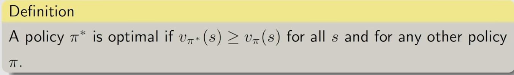
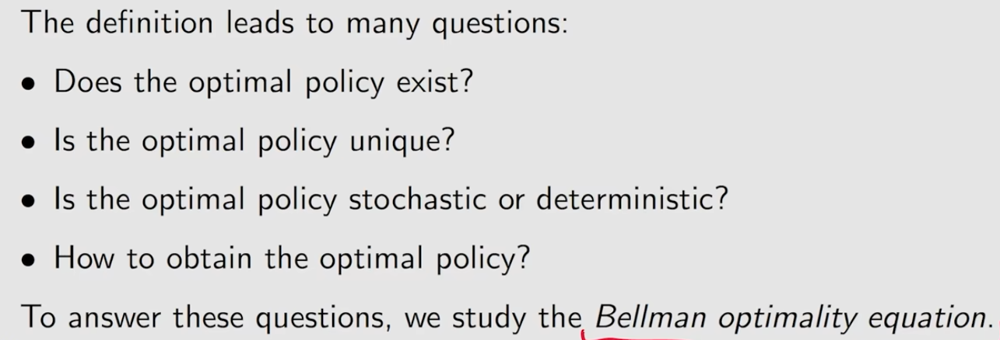

## Bellman optimality equation(BOE)
### BOE introduction
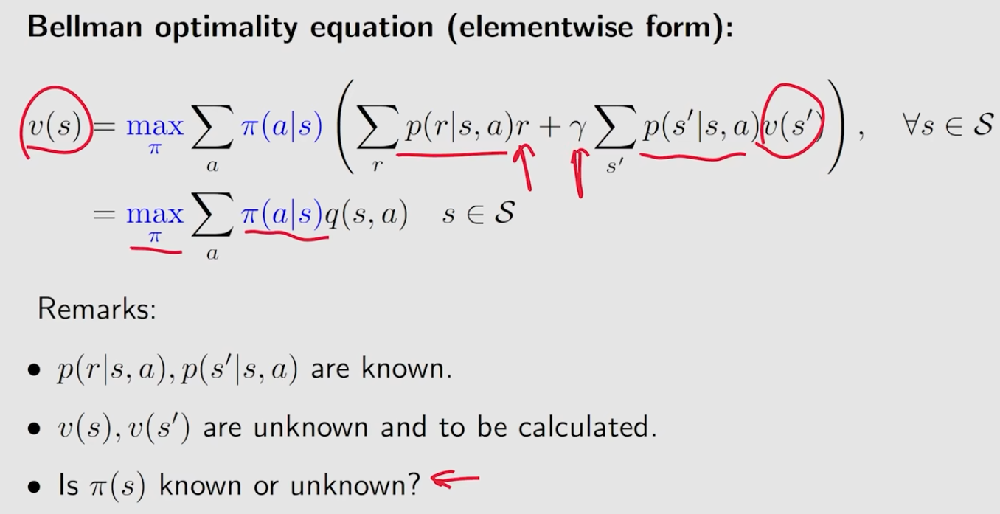
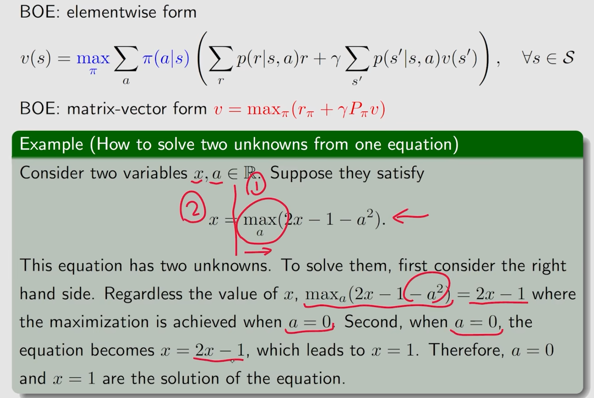
### maximization on the right side
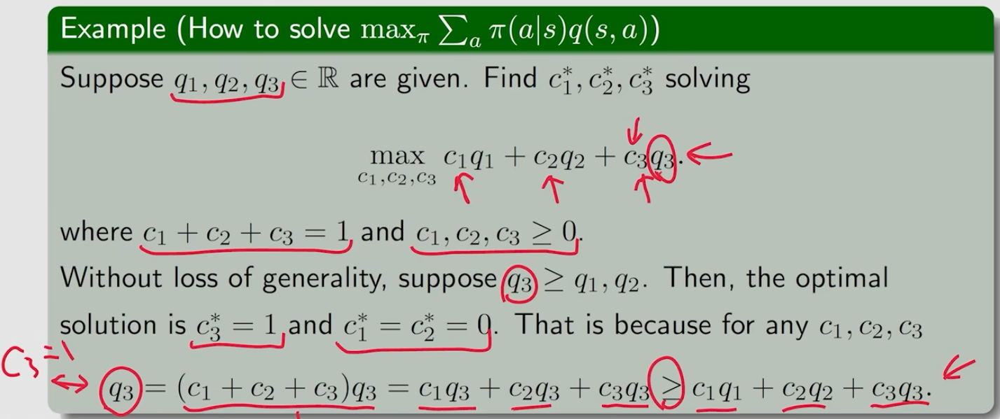
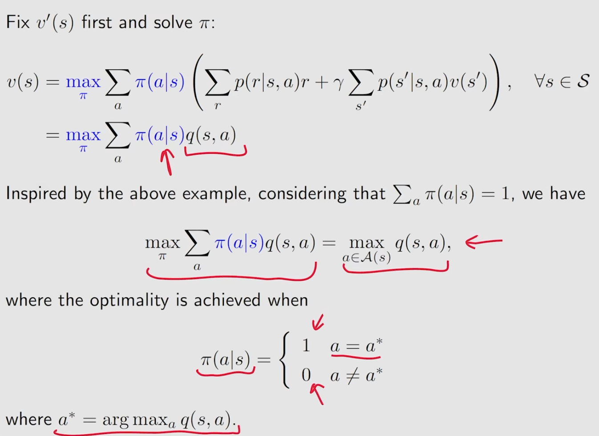

### Contraction mapping theorem
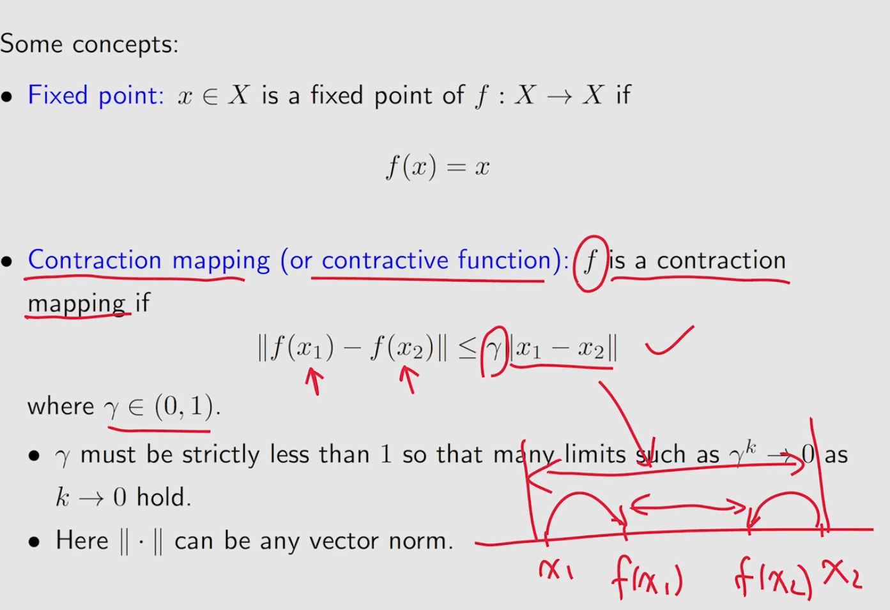
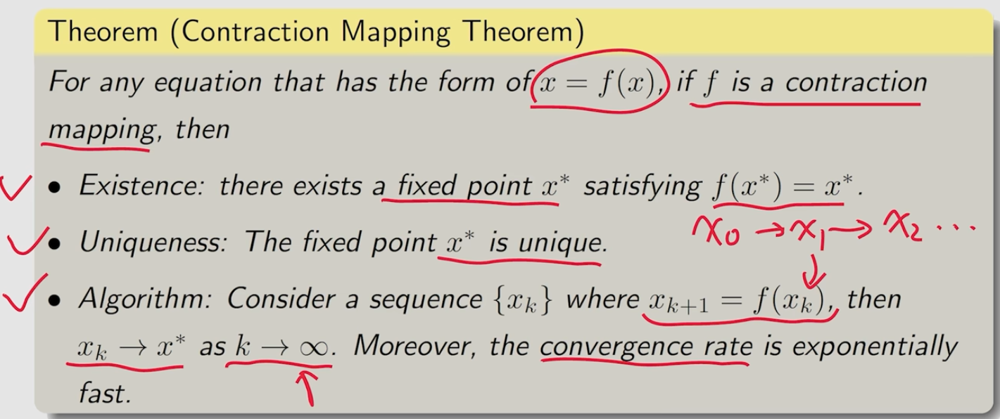

### BOE solution
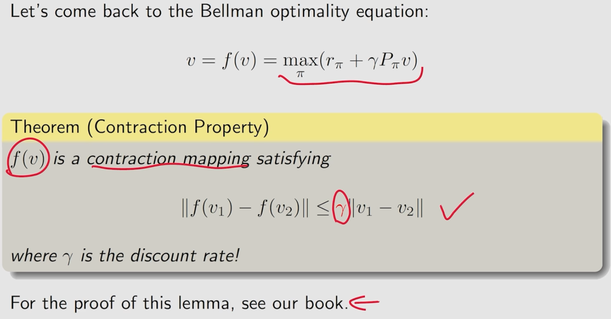
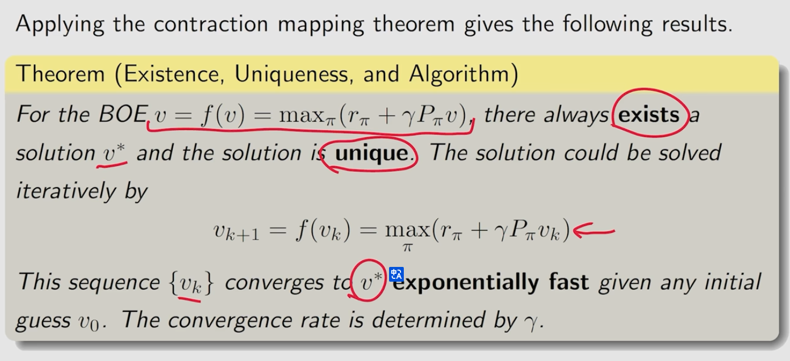
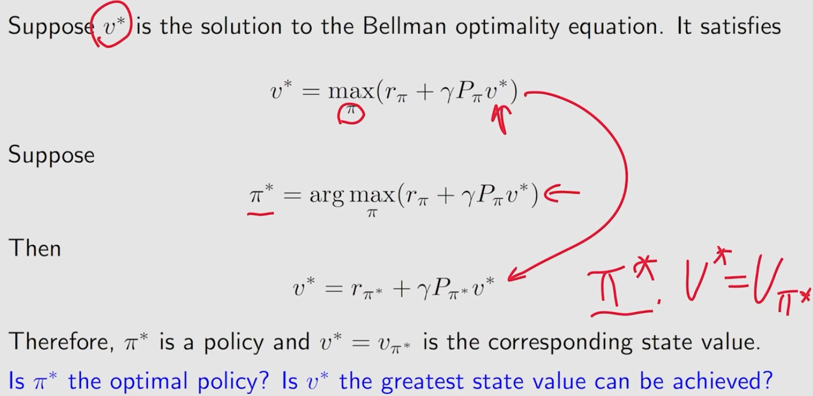
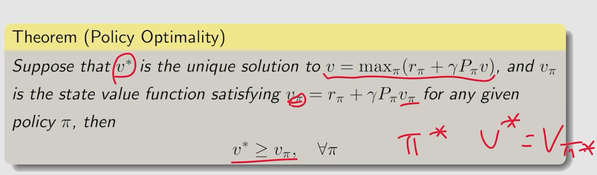

## analyze optimal policies

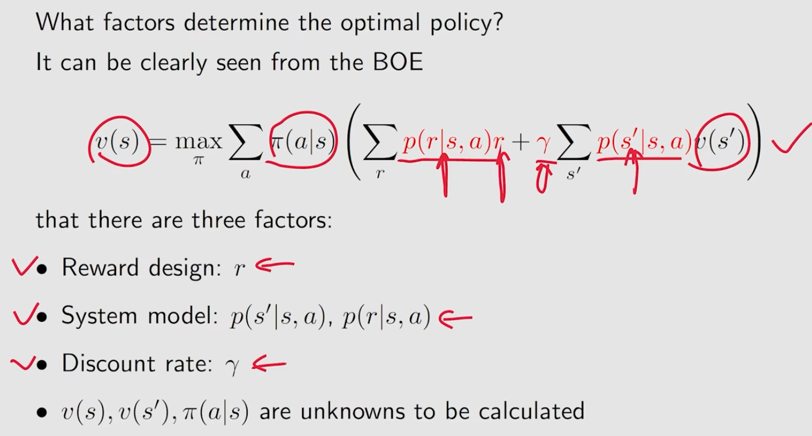
### $\gamma$大小的影响

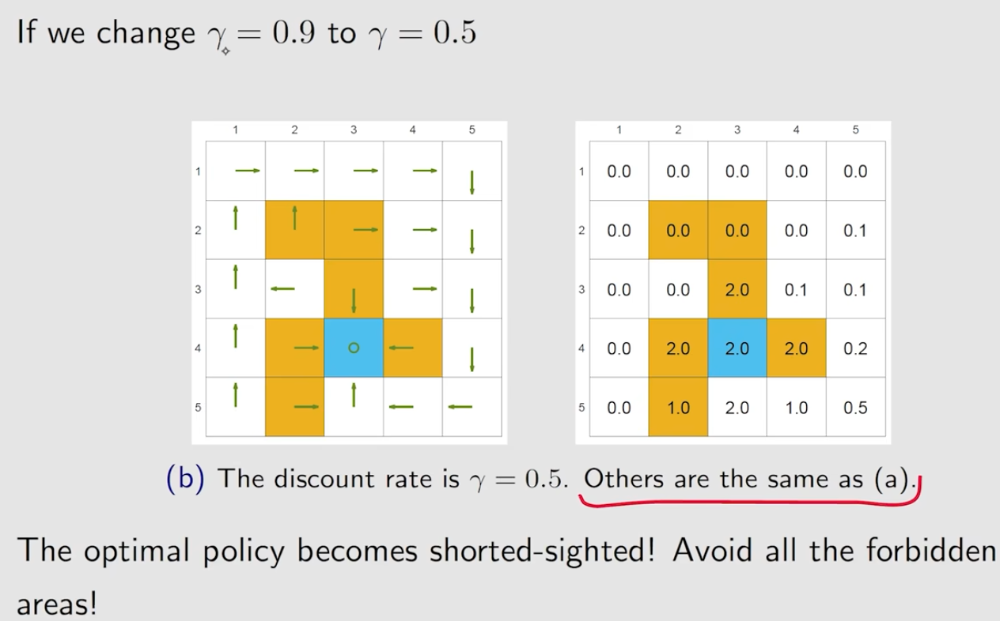

### r线性变换的影响
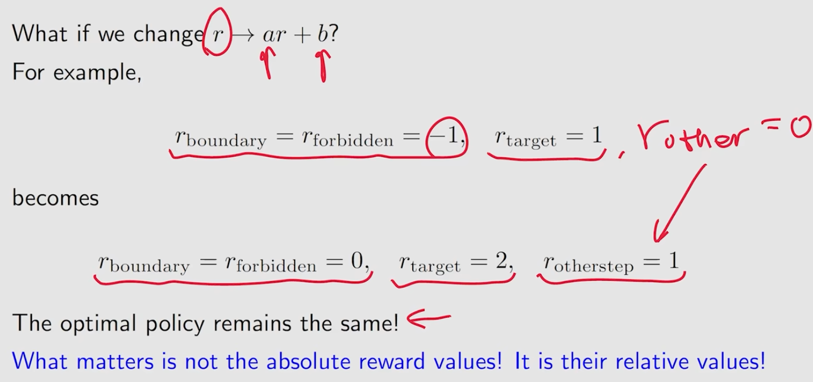

## 总结

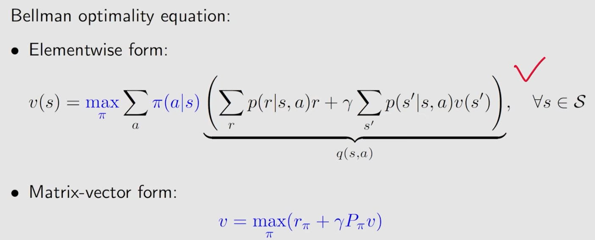
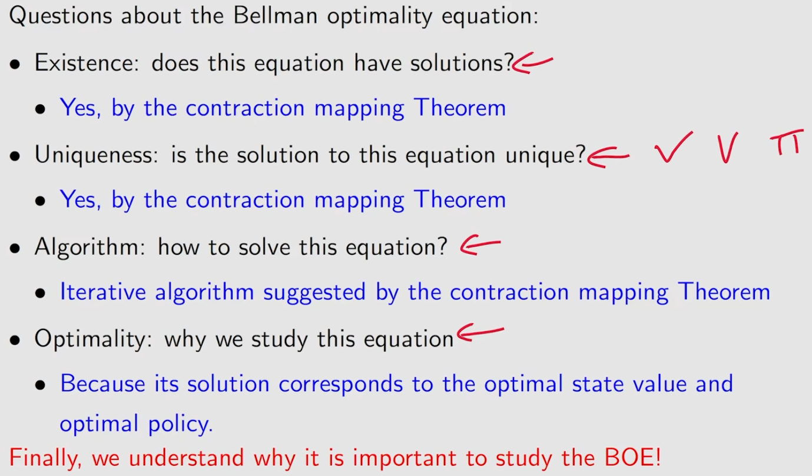
