# lecture3 Optimal Policy and Bellman OPtimality Equation
[toc]
## Optimal policy

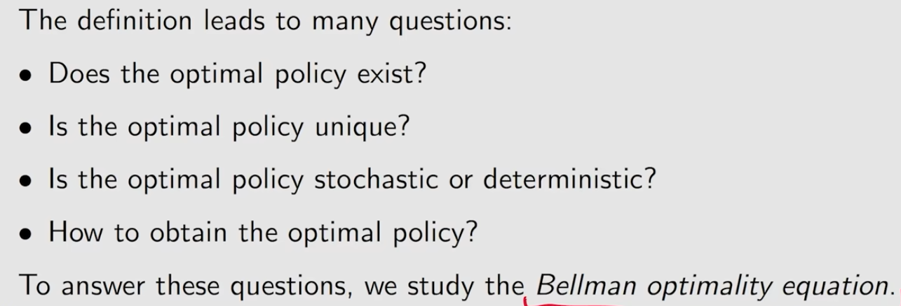

## Bellman optimality equation(BOE)
### BOE introduction
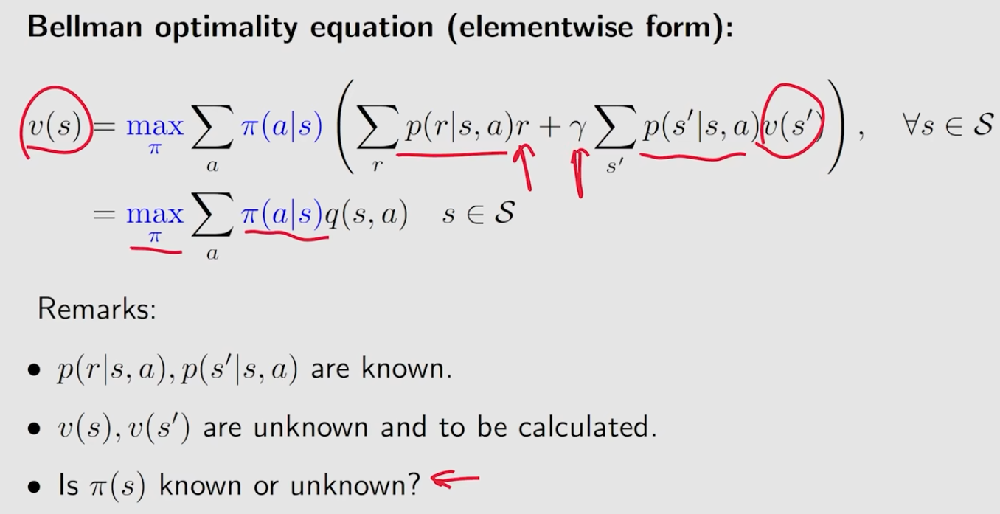
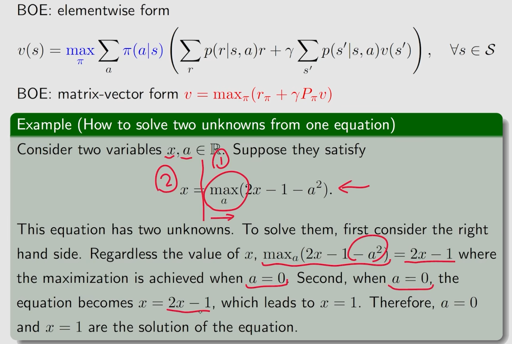
### maximization on the right side
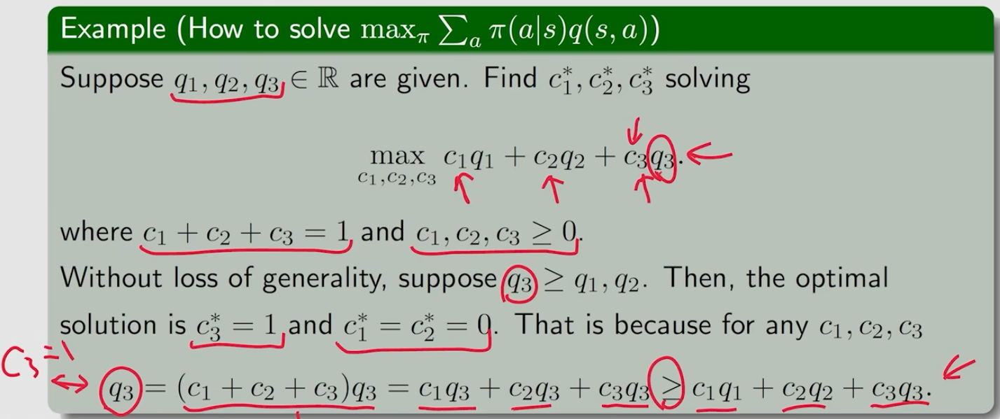
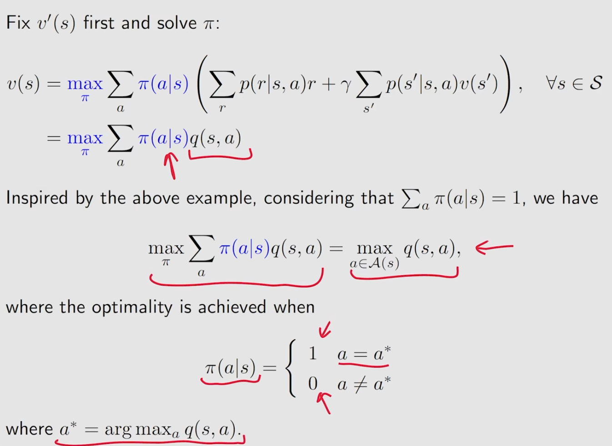
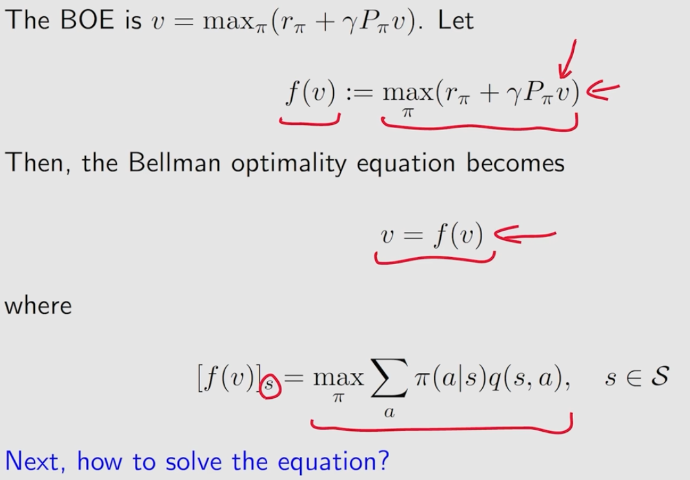

### Contraction mapping theorem
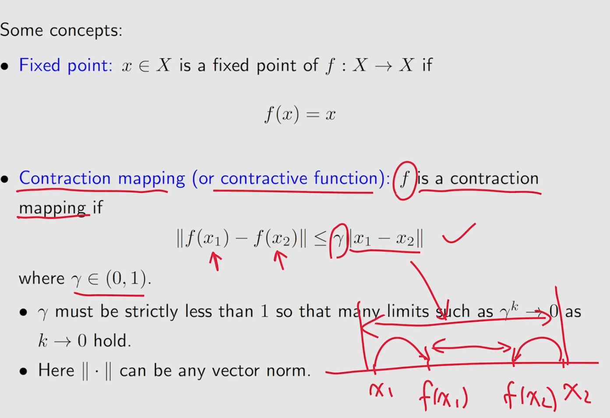
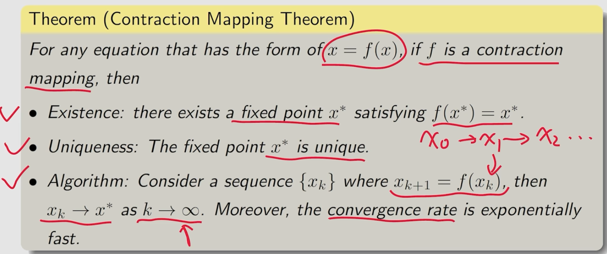

### BOE solution

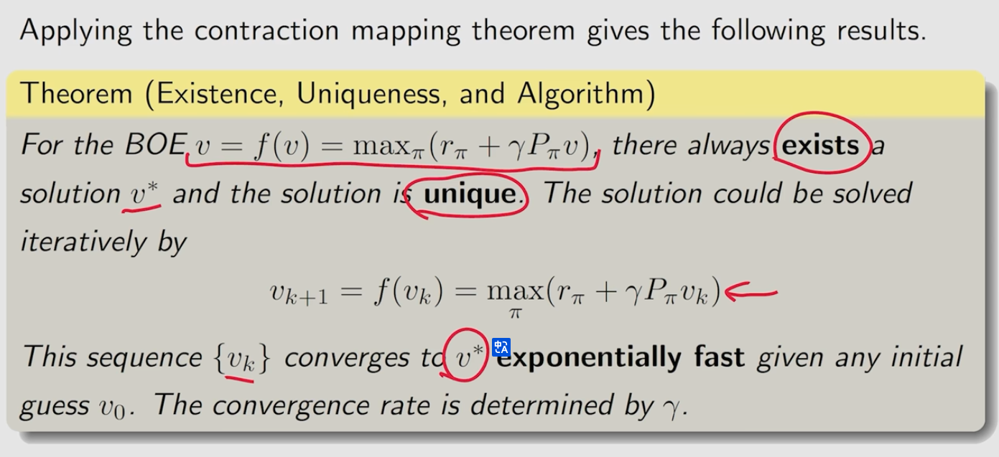
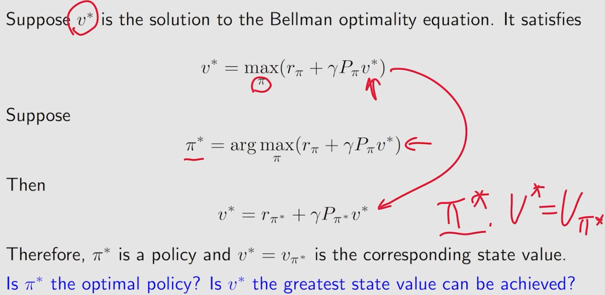
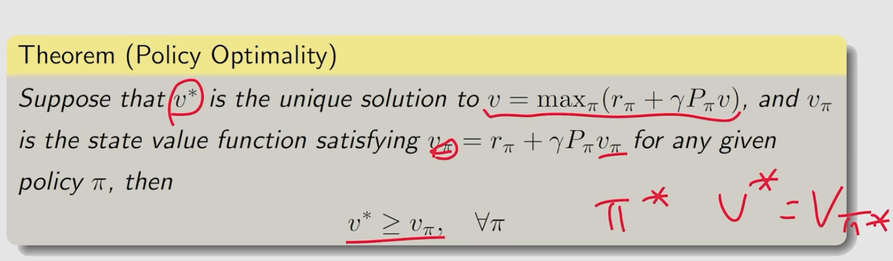
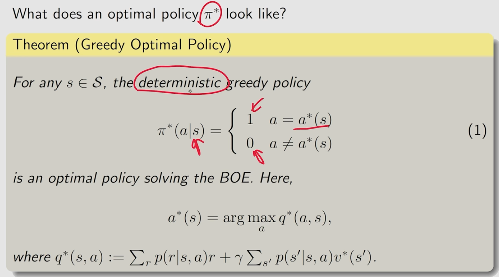

## analyze optimal policies

### $\gamma$大小的影响
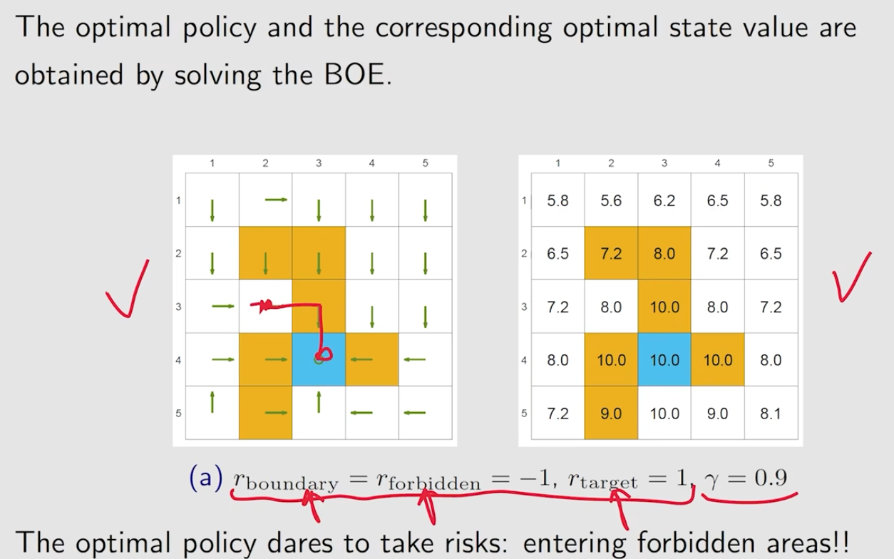

### r线性变换的影响

## 总结

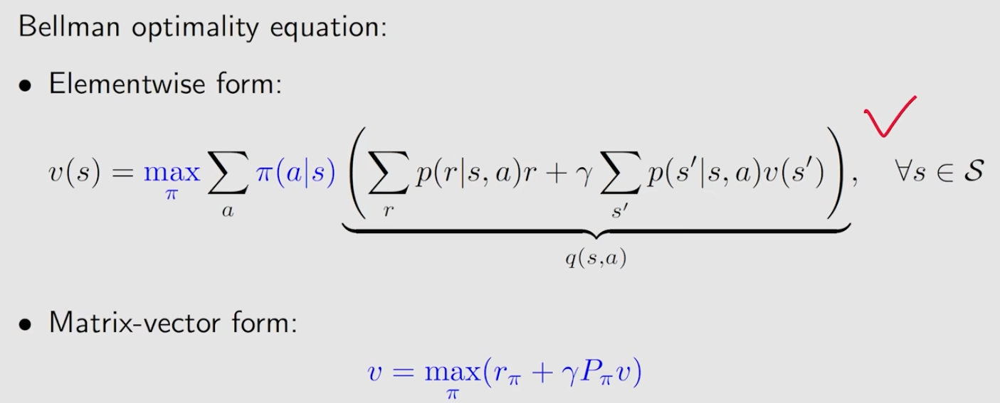
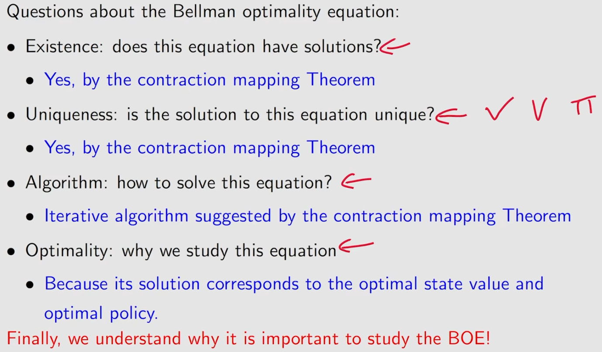
