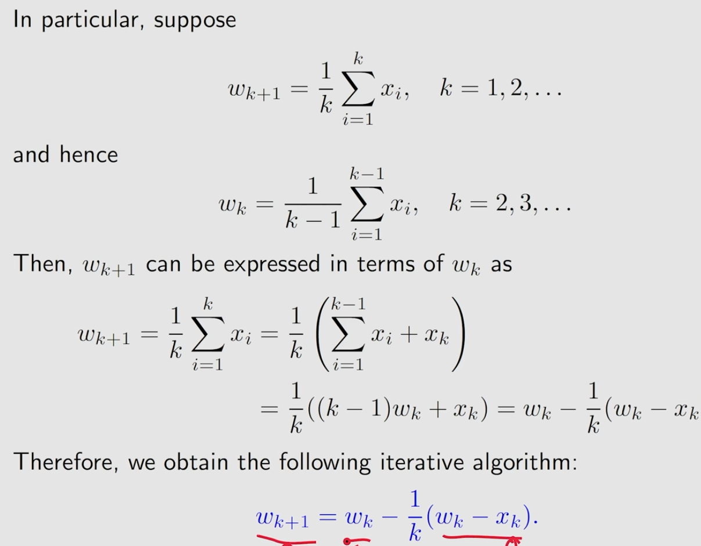
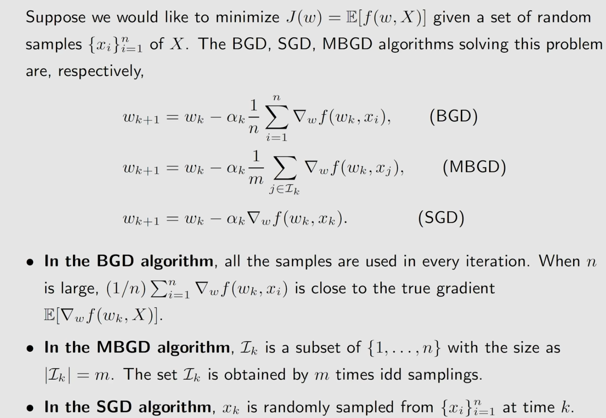

# lecture6 Stochastic Approximation and Stochastic Gradient Descent
[toc]
## motivating examples

## Robbins-Monro algorithm
### problem statement

### RM algorithm

### example

### RM收敛条件

## Stochastic gradient descent

### SGD example and application

### SGD convergence

### Convergence pattern

## BGD,MBGD,and SGD

