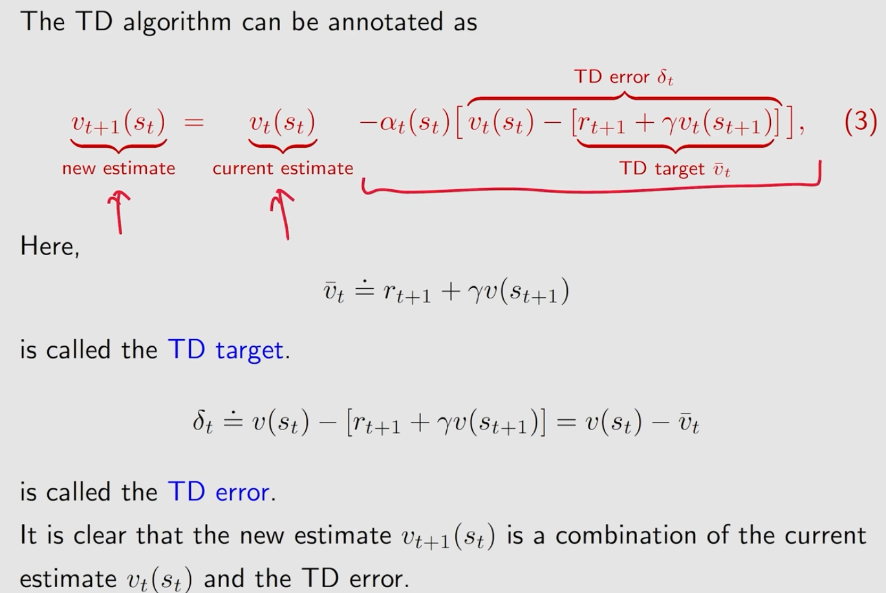
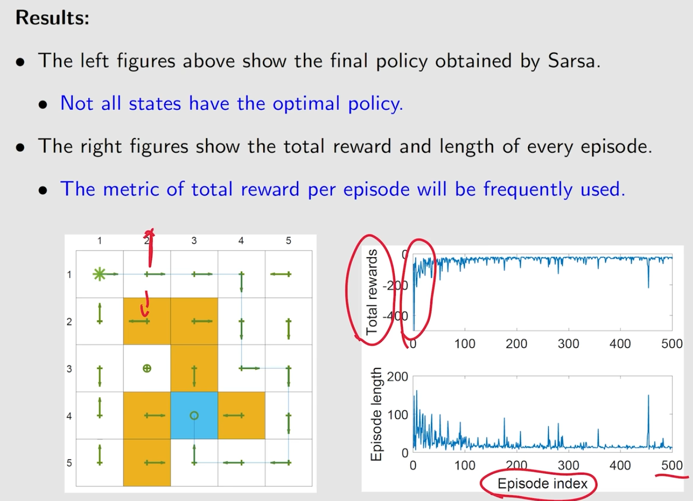

# lecture7 Temporal-Difference Learning
[toc]

## motivating examples

## TD learning of state values

### why $\bar{v}_t$ is called TD target

### TD error

### what do TD do mathmetically
It sovles the bellman equation of a given policy $\pi$

### convergence of TD

### TD learning and MC learning

## TD learning of action values: Sarsa

总而言之，就是通过某种方法能够估计此时的action value,在根据最大的action value,通过$\epsilon$-greedy方法去选择action
### examples

## TD learning of action values: Expected Sarsa

## TD learning of action values: n-step Sarsa

## TD learning of optimal action values: Q-learning

### on-policy and off-policy

### q-learning oseudocode

### task description

## unified view

