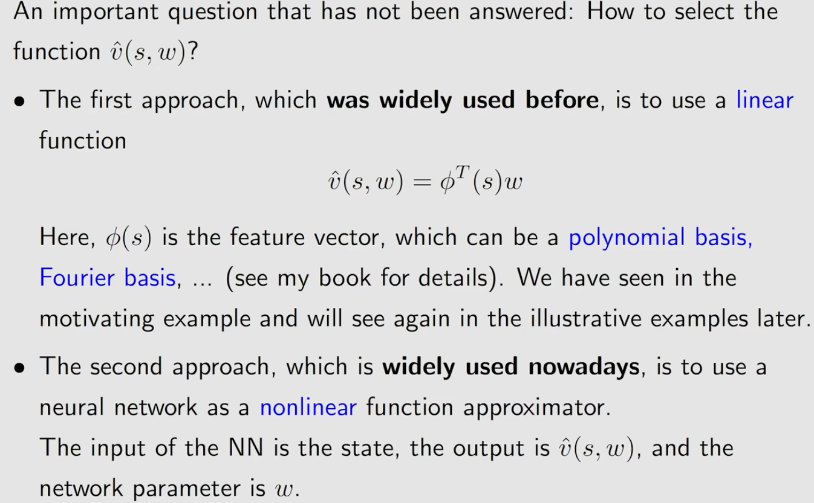
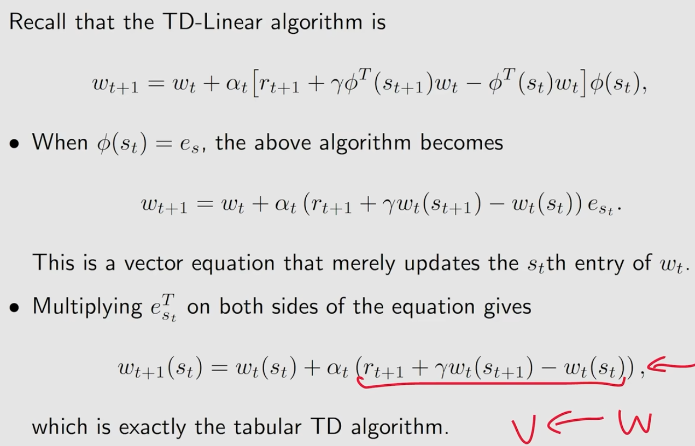
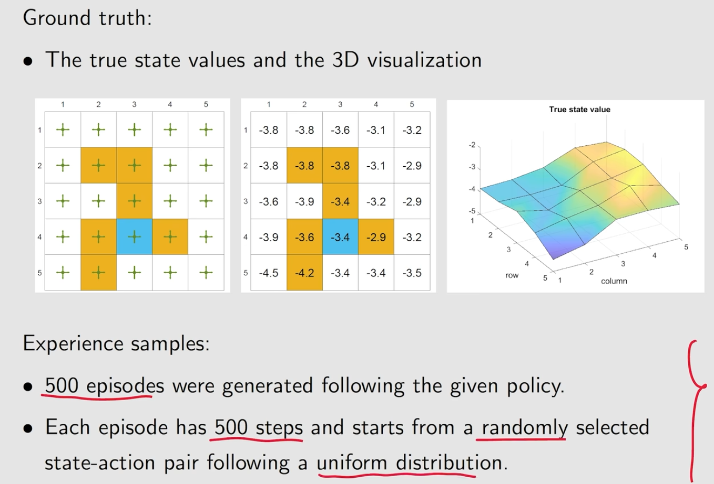

# lecture8 Value Function Approximation
[toc]
## motivating example
### tables

### functions

## Algorithm for state value estimation
### objective function

#### uniform distribution

#### stationary distribution

### 优化算法

### 近似函数的选择

### examples

### summary of the story

## Sarsa with function approximation

## Q-learning with fucntion approximation

## Deep Q-learning

### objective function

### minimize objective function

#### two networks

#### experience replay

### off policy dqn

